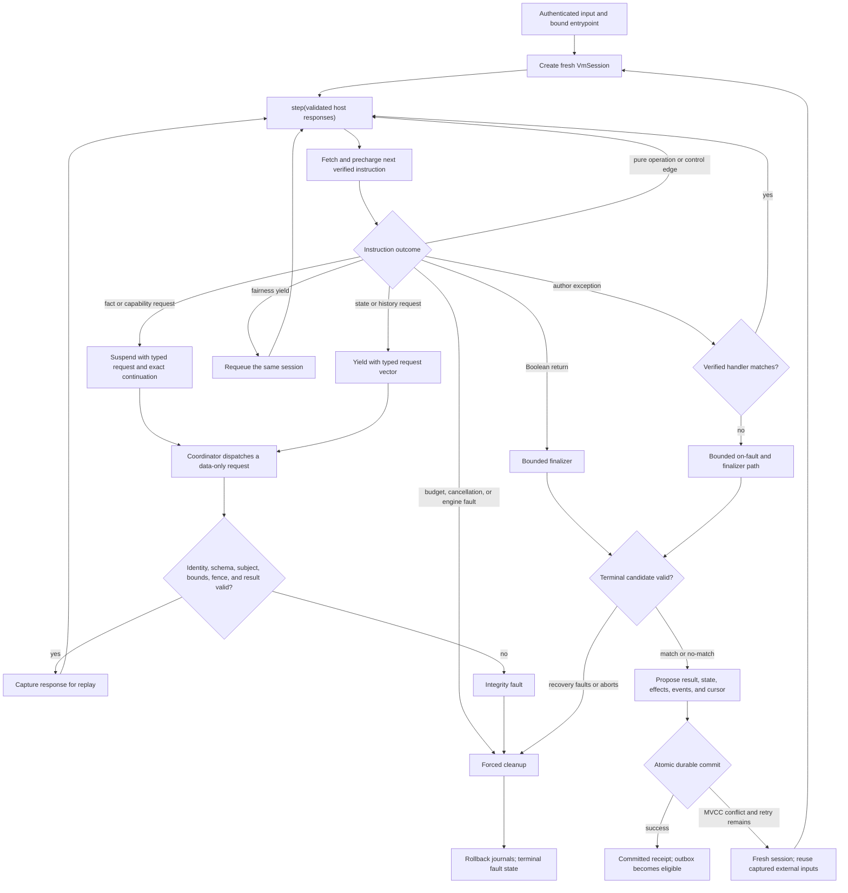

# VM Semantics and Execution

This guide explains how a verified Python-authored rule actually runs. It is
the short companion to the normative
[`architecture/04-compiler-ir-and-vm.md`](architecture/04-compiler-ir-and-vm.md).

The central rule is: **CPython parses, C++ decides**. CPython is absent from
evaluation. The C++ compiler defines the supported language, and the verified
C++ register VM owns values, control flow, exceptions, budgets, suspension,
state, and the final verdict.

## Mental model

Each invocation receives immutable verified bytecode and creates a fresh
`VmSession`. The session contains a program counter, typed registers, frames,
the current exception/unwind state, resource counters, captured inputs, and
journals for proposed writes.

`step(...)` runs until one of four things happens:

1. the rule finishes;
2. it needs a host-owned fact or capability;
3. it cooperatively yields; or
4. it faults, is quarantined, or is canceled.

Suspension is not a restart. The session retains an exact continuation and
resumes only after the coordinator validates a matching response.

## Execution graph

The endpoint side of a fact or scan request receives only a typed data request.
It never receives the rule predicate, bytecode, or authority to decide a
match.

## Observable step states

The VM returns one of these states to its owner:

| State | Meaning |
|---|---|
| `yielded` | Fairness yield, or a pending state/history request carried in the step |
| `waiting_for_facts` | One or more typed facts must be supplied |
| `waiting_for_capabilities` | A declared service/capability response is pending |
| `complete` | A Boolean candidate and its journals are ready for commit handling |
| `faulted` | Execution ended with an ordinary or engine fault |
| `quarantined` | Integrity or policy handling isolated the invocation |
| `canceled` | Deployment or operator cancellation stopped it |

A step can also carry bounded fact, scan, capability, state, and history
request vectors, plus journal, event, and recorder deltas. The coordinator
must inspect both the state and those vectors.

## Instruction families

The current exact bytecode ABI is deliberately small:

| Purpose | Opcodes |
|---|---|
| Values and arithmetic | `load_const`, `move`, `unary_op`, `binary_op`, `compare` |
| Control flow | `jump`, `jump_if_false`, `call`, `return_value` |
| Lists, tuples, maps | `build_list`, `build_tuple`, `build_dict`, `load_subscript`, `store_subscript` |
| Bounded iteration | `get_iter`, `iter_next`, `yield_value` |
| Host suspension | `await_fact`, `await_capability` |
| State | `read_state`, `write_state`, `delete_state` |
| Journals | `append_effect`, `emit_event` |
| Transactions | `begin_transaction`, `commit_transaction`, `rollback_transaction` |
| Exception regions | `enter_try`, `leave_try`, `leave_except` |
| Exception handling | `raise_fault`, `load_current_exception`, `match_exception`, `reraise` |
| Structured cleanup | `unwind_jump` |

There is no generic "call arbitrary C++" or "execute Python" instruction.
Every reachable operation has verifier-visible operand types, control edges,
effects, suspension behavior, and cost.

## Value and evaluation rules

The implemented heap currently represents:

- `None`, Boolean, arbitrary-size integer, and binary64 float;
- Unicode strings and bytes;
- lists, tuples, insertion-ordered maps, and iterators; and
- typed records.

The independent verifier proves register initialization and type compatibility
on every control-flow edge before activation. Runtime handles are checked; an
invalid or stale handle faults rather than becoming native memory access.

Source evaluation remains left to right. Boolean short-circuiting, comparison
order, mutation order, and exception replacement through `finally` are
observable behavior. Optimizations may not change them.

Integer division and modulo follow Python rules. Work and allocation for large
integers and container construction are charged before mutation, so a budget
failure cannot leave half an operation behind.

## Charging and suspension

Every instruction is precharged before it changes VM state. Charges include
semantic instructions, loop/yield work, live heap, logical allocations, host
boundaries, and operation-specific limits.

At `await_fact` or another boundary, the VM emits a typed request containing
the expected route/capability, subject, schema, limits, and continuation
identity. A response is accepted only for that outstanding request and only
after boundary validation. A malformed, oversized, stale, or mismatched
response becomes a typed boundary or integrity failure.

Accepted external inputs are captured. Replay and an MVCC retry therefore see
the same logical facts and capability results even though the VM session is
fresh.

## Exceptions and cleanup

Author exceptions and engine control faults are separate:

- supported author exceptions follow verified `try`/`except`/`else`/`finally`
  edges;
- a handler matches only its declared closed exception filter;
- returns, raises, and jumps crossing `finally` use explicit unwind records;
- hard budget, cancellation, and integrity faults bypass author handlers; and
- engine-owned cleanup still runs under a small, separate recovery budget.

An unhandled author exception enters the bounded `on_fault` policy, followed by
the finalizer when applicable. A fault in recovery enters the double-fault
policy; it cannot recursively create unbounded recovery work.

## Journals, commit, and retry

State writes, effect intents, emitted events, and the result are proposals
until commit. Normal execution cannot publish them directly.

The store atomically commits the verdict, state mutations, event/effect
intents, and input cursor. A fault or cancellation rolls back the journals. An
MVCC conflict can start a fresh session at most twice under `balanced.v1`;
captured external inputs are reused and cumulative budgets are not reset.

Only after a successful commit may the outbox deliver an external effect.
Delivery can be retried, so sinks still use stable intent IDs for idempotency.

## `balanced.v1` at a glance

| Resource group | Normal evaluation limit |
|---|---|
| Time | 10 s elapsed, 100 ms active CPU |
| Core VM | 1,000,000 instructions, 128 frames |
| Memory and loops | 16 MiB live heap, 250,000 loop/yield steps |
| Facts | 512 reads, 16 rounds, 16 MiB returned data |
| Services | 128 calls, 16 active, 16 MiB responses, 5 s per call |
| History | 16 queries, 10,000 rows, 16 MiB |
| State | 256 keys, 1 MiB |
| Effects and events | 256 of each, 2 MiB of each, event depth 64 |
| Recorder | 25,000 entries, 4 MiB |

Recovery is smaller: the fault/finalizer path gets 2 s elapsed, 50 ms CPU,
100,000 instructions, and 2 MiB heap; double-fault and forced-cleanup budgets
are smaller again. Limits are deployment policy, not values a rule can change.

## Exact execution and optimization

Verified unoptimized bytecode is the semantic oracle. An optimizer must retain
source/charge mappings and synthetic charges for eliminated work. Exact and
optimized execution must agree on verdicts, faults, logical reads, ordered
journals, and semantic counters.

Measured CPU time can differ because scheduling is not deterministic. It is an
operational limit, recorded as such, rather than a replayable language value.

## Current limitations

- Only the bounded source subset listed in
  [`IMPLEMENTATION_STATUS.md`](IMPLEMENTATION_STATUS.md) reaches this VM today.
- Scan and history request plumbing exists, but their complete author-source
  lowering is not yet exposed by the exact current opcode path.
- State, event, effect, async, and full exception contracts are broader than
  the currently reachable lowering.
- The implemented heap is intentionally narrower than the eventual static
  Python type model.
- There is no JIT. The verified register interpreter is the reference runtime.
- Python native extensions, runtime imports, reflection, dynamic code, and a
  system-Python fallback are not supported.

These gaps fail closed during checking or activation. For the detailed
instruction proofs, optimizer rules, and long-form rationale, see
[`architecture/04-compiler-ir-and-vm.md`](architecture/04-compiler-ir-and-vm.md).
For author-facing examples, see [`RULE_EXAMPLES.md`](RULE_EXAMPLES.md).
