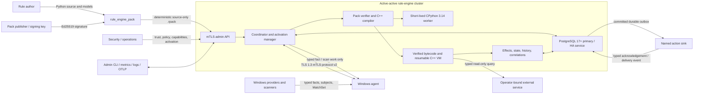
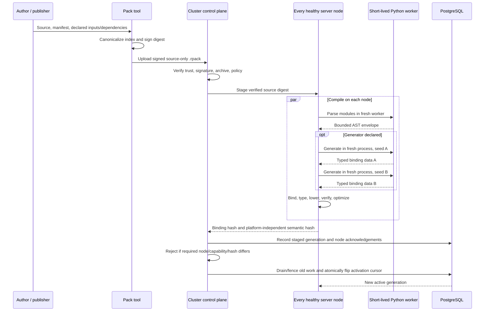
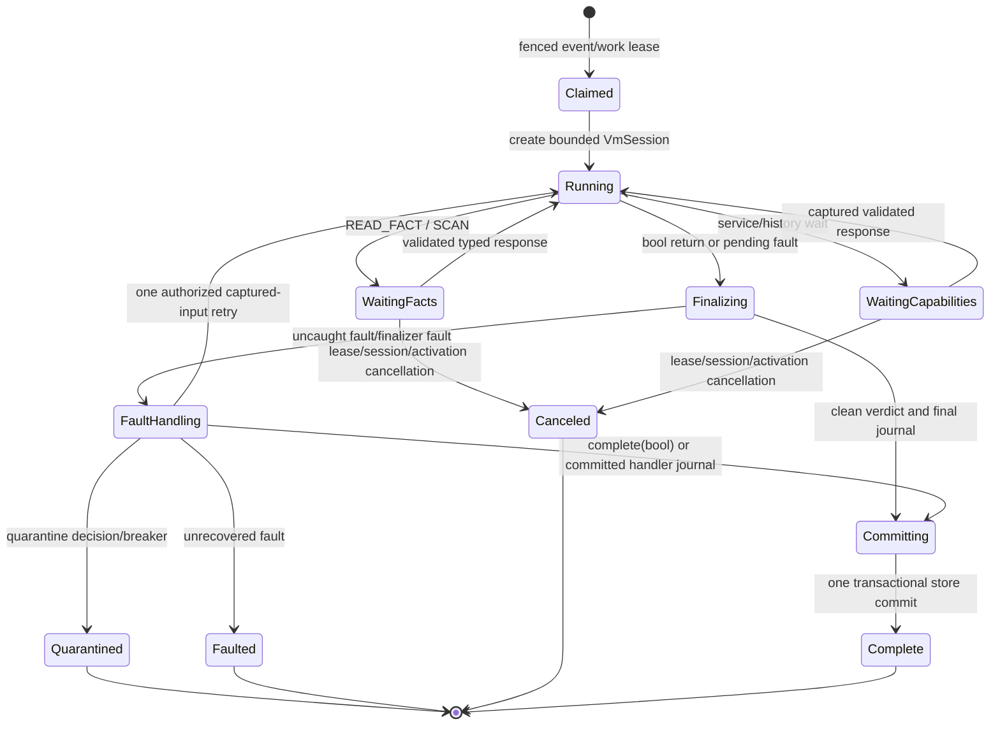

# System Context and Ownership Boundaries

## Purpose

This document defines the target system at its outermost boundary: who supplies rules and facts, where semantics execute, what is persisted, and which component is authoritative for each decision. It is the starting point for all lower-level architecture documents and shared contracts.

The rewrite replaces the current YARA/YARA-X path with a statically checked Python 3.14 authoring language compiled into verified bytecode for a resource-bounded C++ VM. The central invariant is unchanged and non-negotiable:

> C++ owns rule semantics and match decisions. Clients and providers return typed observations, facts, scan results, or diagnostics; they never evaluate a predicate or decide a match.

## Goals

- Give authors expressive Python syntax without executing rule modules in CPython.
- Keep binding, typing, semantics, optimization, execution, verdicts, effects, state, and correlation in C++.
- Evaluate live Windows subjects through typed, asynchronous facts supplied by remote agents.
- Make execution bounded, replayable, diagnosable, and safe from accidental or operational abuse.
- Support active-active Windows or Linux server nodes over one PostgreSQL 17+ primary/HA service.
- Activate signed source-only rule packs atomically across healthy server nodes.
- Preserve exact observable behavior across optimized and non-optimized execution.
- Remove YARA, the Rust bridge, protocol v1, and their build/runtime dependencies completely at cutover.

## Non-goals

- Treating signed pack authors or signed generator code as hostile tenants.
- Running arbitrary Python bytecode or a general Python interpreter inside an evaluation.
- Giving agents rule conditions, rule bytecode, or authority to decide verdicts.
- Providing a Linux fact-provider agent in the first release.
- Providing global total event order, database multi-primary, exactly-once delivery to arbitrary external systems, a YARA translator, or a custom language server initially.
- Supporting ambient rule access to filesystems, processes, networks, clocks, randomness, reflection, native extensions, or installed Python packages.

## Actors and responsibilities

| Actor | Responsibility | Explicitly does not own |
|---|---|---|
| Rule author | Writes typed rule, model, template, correlation, and optional generator source. | Runtime semantics, provider routing, deployment policy, sink configuration. |
| Pack publisher | Builds a deterministic `.rpack`, signs its canonical source index, and submits it for staging. | Trust-store policy or activation authority. |
| Security/operator control plane | Manages trusted signing keys, peer certificates, capabilities, policies, budgets, retention, sinks, service bindings, capture profiles, activation, rollback, and quarantine. | Rule truth or client-side match decisions. |
| Rule-engine server node | Verifies packs, compiles source, schedules facts, executes bytecode, decides verdicts, commits state/effects/events, and coordinates correlations. | Producing privileged Windows facts it cannot observe locally. |
| Windows agent | Authenticates as a peer, enumerates subjects, resolves typed facts, executes bounded scan plans, spools results, and reconciles authoritative inventories. | Rules, predicates, optimization, state/effects, or verdicts. |
| Fact provider | Implements a named typed route for one fact or scope enumeration. | Deciding whether the returned value satisfies a rule. |
| PostgreSQL | Durably orders ingress and atomically stores cursors, results, state, effects, events, outbox, retention, leases, and audits. | Application-level rule semantics. |
| External service | Answers an operator-bound, typed, read-only/idempotent query. | Direct rule-engine state or untyped ambient access. |
| Action sink | Receives committed, idempotency-keyed post deliveries. | Participating in the originating database transaction. |
| Administrator/observer | Uses the mTLS admin API, CLI, metrics, logs, and audits to operate the cluster. | Silent mutation outside authenticated, authorized, audited operations. |

## System context



The CPython worker is drawn inside the server deployment boundary but outside the authoritative execution core. It converts trusted source to a bounded data representation or executes a trusted generator. It never owns semantics and never returns executable Python bytecode to the VM.

## Component ownership

### Pack tool and verifier

- Canonicalize and validate the source-only archive.
- Verify its SHA-256 payload index and Ed25519 signature before compilation or generator execution.
- Resolve only embedded, digest-pinned source dependencies.
- Reject traversal, symlinks, Unicode/case collisions, native code, bytecode, unsupported compression, and archive bombs.
- Produce a `VerifiedRulePack`; unverified bytes never enter the compiler.

### Short-lived Python worker

- In `parse` mode, run the pinned private CPython parser and serialize the complete AST, constants, and UTF-8 source spans through bounded length-prefixed UTF-8 JSON with exact tagged scalars.
- In `generate` mode, execute only the verified pack generator with declared immutable inputs, a private standard library, and locked pure-Python wheels.
- Exit after one request. It does not remain resident, import rule modules during parsing, compile rule bytecode, or decide rule semantics.
- Operate under process-tree, wall-time, CPU, memory, and output limits. Those controls protect availability; they do not make trusted generator Python safe against an adversarial signer.

### C++ compiler and optimizer

- Bind modules and names; enforce the static subset, schemas, capabilities, annotations, and labels.
- Lower AST into typed HIR, explicit CFG/SSA-like IR, and verified register bytecode.
- Issue transitive purity, effect, fault, fact, state, service, history, and recorder-observability certificates.
- Optimize only when verdict, logical reads, faults, state, effect journal, trace, budgets, and breaker accounting remain observationally equivalent.

### C++ VM and runtime host

- Own frames, registers, heap, hash seed, instruction/accounting budgets, task groups, state/effect journal, recorder, and captured replay inputs.
- Suspend at explicit host operations and resume the same continuation; never restart an entrypoint merely because a fact was missing.
- Decide MATCH, NO_MATCH, FAULTED, QUARANTINED, or CANCELED.
- Freeze and validate every value crossing a provider, service, event, state, history, effect, or persistence boundary.

### Coordinator and Windows agent

- The coordinator leases typed work, batches fact requests, fences stale sessions, drives VM continuations, and serializes work per peer or correlation group.
- The agent maintains an outbound mTLS session and durable local spool, reconciles authoritative subject snapshots, and returns typed values/statuses for explicit routes.
- Providers receive request identity, typed subject, route, deadline, and cancellation only. They never receive a rule predicate or whole bytecode program.

### Store, services, and action sinks

- `IRuntimeStore::transact_event` atomically commits the input event/cursor, state compare-and-swap, result, emitted events, retention, journal, outbox, and audit records.
- Read-only services are operator-bound capabilities. Their responses are schema-validated and captured for deterministic retry/replay.
- Action delivery happens only from a committed outbox. Because an arbitrary sink cannot share the database transaction, delivery is at-least-once and requires deterministic idempotency keys.

## Public interfaces and owned data

| Interface | Producer → consumer | Authoritative owner |
|---|---|---|
| `VerifiedRulePack` | Pack verifier → `PackCompiler` | Pack verifier owns provenance and canonical source identity. |
| Versioned AST envelope | Fresh parse worker → C++ frontend | Worker owns parser fidelity; C++ owns validation and all semantic interpretation. |
| `CompiledPack` and verified bytecode | Compiler → activation manager/VM | Compiler owns types, lowering, certificates, and semantic hashes. |
| `VmStep`/host-response exchange | VM ↔ coordinator runtime host | VM owns continuation and logical execution; host owns validated external completion. |
| Fact/scan request and response | Coordinator ↔ agent/provider | Coordinator owns requested identity/schema; agent owns measurement only. |
| Protocol-v2 session | Server ↔ authenticated Windows agent | Server owns session, lease, fence, and negotiated capability authority. |
| `EffectJournal` | VM → transactional runtime/store | VM owns reached intent order; store transaction owns durable disposition. |
| `IRuntimeStore::transact_event` | Coordinator → PostgreSQL/SQLite adapter | Runtime-store contract owns atomic event/cursor/state/result/effect persistence. |
| Typed service/action envelope | Runtime/outbox ↔ operator-bound endpoint | Engine owns schema/call/intent identity; endpoint owns reply/delivery acknowledgement. |
| Admin API | Authorized administrator → cluster control plane | Control plane owns policy versions, activation, quarantine, and audited mutation. |

No public interface transfers whole-rule semantic authority to a worker, agent, provider, service, sink, or database adapter.

## Principal flows

### Pack lifecycle



Invariant: source is verified before CPython generator execution; activation is visible only after all healthy leased nodes compile the same semantics and old-generation commits are fenced.

### Evaluation lifecycle



All suspension is explicit and resumable. Host responses are validated before re-entry. Effect delivery is not part of VM execution; it starts only after the journal and outbox commit.

### Fact ownership boundary

```mermaid
sequenceDiagram
    participant V as C++ VM
    participant C as Coordinator
    participant A as Windows agent
    participant P as Provider / scanner

    V->>C: Need(route, SubjectKey, schema, deadline)
    C->>A: Fenced typed request; no predicate
    A->>P: Resolve fact or bounded scan plan
    P-->>A: Typed value / MatchSet / terminal status
    A-->>C: Sequenced response from durable spool
    C->>C: Validate session, fence, request, subject, schema, size
    C-->>V: FactValue or typed exception
    V->>V: Resume exact READ_FACT instruction and decide semantics
```

## Core invariants

1. Only verified source reaches compilation or generator execution in production.
2. CPython never executes a rule/model module and never decides semantics.
3. Only verified C++ bytecode reaches the VM.
4. Agents and providers never receive rules or predicates and never return verdicts.
5. A logical fact read occurs only when execution reaches `READ_FACT`; prefetch is physically invisible until then.
6. A suspended invocation resumes its exact continuation and does not duplicate state or effects.
7. Boundary data is typed, size-bounded, schema-validated, labeled, and canonically frozen before persistence or transport use.
8. Effects are ordered by reach but become externally actionable only after one durable root commit.
9. Replay can reproduce captured engine inputs but never delivers an external action.
10. Stale session, lease, work-attempt, and pack-generation fence tokens cannot commit.
11. Processing is serial per peer and correlation group; no global total order is promised.
12. Active pack generations never overlap for committed work.

## Failure modes and recovery

| Failure | Required behavior |
|---|---|
| Invalid signature/archive/dependency | Reject before parse/generate; retain active generation; audit digest and reason. |
| Parser/generator timeout, memory limit, protocol violation, or crash | Terminate the complete worker process tree, discard output, emit bounded diagnostics, and leave server node healthy. |
| Generator runs disagree | Reject the pack as nondeterministic; never stage its bindings. |
| Compiler/type/verifier failure | Return source-mapped diagnostics; do not create an executable generation. |
| Agent disconnect or duplicate/reordered response | Reconnect and replay spool; coordinator deduplicates by epoch/sequence and fences stale sessions. |
| Invalid authoritative snapshot | Reject the entire snapshot, emit a provider protocol fault, retain last-good visibility only for future diff, and emit no removals. |
| Provider terminal status | Raise the corresponding typed VM exception at the reached read. |
| Server node fails mid-evaluation | Lease expires; another node replays captured/durable input; stale node cannot commit. |
| PostgreSQL transaction conflict | Retry through the defined captured-input state policy; after three total attempts, produce `FAULTED(StateConflict)`. |
| External action transport failure | Keep/retry committed outbox row within policy, then dead-letter; never change the originating verdict. |
| Pack activation node/hash mismatch | Abort activation and keep the prior generation active. |
| Triple fault | Persist the chain, suppress uncommitted actions, quarantine exact executor, and apply conservative peer/global breaker thresholds. |

## Consistency and ordering guarantees

- PostgreSQL ingest order is authoritative for normal event processing.
- A peer stream and a correlation group are processed serially under fenced leases.
- Producer occurrence timestamps are preserved but affect windows only when a correlation explicitly selects bounded-lateness event-time mode.
- Event/cursor/result/state/effects/emitted events/outbox commit atomically inside one database transaction.
- External action delivery is at-least-once; deterministic idempotency is the cross-system contract.
- Agent messages are at-least-once over reconnect; session fencing and durable sequence acknowledgement make replay safe.
- Cluster pack activation is all-healthy-node atomic at the database activation cursor.

## Security and resource guarantees

- Production peers and administrators authenticate with TLS 1.3 mutual certificates; certificate policy maps identities to trusted `PeerId` or admin principals.
- Production packs require a trusted Ed25519 signature; unsigned source is confined to explicit development mode and visibly marked.
- Rules have no ambient authority. All external access is a statically typed operator binding with runtime schema and label checks.
- `balanced.v1` bounds elapsed time, active VM work, instructions, frames, heap, loops/yields, facts, provider rounds/bytes, services, history, state, effects, and recorder size.
- Parse/generate workers have independent wall, CPU, memory, output, and process-tree limits.
- These controls reduce accidental and operational abuse. They do not make a deliberately malicious signed generator safe; see `01-trust-and-threat-model.md` and ADR-002/ADR-017.

## Observability and diagnostics

- Every pack audit records source digest, signer/trust decision, runtime/compiler ABI, generator input hash, binding hash, semantic hash, node acknowledgements, and activation cursor.
- Every evaluation carries tenant, peer, subject, executable, generation, event, execution, invocation, attempt, lease fence, and causation identities.
- Structured logs and metrics expose worker outcomes, compiler diagnostic codes, fact route latency/status, VM suspension, budgets, fault ladder, breaker state, lease loss, transaction retries, outbox delivery, and activation state.
- The optional bounded flight recorder captures calls, branches, returns, logical facts, effects, services/history/state, faults, and optimizer decisions when pre-armed by policy.
- Durable audit records cover trust-store changes, capability/sink policy, pack lifecycle, trace/capture requests, quarantine, purge, and outbox/dead-letter operations.

## Alternatives considered

### Execute rules directly in CPython

Rejected because Python execution would own semantics, make fact suspension and exact resource accounting difficult, expose a much larger ambient/runtime surface, and weaken replay and optimization equivalence.

### Send predicates or bytecode to agents

Rejected because clients would become semantic authorities, peer versions could disagree, rule source would cross a wider trust boundary, and server-side auditing/optimization would no longer be complete.

### Keep YARA as a compatibility frontend

Rejected because two semantic models would prolong Rust/Cargo/build dependencies, require ambiguous equivalence rules, and prevent a clean schema/effect/type architecture.

### Run one persistent Python worker

Rejected because state/import leakage and allocator corruption could contaminate later packs, and a parser/generator crash could disrupt unrelated work.

### Embed Python in the server process

Rejected because parser stack/memory failure would share the server failure domain and generator execution would have the server's process authority.

### Put evaluation on the agent

Rejected because it violates the project trust boundary and makes version, policy, state, effects, correlation, and audit correctness dependent on remote clients.

## Consequences and tradeoffs

Positive consequences:

- One authoritative semantic implementation with deterministic validation and replay.
- Rich Python-shaped authoring without ambient Python runtime authority.
- Typed facts and identities allow precise privacy, caching, scheduling, and diagnostics.
- Transactional effects/state and fenced distributed work prevent most duplicate observable results.
- Windows providers remain specialized while the coordinator/compiler/VM become portable to Linux.

Negative consequences:

- Implementing Python-compatible values, control flow, classes, exceptions, generators, and async behavior in C++ is substantial work.
- Full Python grammar support does not mean all Python programs are accepted.
- Conservative observability rules limit optimization for effectful or recorded executions.
- Cross-platform packaging must maintain a private exact Python runtime solely for parsing/generation.
- Active-active correctness depends on PostgreSQL availability and disciplined fence-token use.

## Known limitations

- Signed pack/generator authors are trusted; the worker is not a security sandbox for adversarial tenants (`L-001`).
- Valid Python outside the documented static subset is rejected (`L-002`, `L-003`).
- Deep or very large source can exceed worker/compiler limits (`L-004`).
- Double-run generation detects common nondeterminism but does not prove determinism (`L-005`).
- There is initially no Linux provider agent; Windows facts depend on privileges and live-process races (`L-006`).
- The cluster has no global total order or database multi-primary (`L-007`).
- External posts are at-least-once and replay cannot reverse side effects (`L-008`, `L-009`).
- Some observable executions must use the exact VM and receive little optimizer benefit (`L-010`).
- RE2 is intentionally not Python `re` compatible (`L-011`).
- State schema changes require migration/reset; generations cannot overlap (`L-012`).
- SQLite is development-only (`L-015`).
- No custom LSP or YARA translator is delivered initially (`L-016`).
- Cyclic VM graphs cannot cross canonical boundaries (`L-017`).

## Required verification

- Prove pack verification precedes parse/generate and that failed staging never changes the active cursor.
- Prove rule/model top-level code is never executed by CPython.
- Prove providers cannot receive a predicate/verdict request through public protocol types.
- Exercise fact suspension/resumption across disconnects without repeated effects.
- Test session/work/generation fencing by committing deliberately late results.
- Test atomic state/effect/event/outbox commit and crash recovery around every transaction boundary.
- Test cross-platform semantic hash equality for the same pack.
- Test exact-versus-optimized parity including verdict, logical facts, state, journal, trace, budgets, and faults.
- Test production rejection of unsigned packs, plaintext non-loopback peers, schema mismatch, missing capabilities, and absent retention policy.
- Run Windows-agent-to-Windows-server and Windows-agent-to-Linux-server end-to-end qualification.

## Traceability

- Decisions: ADR-001, ADR-002, ADR-004, ADR-005, ADR-006, ADR-007, ADR-008, ADR-011, ADR-012, ADR-013, ADR-014, ADR-017, ADR-018.
- Shared contracts: `VerifiedRulePack`, `PackCompiler`, `CompiledPack`, `VmSession`, `IProviderDispatcher`, `EffectJournal`, `IRuntimeStore`, protocol v2, activation cursor.
- Tasks: D0, F0, PK1-PK3, C1-C3, V1-V4, E1-E3, R1-R3, P1-P3, S1-S3, O1-O2, I1-I2, X1, Q1.
- Acceptance: complete platform/build matrix, distributed failure tests, security/replay/fuzz qualification, YARA/Rust removal scan, and clean repository/worktree checks.
