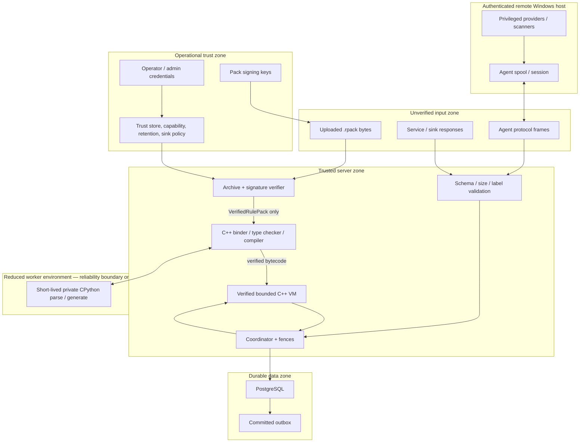
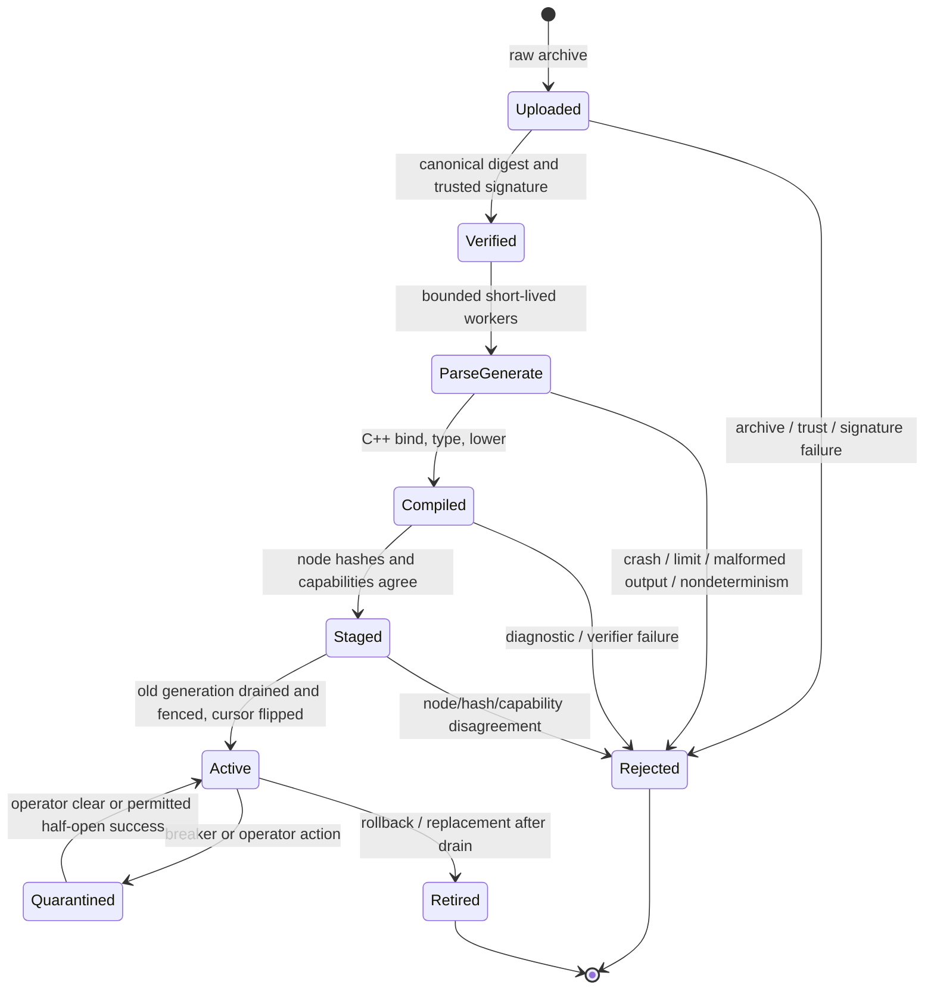

# Trust and Threat Model

## Purpose

This document states what the rule engine protects, whom it trusts, which abuse cases are in scope, and where operational security is required. It intentionally distinguishes three concepts that must not be conflated:

1. **Static rule safety:** rule/model source is parsed and compiled into a C++ VM with no ambient authority.
2. **Worker reliability containment:** CPython parse/generate processes are short-lived and resource-bounded so failures do not take down the server.
3. **Pack-author trust:** a production signature authorizes trusted operational source. A signed generator is not treated as hostile code, and worker containment is not an AppContainer, LPAC, seccomp, container, or virtualization security boundary.

## Goals

- Only an authorized, integrity-verified source pack can be staged or activated in production.
- A malformed pack, AST, provider response, protocol frame, service response, or persisted value cannot bypass type/schema/size validation.
- Static rule evaluation cannot obtain ambient OS, filesystem, process, network, clock, randomness, reflection, import, or native-code authority.
- A parser/generator crash, resource spike, malformed output, or child process cannot corrupt or terminate the long-lived server.
- A remote peer cannot impersonate another peer, submit stale work, decide verdicts, or mutate server semantics/state outside an authorized typed message.
- A stale server/node/session/work owner cannot commit after losing its lease or generation.
- Sensitive/Secret information cannot reach an unauthorized persistence class, trace, service, action sink, or event without an approved named declassification transform.
- Replay and optimization cannot silently dispatch external actions or alter observable rule behavior.
- Security-relevant administration is authenticated, authorized, and durably audited.

## Non-goals and accepted trust assumptions

- The engine does **not** securely execute an intentionally malicious generator signed by a trusted production key.
- The short-lived worker is **not** claimed to resist an OS-level escape, Python-runtime exploit, deliberate data exfiltration by trusted generator code, or arbitrary-code execution under the worker account.
- Pack signing-key custody, signer review/approval, host hardening, certificate issuance/revocation, PostgreSQL security, external service/sink security, and deployment network isolation are operational responsibilities.
- Denial of service within configured tenant/operator quotas may still delay other work until scheduling/backpressure reacts; limits make the blast radius bounded and observable rather than impossible.
- The engine does not provide exactly-once delivery to arbitrary sinks, global event order, or confidentiality against a fully compromised server/agent host.
- Unsigned development mode and loopback plaintext development mode intentionally weaken production assurances and must be impossible to enable accidentally in a production profile.

## Assets

| Asset | Security property |
|---|---|
| Pack source and dependencies | Integrity, provenance, deterministic identity, confidentiality where deployment requires it. |
| Signing and trust-store keys | Confidentiality/integrity; unauthorized keys must not activate packs. |
| Peer and admin certificates | Confidentiality/integrity, correct principal mapping, revocation. |
| Model/schema descriptors | Integrity and consistent hashes across nodes/agents. |
| Bytecode and optimizer certificates | Integrity, verifier acceptance, source/executable binding. |
| Rule verdicts and faults | Integrity, attribution, once-per-event visibility. |
| Facts, scans, service replies, history, and captures | Integrity, freshness/fencing, confidentiality, label provenance. |
| State, event cursors, correlation groups | Atomicity, ordering, tenant/peer isolation, recoverability. |
| Effect journal and outbox | Integrity, transactional disposition, idempotency, no replay dispatch. |
| Flight recordings/logs/audits | Integrity, bounded disclosure, access control, retention/purge correctness. |
| Availability budgets | Enforced consumption ceilings and observable exhaustion. |

## Actors and trust levels

| Actor/component | Trust level | Rationale |
|---|---|---|
| Security/operator administrators | Highly trusted | Configure roots of trust, capabilities, sinks, retention, activation, and quarantine. Actions must still be authenticated/audited. |
| Production pack signer/publisher | Trusted source authority | A valid signature authorizes pack source and generator execution. Key compromise is a major incident. |
| Rule/model author before signing | Untrusted input producer | Source is not authorized until reviewed/signed; tooling may parse it only in local development contexts. |
| Static rule code after compilation | Capability constrained | It is not trusted with ambient authority; bytecode verifier and VM enforce available operations/budgets. |
| Generator after verified signature | Trusted code in a reduced environment | It can execute CPython; environment/resource controls are defense in depth, not a security sandbox. |
| Server/compiler/VM/coordinator | Trusted computing base | Owns semantics, validation, persistence decisions, and distributed fencing. |
| Windows agent binary | Authenticated data plane, not semantic authority | Trusted to attempt fact acquisition but all responses are schema/fence validated and can fault. |
| Provider/plugin implementation | Privileged local component | May access processes; cannot decide rule truth or directly mutate server state. |
| PostgreSQL/SQLite implementation | Trusted persistence component | Protected by deployment credentials/host controls; application still validates stored envelopes and fences. |
| External service or action sink | Independently trusted per binding | Replies/acks remain untrusted wire input and are schema/size/label validated. |
| Network | Hostile | TLS, identities, sequence numbers, fences, deadlines, and size limits are mandatory. |

## Trust zones and control/data flow

The line around the worker is not an adversarial sandbox line. Its purpose is to prevent normal parser/generator faults and bounded resource abuse from sharing the server process. If future requirements admit mutually untrusted pack publishers, a separate security project must place generator execution inside a real OS/container/virtualization isolation boundary and revise ADR-002 and ADR-017.

## Public interfaces and owned data

- Raw `.rpack` bytes cross into the trusted server only through archive, digest, signature, trust-policy, and limit validation; only `VerifiedRulePack` is compiler input.
- The AST envelope is untrusted worker output until C++ validates protocol version, node/field schema, exact scalar tags, counts, nesting, and source spans.
- Verified bytecode is executable only after compiler and bytecode-verifier success; raw worker output is never executable.
- Agent fact/scan replies are untrusted authenticated inputs until session, fence, request, subject, route, exact requested/returned schema ID and hash, terminal shape, label, and size validation completes. Schema identity is independently sourced from the active pack and provider route catalogs; an echoed request field is not evidence.
- Service/action envelopes are identified, versioned, typed, and bounded; endpoint authentication never replaces application validation.
- Canonical `FrozenValue` is the only value form accepted by state, history, events, effects, outbox, and durable storage.
- Admin mutation is exposed only through the authenticated authorization/audit interface; direct database access is an operationally privileged action outside the product API.

Ownership follows `CONTRACTS.md`: the verifier owns provenance, the compiler owns semantics, the VM owns logical execution, the coordinator owns external scheduling/fences, the runtime store owns atomic durability, and operators own trust/capability/sink policy.

## Entry points and validation

| Entry point | Threats | Mandatory controls |
|---|---|---|
| `.rpack` upload | Tamper, spoofed signer, traversal, duplicate/colliding names, zip bomb, native payload, dependency confusion | Canonical index, SHA-256, Ed25519 trust policy, strict archive format, NFC/case collision checks, no symlinks/native/bytecode, per-entry/total limits, embedded exact-digest dependencies. |
| CPython worker input/output | Stack/memory exhaustion, crash, malformed/truncated/oversized frame, unexpected child process, environmental nondeterminism | Private exact runtime, single request, bounded length-prefixed protocol, C++ schema validation, cleared environment, explicit imports/inputs, wall/CPU/memory/output/process limits, kill entire tree, no partial-output acceptance. |
| Agent protocol v2 | Peer spoofing, replay, downgrade, stale session, oversize frames, false subject identity, malicious values | TLS 1.3 mTLS, certificate-to-`PeerId`, no early data, version/capability/schema negotiation, session/epoch/sequence/work IDs, monotonic fences, frame/value limits, authoritative snapshot digest, typed validation. |
| Provider response | Predicate injection, wrong route/schema/subject, duplicate response, forged or missing schema attestation, mixed/unknown terminal shape, oversized scan context | Provider API contains no predicate/verdict type; correlate request/fence/subject/route; require exact returned schema ID/hash on values and no schema/value on non-value terminals; validate the value against the active descriptor; reject protocol violations atomically before VM exposure. |
| Service response | Spoofing, stale/cross-call reply, schema/type confusion, oversized/confidential data | HTTPS TLS policy, typed versioned envelope, method/schema/call/deadline/idempotency/causation IDs, size/label validation, capture exact accepted response. |
| Action acknowledgement | False success, replay, invalid payload | Bind to intent/idempotency/schema, validate typed acknowledgement, persist as delivery event, retain dead-letter/audit evidence. |
| Database row | Stale lease, cross-tenant key, corrupted version/schema, forged state/effect | Strong typed IDs, tenant predicates, transaction invariants, schema hashes, CAS/fence predicates, checksums where applicable, migration-controlled decoding. |
| Admin API | Privilege escalation, destructive misuse, unaudited policy change | Separate admin mTLS identity/authorization, least privilege, preview for purge, explicit generation/policy versions, immutable audit, bounded request sizes/rates. |

## Threat analysis and controls

### Pack provenance and dependency attacks

Threats include signer spoofing, key misuse, post-signing modification, dependency substitution, archive path tricks, case/Unicode aliases, and stale/revoked keys.

Controls:

- Sign the canonical source index domain-separated as `rule-engine-rpack-v1\0 || index`.
- Hash every payload and embedded dependency by SHA-256; dependency lookup never consults a live registry during activation.
- Bind trust decisions to tenant/operator policy and audit signer, key ID, source digest, revocation state, and verification time.
- Verify archive structure and trust before invoking generator mode.
- Treat a valid signer as authority to run its generator; do not misrepresent resource controls as protection against that signer.

Residual risk: compromise or malicious use of a trusted signing key authorizes arbitrary generator Python under the worker account. Operational key protection, review, revocation, host isolation, and incident response are therefore part of the security boundary.

### Static rule escape

Threats include dynamic import, reflection, monkey-patching, native extensions, arbitrary descriptors, metaclasses, code generation, ambient I/O, unbounded recursion/loops/allocations, and boundary object confusion.

Controls:

- CPython only parses rule/model modules; C++ rejects unsupported AST/binding/type constructs.
- Compiler imports resolve only pack-local source, embedded source dependencies, `rule_engine`, and the modeled allowlist.
- The bytecode verifier proves valid register types, control edges, exception regions, suspension points, capability use, and budget checks before execution.
- The VM exposes explicit host instructions only. No OS handle, Python object, CPython API, or raw provider implementation enters `PyValue`.
- Hard budgets are unsuppressible VM control faults; soft author sub-budgets alone are catchable.
- Values crossing a boundary are deep-validated, labeled, size-bounded, frozen, and required to be acyclic.

Residual risk: implementation errors in the compiler, verifier, VM, modeled libraries, or native dependencies remain in the trusted computing base. Fuzzing, sanitizers, differential tests, and explicit no-exceptions/no-RTTI ownership rules reduce but cannot eliminate this risk.

### Availability and resource exhaustion

Threats include parser stack exhaustion, generator fork/process trees, compiler explosions, recursive VM code, huge subject inventories, fact/service fan-out, correlation hot keys, trace amplification, and outbox storms.

Controls:

- Worker CPU/memory/wall/output/process-tree caps; compiler source/AST/binding caps.
- `balanced.v1` instruction, active CPU, elapsed, heap, frame, loop/yield, fact, provider-round, service, history, state, effect, and recorder quotas.
- Per-frame/per-message limits, backpressure, bounded authoritative snapshots, spool quotas, fair queues, per-peer/group serialization, deadlines, and cancellation.
- Named operator profiles; packs and rules may only lower a selected ceiling.
- No optimizer may erase a hard budget event unless equivalent accounting is proven.

Residual risk: legal work up to a profile ceiling consumes real capacity and may cause queueing. Operators require tenant quotas, capacity planning, alerts, and possibly deployment-level cgroups/Job Objects beyond per-evaluation accounting.

### Remote peer and protocol attacks

Threats include certificate theft, peer spoofing, downgrade, early-data replay, stale-session responses, sequence gaps, forged subject identities, invalid authoritative removal, and oversized scan results.

Controls:

- TLS 1.3 mutual authentication, disabled early data, explicit certificate-to-peer mapping, revocation/rotation policy, and protocol-v2-only negotiation.
- Server-issued sessions, agent epochs, cumulative sequence ACKs, request/work IDs, deadlines, cancellation, and monotonic lease fences.
- Hierarchical typed `SubjectKey`; no opaque caller-defined subject string.
- Stage enumeration begin/chunks/commit and expose changes only after identity/count/digest validation.
- Treat provider protocol violations as explicit faults and retain last-good inventory for later reconciliation.

Residual risk: a compromised authenticated agent can lie about the facts it is authorized to supply. Server validation prevents type/protocol corruption, not falsified real-world measurements. Cross-source consistency checks and agent attestation are future optional defenses.

### Distributed races and stale ownership

Threats include two nodes processing the same event, stale lease commit, activation overlap, state lost updates, duplicate outbox insertion, and retry with different external inputs.

Controls:

- PostgreSQL transactions, deterministic work order, row leases, monotonically increasing fences, and commit predicates that include the current fence/generation.
- One transaction for event/cursor/state CAS/result/emitted events/journal/outbox/audit.
- Captured facts, services, history selection, time, and hash seed for state-conflict replay.
- Drain/cancel and fence old generation before one activation-cursor flip.
- Deterministic event and intent idempotency keys.

Residual risk: PostgreSQL availability is a cluster dependency, and actions remain at-least-once after the transactional boundary.

### Data disclosure and confused-deputy effects

Threats include Sensitive/Secret facts reaching public sinks, traces capturing confidential values, service/action calls under the wrong binding, control-flow leaks, capture amplification, and declassification abuse.

Controls:

- Value and control labels join through VM operations and conditional effects.
- Each persistence class, recorder, service, event, action sink, and capture profile declares a maximum classification/category policy.
- Capability names and schemas are static or binding-time values; dynamic ambient endpoint selection is unavailable.
- Declassification requires a named operator-bound transform with explicit input/output labels and audit identity.
- Flight recording is pre-armed and bounded; redaction/retention policy applies before durable storage.
- Replay uses a no-dispatch host and cannot convert an old suppressed/dry-run call-site decision to queued.

Residual risk: conservative control taint may overclassify. Incorrectly configured declassification transforms or sink policies are operator risks and must be audited/tested.

### Fault-handler abuse

Threats include using exception/finalizer paths to evade budgets, duplicate effects, repeatedly retry, read additional sensitive data, or keep a broken binding alive.

Controls:

- Normal Python handling runs under the original budget; finalizer, nearest `@on_fault`, and `@on_double_fault` receive separate strictly smaller capability/limit profiles.
- Only one recovery attempt is permitted. Original state/effect journals are discarded before retry or handler completion.
- Double-fault code has diagnostics/quarantine capabilities only. Triple fault executes no further pack code and suppresses uncommitted actions.
- Conservative peer/global breaker thresholds quarantine repeated triple faults.

Residual risk: intentionally pathological but signed handler code can consume its full small allowance per fault; scheduling and breaker policy bound the aggregate impact.

## Security state transitions

No transition from Uploaded to parse/generate exists in production without successful trust verification. Unsigned development mode is a distinct deployment profile and its products remain visibly non-production.

## Authentication, authorization, and audit

- Pack trust and peer/admin trust are separate roots. A pack signing key does not grant admin or peer identity; a peer certificate does not authorize pack activation.
- Peer authorization is an intersection of certificate identity, operator policy, protocol capabilities, and schema hashes.
- Rule capability authorization is resolved during compilation/activation. Missing mandatory capability rejects atomic activation; optional typed capabilities become `None` consistently cluster-wide.
- Admin operations use separate roles for pack upload/stage, activation/rollback, trust policy, capability/sink policy, quarantine, trace/capture, purge, and outbox/dead-letter redrive.
- Audit records are durable, immutable through normal APIs, and include actor, action, target, before/after version or digest, timestamp, request/causation identity, outcome, and policy context.

## Consistency, ordering, security, and resource guarantees

- Trust, schema, capability, and label uncertainty fails closed.
- Session, work, store, and generation fence tokens are checked at commit, not merely at dispatch.
- Input events and correlation groups are serial within their defined key; no global total order is claimed.
- State, cursor, result, emitted events, effects, outbox, retention, and audit commit atomically for one event attempt.
- External delivery is at-least-once and requires deterministic endpoint idempotency.
- Hard VM and deployment ceilings are not catchable by pack code; subordinate author budgets alone are catchable.
- Worker limits bound the process failure domain but do not restrict a trusted generator's authority sufficiently to claim hostile-code security.
- Runtime data/control labels and per-sink ceilings remain enforced after static type checking.

## Failure modes, recovery, and safe defaults

- Verification uncertainty fails closed: reject pack, certificate, schema, capability, or response.
- Worker partial output is never consumed; any framing/protocol/exit mismatch rejects the operation.
- Missing production retention/classification policy prevents startup rather than silently retaining sensitive data.
- Unknown provider/service statuses and schema versions fail as typed protocol faults.
- Invalid authoritative inventory never implies removal.
- Lost lease/session/generation authority prevents commit even if computation completed.
- External action failure does not rewrite the originating verdict; it is retried/dead-lettered as a separate delivery lifecycle.
- Replay, backfill, and development watch default posts/captures to no-dispatch or dry-run unless a separate explicit authorization says otherwise.

## Observability and diagnostics

- Trust telemetry records signer/key, canonical source digest, trust-policy version, revocation result, runtime/worker identity, generator input/output hashes, and activation outcome.
- Worker telemetry records mode, limits, duration, peak resources where available, response size/count, termination class, and bounded sanitized diagnostics without logging unrestricted source/input secrets.
- Protocol telemetry records certificate principal, peer/session/epoch, sequence gaps/duplicates, schema/capability negotiation, invalid frames/snapshots, fences, and backpressure.
- Evaluation telemetry records executable/generation, tenant/peer/subject/event/invocation/attempt, logical facts, budget exhaustion, boundary/label rejection, fault ladder, and breaker state.
- Storage/effect telemetry records lease conflicts, transaction retries, cursor movement, state conflicts, outbox attempts, dead letters, purge, and replay no-dispatch enforcement.
- Alerts distinguish operational trust failure, malformed input, ordinary budget exhaustion, provider protocol violations, node/store availability, and suspected key/certificate compromise.

## Operational controls outside the engine

The deployment must provide:

- Signing keys in protected storage with review, rotation, revocation, and incident procedures.
- Separate least-privilege service accounts for server, worker, agent, and database access where practical.
- Host patching and endpoint protection for CPython, C++ dependencies, agents, and PostgreSQL.
- Network policy limiting database, admin API, peer, service, and sink paths.
- Certificate enrollment/revocation and clock synchronization adequate for certificate and audit validation.
- Filesystem permissions around private runtime, spool, logs, audit exports, configuration, and trust stores.
- PostgreSQL encryption/backup/HA/access controls and tested restore.
- Deployment cgroups or Windows Job/host policy as defense in depth beyond engine-local limits.

These are prerequisites, not capabilities secretly supplied by the C++ VM or short-lived worker design.

## Alternatives considered

### Treat every pack generator as hostile and claim a sandbox

Rejected for this release. Correctly sandboxing hostile Python is an OS/deployment security architecture, not an import allowlist or resource-limit feature. AppContainer/LPAC was specifically not selected; Linux parity would also require a separately analyzed isolation design. The product instead makes signer trust explicit and prevents static evaluated rules from executing in CPython.

### Rely only on signatures with no worker containment

Rejected. Trusted code and parsers can still contain bugs, infinite loops, accidental forks, memory spikes, or malformed output. Short-lived bounded workers reduce the operational blast radius.

### Allow unsigned production packs after compiler validation

Rejected because compiler safety does not establish provenance or authorize generator execution and capabilities.

### Rely on TLS identity without session/work fences

Rejected because a legitimately authenticated but stale connection or node could still submit an old result after reassignment.

### Trust provider values after mTLS

Rejected because authentication does not prove schema, request correlation, bounds, or measurement correctness.

### Remove runtime labels after static typing

Rejected because provider/service/history inputs and control-dependent flows require runtime provenance through persistence and effect sinks.

## Consequences and tradeoffs

- The trust model is honest and operable: signing-key compromise is treated as code-execution authority for generators, while static rules remain VM-confined.
- Security assurance focuses on small explicit boundaries—archive verification, AST envelope, bytecode verifier, typed wire schemas, canonical freezing, leases/fences, and effect commit.
- Production operation carries real responsibilities for key custody, host isolation, certificate lifecycle, PostgreSQL, and endpoint policy.
- Strict failure-closed validation can reduce availability during schema/policy drift; activation staging and diagnostics must make that failure actionable.
- Runtime labels and comprehensive IDs increase storage/CPU cost and implementation complexity but support audit, replay, and leak prevention.

## Known limitations

- A malicious or compromised trusted signer can authorize generator code under the worker account (`L-001`).
- Worker double-run and limits are defenses in depth, not proof of generator determinism or security (`L-004`, `L-005`).
- A compromised authenticated agent can forge plausible fact values within its schemas; semantic decisions still remain server-side (`L-006`).
- PostgreSQL and host compromise are outside in-process confidentiality guarantees (`L-007`).
- At-least-once actions require sink idempotency; diagnostic replay cannot undo prior effects (`L-008`, `L-009`).
- Conservative labels may block safe-looking output until an audited transform is configured (`L-014`).
- Unsigned dev mode and plaintext loopback mode do not carry production assurances.

## Required tests and acceptance criteria

- Fuzz archive indexes, path normalization, AST frames, protocol-v2 frames, service envelopes, canonical values, and bytecode verification.
- Run ASan/UBSan and property tests over parser decoding, VM values/GC, wire codecs, and store migrations.
- Test tampered/revoked/wrong-tenant signatures and prove generator mode is never invoked before verification.
- Remove system Python from `PATH`, poison Python environment variables/site packages, and prove the private runtime is used.
- Force worker timeout, memory exhaustion, crash, malformed frames, child processes, and output overflow; prove process-tree cleanup and server survival.
- Attempt static imports/reflection/code generation/native access and prove compilation rejects them with stable source diagnostics.
- Attempt stale peer, work, lease, and activation commits; prove every database mutation is fenced.
- Attempt mislabeled persistence/post/service/event/trace flows, including control-tainted values; prove rejection and safe diagnostics.
- Replay successful and failed evaluations; prove external transport is never called and intended journals are comparable.
- Exercise duplicate action delivery and prove deterministic idempotency keys/receipts/dead-letter behavior.
- Audit every privileged admin operation and destructive purge preview/commit path.

## Traceability

- Decisions: ADR-001, ADR-002, ADR-006, ADR-009, ADR-011, ADR-012, ADR-015, ADR-017.
- Contracts: trust result in `VerifiedRulePack`; `OptimizationCertificate`; `VmSession`; `FactValue`/`FrozenValue`; `IProviderDispatcher`; `EffectIntent`; `IExternalTransport`; store fence tokens; protocol-v2 session identity.
- Tasks: PK1-PK3, C1-C3, V1-V4, E1-E3, P1-P3, S1-S3, I1, Q1.
- Limitations: L-001, L-004-L-009, L-014-L-015.
