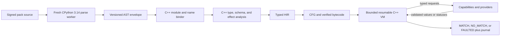

# Authoring Language, Static Types, and Models

Status: normative for `design-v1`\
Owners: compiler lane (`C1`, `C2`, `C3`) with integration ownership of the public API\
Related decisions: [ADR-003](../decisions/ADR-003-python-314-static-language.md), [ADR-001](../decisions/ADR-001-cpp-owns-semantics.md), [ADR-015](../decisions/ADR-015-runtime-data-labels.md)\
Known limitations: [L-002, L-003, L-004, L-011, L-014, L-016, L-017](../LIMITATIONS.md)

## 1. Purpose and goals

The authoring surface looks and type-checks like Python 3.14, while compilation and execution remain owned by C++. The design has five goals:

1. Give rule authors familiar control flow, types, classes, exceptions, generators, and structured async code.
2. Make every provider read, service, state operation, effect, and persistent value statically visible and capability-controlled.
3. Preserve pinned Python value and evaluation semantics where a construct is supported.
4. Reject valid-but-unsupported Python at compile time with stable diagnostics and exact source spans.
5. Produce canonical schemas and bytecode without importing or executing a rule/model module in CPython.

This document fixes the source-language contract. Runtime behavior for effects, services, state, correlations, and scans is refined in architecture documents 05 through 08; those APIs cannot weaken the language and type rules here.

## 2. Non-goals

- Running arbitrary Python bytecode, importing rule modules with CPython, or embedding a long-lived Python interpreter in the server.
- Supporting every Python standard-library module or dynamically discovering library behavior.
- Preserving Python implementation details such as object addresses, reference counts, hash values, frame objects, traceback objects, or garbage-collection timing.
- Supporting metaprogramming, runtime reflection, monkey-patching, native extensions, or dynamic module loading.
- Providing source compatibility with YARA or an automatic YARA-to-Python translation layer.
- Making Pyright authoritative. Pyright is an early authoring aid; the C++ compiler is the semantic authority.

## 3. Trust boundaries and owned data

| Actor | May provide | May decide or execute |
|---|---|---|
| Pack author | Signed source, static models, templates, bindings, declared generator inputs | Source declarations only; no runtime authority |
| CPython parse worker | A bounded serialization of the Python 3.14 AST | Parsing only; it never imports, compiles, or executes rule/model modules |
| C++ compiler | Diagnostics, descriptors, typed HIR, CFG, bytecode, capability requirements | All binding, typing, semantics, lowering, and validation |
| C++ VM | Evaluations over validated values and explicit capabilities | All rule control flow, match/fault decisions, budgets, and journals |
| Provider/agent | Typed eager fields, facts, scans, observations, and terminal statuses | Never receives a predicate and never determines a match |

The C++ compiler owns the meaning of every accepted AST node. A CPython AST node name is only a versioned parse interchange; it does not delegate semantic decisions to CPython.

## 4. Module form and public author API

### 4.1 Source layout and static top level

Pack modules live under `src/` and use normal dotted names. The top level may contain only:

- allowed imports;
- `type` aliases and type-variable declarations;
- statically constructible immutable constants annotated with `Final`;
- class, function, async-function, rule, template, and correlation declarations;
- static pattern declarations;
- concrete top-level `bind(...)` assignments;
- an `if TYPE_CHECKING:` block containing only allowed imports and declarations;
- module, class, function, and attribute docstrings.

No other top-level expression is executed. Calls used by supported decorators, `provider_fact`, `wire_field`, pattern constructors, and `bind` are compiler-recognized declarations, not Python calls. A top-level call to any other function is `PY-TOPLEVEL`.

Module imports are resolved statically and erased after compilation. Cyclic module imports are rejected rather than emulating partially initialized Python modules.

### 4.2 Declaration API

The following declaration names are exported from the root `rule_engine` stub. Their call shapes are normative; implementations are compiler intrinsics, not Python runtime functions.

```python
from collections.abc import Callable
from typing import Any, LiteralString, TypeVar

T = TypeVar("T")

class Model: ...
class WireRecord: ...
class EventRecord(WireRecord): ...
class StateRecord(WireRecord): ...

type Identity[T] = T
type Public[T] = T
type Internal[T] = T
type Sensitive[T] = T
type Secret[T] = T

def provider_fact(*, route: LiteralString) -> Any: ...
def wire_field(*, id: int, default: Any = ...) -> Any: ...
def schema(id: LiteralString) -> Callable[[type[T]], type[T]]: ...

def rule(
    id: LiteralString,
    *,
    budget: LiteralString | None = None,
    trace_policy: LiteralString | None = None,
) -> Callable[[Callable[..., bool]], Callable[..., bool]]: ...

def rule_template(
    id: LiteralString,
    *,
    budget: LiteralString | None = None,
    trace_policy: LiteralString | None = None,
) -> Callable[[Callable[..., bool]], Callable[..., bool]]: ...

def correlation(
    id: LiteralString,
    *,
    budget: LiteralString | None = None,
    trace_policy: LiteralString | None = None,
) -> Callable[[Callable[..., bool]], Callable[..., bool]]: ...

def correlation_template(
    id: LiteralString,
    *,
    budget: LiteralString | None = None,
    trace_policy: LiteralString | None = None,
) -> Callable[[Callable[..., bool]], Callable[..., bool]]: ...

def bind(template: Callable[..., bool], /, *, id: LiteralString, **arguments: Any) -> Any: ...
```

Rules and correlations must resolve to `bool`; helpers may return any supported type. An async entrypoint is annotated `-> bool`, not `-> Awaitable[bool]`, matching ordinary Python annotation syntax. `True` means MATCH, `False` means NO_MATCH, and an unrecovered exception or control fault means FAULTED.

Every reportable decorator and concrete binding has a nonempty explicit stable ID. IDs are UTF-8 reverse-DNS strings matching `[a-z0-9](?:[a-z0-9._-]{0,126}[a-z0-9])?`; comparison is byte-exact after NFC normalization. A binding ID is unique in the fully generated consumer pack. Template IDs are unique in their declaring pack. The compiler reports collisions before lowering.

`@correlation_template` and `bind(...)` use the same binding mechanism as rules. A library pack may export models, helpers, rule templates, and correlation templates, but never activates concrete reportable entrypoints by itself.

### 4.3 Representative source

```python
from enum import StrEnum
from typing import Final

from rule_engine import (
    Identity,
    Model,
    Sensitive,
    bind,
    provider_fact,
    rule_template,
)

MAX_UNSIGNED: Final[int] = 4

class TrustLevel(StrEnum):
    UNKNOWN = "unknown"
    TRUSTED = "trusted"

class Signer(Model):
    is_signed: bool
    trust: TrustLevel

class Section(Model):
    virtual_address: Identity[int]
    raw_data_offset: Identity[int]
    is_executable: bool

class Process(Model):
    """One stable process incarnation on one authenticated peer."""

    pid: Identity[int]
    """Operating-system process identifier."""

    creation_time: Identity[int]
    """Provider-defined process creation tick used to disambiguate PID reuse."""

    image_path: Sensitive[str]
    sections: list[Section]
    signer: Signer = provider_fact(route="process.signer")

    @property
    def is_system_image(self) -> bool:
        return self.image_path.casefold().startswith("c:\\windows\\")

@rule_template("com.acme.process.unsigned")
def unsigned_process(process: Process, threshold: int) -> bool:
    unsigned = 0
    for section in process.sections:
        if not section.is_executable:
            continue
        if not process.signer.is_signed:
            unsigned += 1
        if unsigned >= threshold:
            return True
    return False

UNSIGNED_SYSTEM = bind(
    unsigned_process,
    id="com.acme.process.unsigned.system",
    threshold=MAX_UNSIGNED,
)
```

Class and field documentation is taken from normal class docstrings and a string-literal statement immediately following a field declaration. These attribute docstrings are stored in generated descriptors, Markdown, and IDE source lookup but have no runtime value.

## 5. Accepted and rejected Python syntax

The worker parses the complete CPython 3.14 grammar. The compiler then applies this closed allowlist.

### 5.1 Accepted statements

- `import` and `from ... import ...` under the import policy in section 9.
- `def`, `async def`, static `class`, and PEP 695 `type` declarations.
- `return`, `raise`, and `raise ... from ...`.
- Local assignment, annotated assignment, unpacking assignment, assignment expressions, augmented assignment, and deletion of locals/items/ordinary mutable-instance fields.
- `if`/`elif`/`else`, `match`/`case`, `for`, `async for`, `while`, `break`, `continue`, and `pass`.
- `with` and `async with` over statically typed modeled or engine context managers.
- `try`/`except`/`else`/`finally`, `except*`, and exception groups, following Python's restriction against mixing `except` and `except*` in one `try`.
- `assert`; `__debug__` is always `True` and the compiler never strips assertions.
- `nonlocal` for a statically resolved enclosing local binding.

All loops and iterator advancement are charged to the selected VM profile. Syntactic validity never exempts a loop from runtime bounds.

### 5.2 Accepted expressions

- Literal `None`, bool, arbitrary integer, binary64 float, string, and bytes values.
- Lists, tuples, dictionaries, sets, slices, ranges, starred unpacking, and comprehensions.
- Lambdas, conditional expressions, named expressions, calls, attributes, subscriptions, and all ordinary boolean/arithmetic/bitwise/comparison operators supported by the operand types.
- F-strings with statically supported format operations.
- `await`, `yield`, `yield from`, generator expressions, async comprehensions, and async generators under structured capability rules.
- Python structural patterns: literal, capture, wildcard, sequence, mapping, class, OR, and `as` patterns. Class patterns require a statically known accepted class.
- Zero-argument and explicit two-argument `super()` where the target MRO is statically known.

Evaluation order, short-circuit behavior, chained comparisons, call-argument evaluation, comprehension scope, exception cleanup, and `finally` precedence match pinned Python 3.14 semantics.

### 5.3 Rejected constructs

- `global`; mutable module globals; arbitrary top-level execution.
- Dynamic `exec`, `eval`, `compile`, `__import__`, import hooks, module mutation, and wildcard imports.
- Metaclasses, dynamic base expressions, `__bases__` changes, monkey-patching, arbitrary descriptors, and runtime class creation.
- `__getattribute__`, `__getattr__`, `__setattr__`, `__delattr__`, `__get__`, `__set__`, `__delete__`, `__init_subclass__`, `__class_getitem__`, `__mro_entries__`, `__prepare__`, `__new__`, and `__del__` user definitions.
- Frame/traceback/code/module objects, object IDs, weak references, garbage-collection controls, and reflection over members, annotations, MRO, globals, or locals.
- Detached event-loop tasks, task spawning outside an engine `TaskGroup`, ambient async I/O, and an awaitable that escapes its owning group/evaluation.
- Runtime ellipsis except in a Protocol/overload declaration body; t-strings in the initial release.
- User-defined decorators. The only accepted decorators are the rule-engine declarations, `property`, `staticmethod`, `classmethod`, `dataclass` with accepted arguments, enum bases, `typing.overload`, `typing.final`, and compiler-recognized fault/finalizer declarations.

Rejected valid syntax receives `PY-UNSUPPORTED` with the AST kind, source span, explanation, and a supported replacement when one exists. Syntax rejected by CPython receives `PY-SYNTAX` with CPython's location normalized to the original UTF-8 source.

## 6. Static classes, records, and object semantics

- Base classes are literal names resolved in the closed module graph. The compiler computes exact C3 MRO and rejects inconsistent MROs.
- Multiple inheritance is supported. A diamond inherits one declaration. Two unrelated bases defining the same field are an error unless the derived class explicitly overrides with the identical type and storage kind.
- Ordinary VM-local classes have fixed declared fields. `__init__` may assign those fields; later dynamic field creation is rejected.
- Models are immutable compiler-constructed records. They cannot define `__init__`, `__new__`, mutation dunders, or assign to `self` fields. Pure methods and properties may read fields and perform deterministic computation; they cannot access state, history, services, effects, or `await`.
- Supported descriptor forms are `property`, `staticmethod`, and `classmethod`. Their targets are statically bound and cannot be replaced.
- Supported user dunder families are construction (`__init__`), representation (`__repr__`, `__str__`, `__format__`), call/truth/hash/comparison, numeric/reflected/in-place operators, container access and iteration, and synchronous/asynchronous context-manager and iterator protocols. Any dunder outside the compiler's versioned `dunders.v1` descriptor is rejected.
- `@dataclass` implements pinned semantics for `init`, `repr`, `eq`, `order`, `frozen`, `kw_only`, `slots`, and `match_args`. `weakref_slot=True`, `unsafe_hash=True`, dynamic default factories, and inheritance requiring a generated layout conflict are rejected. A default factory must be a statically known pure zero-argument function.
- `Enum`, `IntEnum`, `StrEnum`, `Flag`, and `IntFlag` declarations are supported; functional/dynamic enum construction is rejected.
- Objects have no observable address or collection timing. `is` is supported only for singleton identity (`None`, enum members, and compiler singletons); arbitrary object-identity observation is rejected.

## 7. Type system

### 7.1 Types and inference

Supported types include:

- `None`, `bool`, arbitrary-precision `int`, binary64 `float`, `str`, and `bytes`;
- enum members and static classes;
- `list[T]`, fixed/variadic `tuple`, `dict[K, V]`, `set[T]`, `frozenset[T]`, `range`, and `slice`;
- `Iterable`, `Iterator`, `Generator`, `AsyncIterable`, `AsyncIterator`, `AsyncGenerator`, `Awaitable`, and engine task/capability types;
- unions using `|`, `Literal`, `Final`, `ClassVar`, `Self`, `Never`, `NoReturn`, and accepted `Annotated` engine metadata;
- records, models, functions, overload sets, static `Protocol`, and bounded/constrained scalar type variables.

Locals and private helpers infer types flow-sensitively. Public rules, templates, correlations, exported helpers, models, wire records, bindings, and capability boundaries require explicit annotations. Default arguments must be statically constructible and assignable to the annotation.

`Any` is permitted inside a helper, but it cannot cross a rule return, fact/provider, service, action, custom event, history, state, retention, capture, wire, or other persistence boundary. Accepted narrowing includes `is None`, literal/enum comparison, class and modeled `isinstance`, structural `match`, explicit validated record decoding, and an always-active `assert`. `typing.cast` changes only the static view and does not satisfy a trust-boundary runtime validation requirement.

### 7.2 Generics and protocols

- PEP 695 class/function/type-alias parameters and legacy scalar `TypeVar` are accepted when each variable is unconstrained, bounded, or has a finite constraint tuple.
- The compiler specializes generic helpers/templates at closed call sites and shares equivalent specializations. Recursive specialization must reach a finite fixed point under the compile budget.
- `Protocol` is structural and static only. `runtime_checkable`, runtime protocol tests, `ParamSpec`, and `TypeVarTuple` are rejected initially.
- `@overload` declarations must be adjacent, followed by exactly one implementation, and have nonoverlapping or order-resolvable parameter domains. Dispatch remains the implementation's ordinary runtime control flow; overloads do not create a hidden dynamic dispatcher.

### 7.3 Numeric, string, and container semantics

- `bool` is a subtype of `int`, as in Python. Integers are arbitrary precision and every size increase is heap charged.
- Floats are IEEE-754 binary64. The compiler preserves bit patterns for constants, including signed zero and overflow to infinity. Complex, `Decimal`, and `Fraction` are rejected.
- Python floor division, modulo, negative shifts, comparison, truthiness, slicing, and exception behavior are normative for supported operands.
- Unicode tables are generated from the exact bundled CPython Unicode data. Strings retain all Python code points, including escaped surrogate code points; source and wire encoding use the explicit WTF-8/canonical encoding defined by the compiler/value contract.
- Dictionaries retain insertion order. Set/frozenset iteration uses a collision-resistant per-evaluation seed captured for replay; authors must not rely on a stable cross-evaluation order.
- Mutable/cyclic values may exist in the VM. Crossing a provider, service, event, effect, state, history, or persistence boundary deep-validates and freezes the value; cycles fail with `BoundaryValidationError`.

### 7.4 Data labels

`Public[T]`, `Internal[T]`, `Sensitive[T]`, and `Secret[T]` are transparent to ordinary value operations but carry a compiler/runtime label. Unannotated source values default to `Internal`; literal constants default to `Public`. Provider and external schema descriptors may impose a higher label.

The VM joins labels from operands and the current control-dependency label. Sinks and persistence enforce operator ceilings. Only a named operator-bound transform with declared input/output labels can lower a label. A cast, copy, string formatting, hashing, or branch cannot declassify.

## 8. Model and wire-schema rules

### 8.1 Provider models

- `Identity[T]` marks an eager canonical identity component and is otherwise transparent to Python typing.
- Identity fields must be eager, nonoptional, immutable, and drawn from bool/int/str/bytes/enum or recursively fixed tuples of those types. Floats and mutable containers are forbidden.
- A nested provider model has at least one identity field. Built-in roots such as the authenticated peer contribute identity outside the model.
- A bare annotated field is eager enumeration payload. `field: T = provider_fact(route="literal.route")` is lazy and cannot be an identity.
- Provider routes are nonempty ASCII dotted identifiers, statically resolved against the operator/provider schema catalog. Route, subject type, result type, status set, and label must match exactly.
- Model descriptors use the declaring pack digest, module, qualified class name, field order/type/storage/identity/label, and method signature hashes. Documentation does not affect semantic schema hashes.

### 8.2 External wire records

- Every external service request/response, action/acknowledgement, custom event, and persisted state record subclasses the corresponding `WireRecord` family and has `@schema("stable.id")`.
- Every serialized field uses `wire_field(id=N, ...)`, where `N` is in `1..536870911`, excluding protobuf's reserved `19000..19999` range. IDs are unique and never reused within a schema lineage.
- A compatible revision may add an optional field with a default. Removing a field, changing its type/cardinality/meaning, making it required, or reusing its ID requires a new schema ID.
- The compiler creates canonical machine descriptors and schema hashes. Activation negotiates these hashes; runtime values are validated before entering the VM and before persistence/dispatch.
- Unknown fields are preserved in envelope storage and forwarding but are not exposed to a rule compiled against an older descriptor. This permits additive compatibility without dynamic reflection.

## 9. Imports and modeled libraries

### 9.1 Import resolution

Imports may target only:

1. modules under the current pack's `src/` root, using absolute or normal relative imports;
2. `rulepack_deps.<manifest_alias>.<module>`, resolved to the exact embedded content digest;
3. the versioned `rule_engine` declaration/runtime stubs;
4. symbols in the closed `stdlib.v1` catalog below.

`sys.path`, namespace packages, site customization, ambient `site-packages`, editable installs, import hooks, zip imports, and filesystem discovery do not exist. Dependency modules are namespaced by consumer and content digest internally, so two dependency versions cannot share module state. Library state is consumer-local unless an explicit shared engine capability is injected.

### 9.2 `stdlib.v1`

No Python module is implicitly available. The initial catalog is:

| Module | Accepted surface | Explicit exclusions |
|---|---|---|
| `typing`, `collections.abc` | Static types listed in section 7, `TYPE_CHECKING`, `overload`, `final`, `cast`, `assert_type`, `assert_never` | Runtime type introspection, `runtime_checkable`, `get_type_hints`, `get_origin`, `get_args` |
| `dataclasses` | `dataclass`, `field`, `replace`, generated comparison/representation | Runtime field reflection, `make_dataclass`, unsafe hashes, weak references |
| `enum` | Static `Enum`, `IntEnum`, `StrEnum`, `Flag`, `IntFlag`, `auto` | Functional enum creation and member mutation |
| `math` | All documented public constants and pure numeric functions in CPython 3.14 | No platform extension names |
| `statistics` | `mean`, `fmean`, `geometric_mean`, `harmonic_mean`, median family, `mode`, `multimode`, `quantiles`, variance/deviation/covariance/correlation/linear-regression functions, `NormalDist` | `kde_random` and ambient randomness |
| `collections` | `deque`, `Counter`, `defaultdict`, `ChainMap`, `OrderedDict` | Dynamic `namedtuple`; use a static dataclass/record |
| `itertools` | Documented iterator constructors/combinators | None; infinite iterators remain VM-budget bounded and `tee` storage is heap charged |
| `functools` | `reduce`, `partial`, `total_ordering` | Caches, dynamic dispatch, wrapper/reflection helpers, cached properties |
| `operator` | Arithmetic, comparison, truth, sequence, `index`, `length_hint`, `itemgetter` | `attrgetter` and `methodcaller` reflection |
| `base64`, `binascii` | Documented in-memory encode/decode/checksum functions | Legacy file interfaces and command-line behavior |
| `hashlib` | Fixed guaranteed SHA/MD5/BLAKE constructors, hash objects, fixed-literal `new` | `file_digest`, platform-only algorithms, provider enumeration |
| `hmac` | `HMAC`, `new`, `digest`, `compare_digest` | None |
| `ipaddress` | Address/network/interface constructors, classes, and pure properties | None |
| `json` | `loads`/`dumps` over supported values with standard scalar/container options | File APIs, hooks, custom encoder/decoder classes, NaN when canonical boundary output is required |
| `struct` | `calcsize`, pack/unpack variants, `iter_unpack`, `Struct` | Native pointer format and platform-dependent modes |
| `urllib.parse` | Pure split/join/quote/unquote/query functions with pinned scheme tables | Environment- or registry-derived scheme changes |
| `pathlib` | `PurePath`, `PurePosixPath`, `PureWindowsPath` | Concrete filesystem paths and all I/O methods |
| `datetime` | Value construction, parsing/formatting, arithmetic, `timedelta`, and fixed-offset `timezone` | Current clock, local timezone, ambient zone database; timestamps require an explicit value and timezone |

Python `re` is not aliased or partially emulated. Regex source uses the explicit RE2 engine API, so unsupported backreferences/lookbehind receive dialect-specific diagnostics.

The catalog is a generated, versioned compiler descriptor. A new symbol or semantic change requires an engine API/profile version, C++ implementation, resource-cost model, differential tests, and documentation update.

## 10. Compilation and runtime flow



Core invariants:

1. Rule/model module code is never run by CPython.
2. Every call target, field, import, capability, effect, and boundary type is resolved before activation.
3. Every bytecode instruction is verifier-approved and source-mapped.
4. Runtime trust boundaries deep-validate against the compiled descriptor even when static typing proved the producer side.
5. Python left-to-right and short-circuit evaluation determines logical fact reads and effects.

## 11. Failure modes and diagnostics

| Code family | Condition | Result |
|---|---|---|
| `PY-SYNTAX` | CPython grammar failure | Pack compilation fails with normalized span and message |
| `PY-UNSUPPORTED` | Valid AST outside the closed subset | Pack compilation fails with construct and replacement guidance |
| `PY-TOPLEVEL` | Executable or mutable module-level behavior | Pack compilation fails |
| `PY-IMPORT` | Missing, cyclic, wildcard, dynamic, ambient, or unapproved import | Pack compilation fails with resolution chain |
| `PY-TYPE` | Assignment/call/return/operator or generic mismatch | Pack compilation fails with expected/actual types |
| `PY-ANY-BOUNDARY` | Unnarrowed `Any` crosses a trust/public boundary | Pack compilation fails at the boundary |
| `PY-MODEL` | Invalid field, mutation, route, inheritance, or method | Pack compilation fails with descriptor context |
| `PY-IDENTITY` | Missing, duplicate, optional, mutable, or lazy identity | Pack compilation fails |
| `PY-SCHEMA` | Missing/invalid/reused field ID or incompatible schema | Pack staging fails before activation |
| `PY-CAPABILITY` | Missing required operator binding or invalid optional use | Atomic activation fails cluster-wide |
| `PY-LIMIT` | Source, AST, type-specialization, descriptor, or bytecode cap | Compilation fails with limit name/current/max |

Terminal provider/service/history/state failures become typed runtime exceptions only after the pack has compiled. Unrecovered exceptions produce FAULTED, never a false MATCH/NO_MATCH.

## 12. Reasoning and alternatives

- **Pinned full grammar plus a static subset:** Authors receive normal tooling and precise grammar errors without committing to unsafe/dynamic semantics. A custom parser would drift from Python; executing CPython bytecode would surrender semantics, budgets, replay, and capability ownership.
- **Public annotations with local inference:** Explicit boundaries make generated schemas and distributed validation reviewable. Requiring annotations on every local would add noise; inferring public APIs would create unstable contracts.
- **Static models in Python:** Model definitions stay beside rule source and support source lookup/docstrings. TOML/protobuf-only schemas would split the author experience; arbitrary Python classes would reintroduce construction and reflection ambiguity.
- **Closed modeled library catalog:** C++ can assign deterministic semantics and costs. Shipping the full stdlib would expose ambient I/O, platform variance, native code, and unbounded behavior.
- **Restricted generics and classes:** Scalar specialization, static Protocols, C3 MRO, and selected dunders cover reusable algorithms while retaining a finite compiler/runtime model. Metaclasses and variadic parameter packs were rejected because they expand or mutate the type/call graph dynamically.
- **RE2 rather than Python `re`:** Bounded-time matching is more important than regex source compatibility.
- **No YARA translator:** A translator would either silently change behavior or perpetuate two semantic contracts during a clean break.

## 13. Consequences and known limitations

Positive consequences:

- Familiar source syntax and existing editor/type-checking support.
- A single C++ semantic authority and auditable provider/effect surface.
- Deterministic schemas, source lookup, cross-platform semantic hashes, and replay.
- Precise rejection instead of best-effort execution.

Negative consequences and limitations:

- Valid Python outside the documented subset does not compile.
- The modeled stdlib is intentionally smaller than CPython's library and may lag new Python APIs.
- Set iteration is replayable within an evaluation but not stable between evaluations.
- Conservative control-flow labeling may reject safe-looking output until an approved declassifier is used.
- Cyclic objects cannot cross canonical boundaries.
- There is no custom LSP or YARA migration tool in the first release.
- Deep or highly specialized valid programs can hit compile/VM limits.

The canonical impacts, mitigations, telemetry, and revisit conditions are maintained in `LIMITATIONS.md`; a compiler-lane task cannot close until new limitations are added there.

## 14. Observability and generated artifacts

- `rule_engine_check --pack` emits text, JSON, or SARIF diagnostics with stable code, pack/module, UTF-8 byte span, related spans, type details, and remediation.
- `--explain-facts` lists eager/lazy fields, routes, estimated costs, logical suspension sites, and physical prefetch choices.
- Pack tooling generates PEP 561 stubs, binding factories, model/wire Markdown, machine descriptors, import graphs, capability requirements, and source maps.
- Metrics count diagnostic families, unsupported AST nodes, compiler phases/limits, schema mismatches, and specialization size without logging protected source values.
- Activated artifacts record source digest, compiler/engine API, Python/Unicode version, semantic hash, binding hash, schema hashes, and required capability hashes.

## 15. Required tests and acceptance criteria

Tasks `C1`, `C2`, and `C3` are complete only when all of the following pass:

- A golden parse/decoder fixture for every CPython 3.14 AST node, including exact locations, type comments, arbitrary integers, float bits, bytes, Unicode, and escaped surrogates.
- Positive and negative tests for every syntax row, decorator, dunder family, import class, annotation rule, model rule, and diagnostic family in this document.
- Differential CPython 3.14 tests for supported numeric, Unicode, formatting, collection, comprehension, closure, exception/finally, class/MRO/super, generator, async, and pattern-matching behavior.
- Property tests for arbitrary integers, slicing, dictionary order, set hashing/replay, generic specialization, schema canonicalization, and label joins.
- Proof tests that importing/parsing a rule module never executes top-level code and that ambient `sys.path`/site packages cannot affect resolution.
- Schema compatibility tests for additive optional fields, unknown-field preservation, all incompatible changes, identity validation, and cluster schema-hash negotiation.
- Byte-identical compiler output and platform-independent semantic hashes on supported Windows and Linux builds.
- Fuzzing of AST envelope decoding, type expressions, descriptors, imports, and bytecode verification under all documented caps.
- Generated stubs pass Pyright for positive fixtures; the C++ compiler remains authoritative for negative and engine-specific cases.

Acceptance evidence is linked from `TRACEABILITY.md` to tasks `C1`–`C3`, `PK3`, `O1`, `I2`, and final gate `Q1`.
