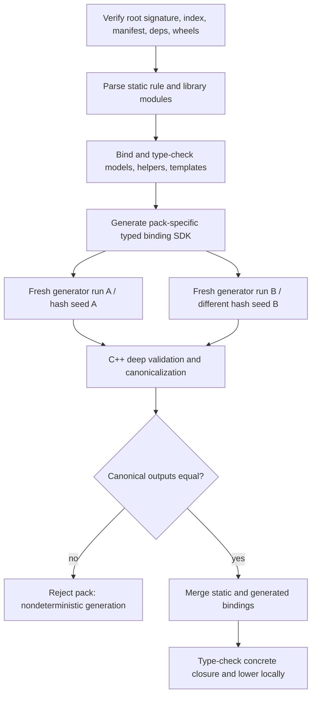
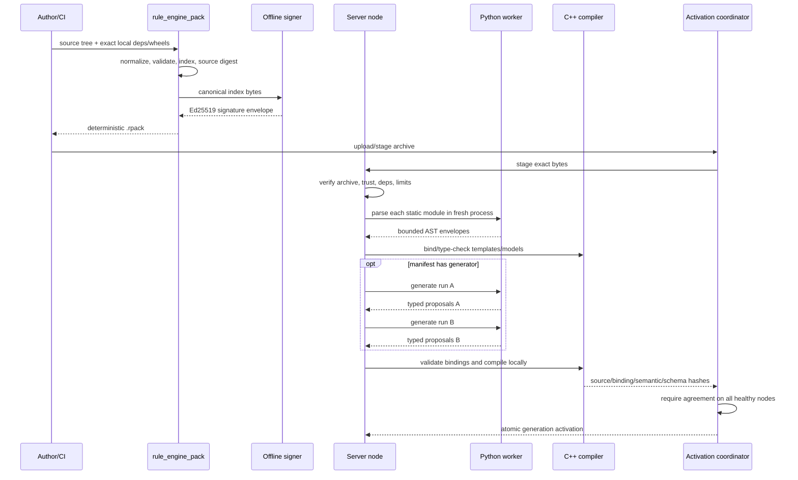

# Rule Packs, Signatures, Generators, and the Private Python Worker

Status: normative for `design-v1`\
Owners: packaging lane (`PK1`, `PK2`, `PK3`) with compiler integration (`C1`, `C2`)\
Related decisions: [ADR-005](../decisions/ADR-005-source-only-signed-rulepacks.md), [ADR-017](../decisions/ADR-017-short-lived-python-worker.md), [ADR-002](../decisions/ADR-002-trusted-signed-pack-boundary.md), [ADR-003](../decisions/ADR-003-python-314-static-language.md)\
Known limitations: [L-001, L-004, L-005, L-012, L-016](../LIMITATIONS.md)

## 1. Purpose and goals

This subsystem turns a reviewable source tree into a deterministic signed `.rpack`, verifies it without executing source, converts Python source to a versioned AST envelope in an isolated process, optionally runs a trusted binding generator twice, and hands canonical source plus bindings to the C++ compiler.

Goals:

1. A source tree, dependency closure, toolchain version, and signing key produce byte-identical archives.
2. The signer-independent source digest identifies content regardless of signature/key rotation.
3. Production accepts only operator-trusted Ed25519 provenance and exact embedded dependencies.
4. Rule/model parsing cannot crash or contaminate the resident server process.
5. Rule/model modules are never imported or executed by CPython.
6. Generator output is typed, bounded, provenance-tracked, locally reproducible, and compared across fresh runs/nodes.
7. Neither parsing nor generation depends on system Python, user packages, the registry, `PATH`, locale, or working directory.

## 2. Non-goals

- Treating a signed malicious generator as safely sandboxed. Pack provenance is a trust boundary; process controls are availability and determinism defenses.
- Shipping precompiled HIR/bytecode or accepting compiler output produced by another node.
- Resolving dependency version ranges, downloading dependencies at activation, or consulting a live package registry.
- Supporting native Python wheels, `.pth` startup code, arbitrary console scripts, or ambient `site-packages`.
- Guaranteeing generator determinism mathematically. Fresh double execution is a detection and operational-validation mechanism.
- Reusing a CPython process across unrelated requests.
- Supporting a production unsigned-pack exception.

## 3. Actors, trust boundaries, and data ownership

| Actor | Trust/authority | Owned data |
|---|---|---|
| Pack builder | Developer/build tool; no production runtime authority | Canonicalizes files, resolves exact dependencies/wheels, creates index/archive |
| Ed25519 signer | Trusted according to operator policy | Signs the canonical root index; private key never enters the pack/server |
| Pack verifier | C++ production trust boundary | Paths, limits, entry digests, dependency closure, signatures, manifest, trust result |
| Parse worker | Disposable helper over trusted or not-yet-semantically-validated text | CPython AST serialization only |
| Generator worker | Disposable helper executing already verified trusted generator source | Typed binding proposals from declared inputs |
| C++ compiler | Sole semantic authority | Validates AST, generator bindings, schemas, capabilities, and produces local IR |
| Cluster activation coordinator | Operational authority | Requires all healthy nodes to compile and agree before generation cutover |

The root signature authenticates all archive payload bytes, including dependency archives, generator inputs, and wheels. C++ validates every nested format after authentication; a valid signature never waives format, type, size, capability, or schema checks.

## 4. `rulepack.toml` v1

The root archive contains exactly one `rulepack.toml`. Keys are case-sensitive. Unknown keys are rejected in format v1 so misspellings cannot silently change policy. SemVer strings are normalized but dependency resolution is digest-only.

```toml
format = 1

[pack]
id = "com.acme.endpoint-rules"
version = "2.1.0"
kind = "rules"                 # "rules" or "library"
engine_api = 1
python = "3.14.6"
entry_modules = ["acme.rules", "acme.correlations"]
budget_profile = "balanced.v1"
policy_profile = "endpoint-production.v1"

[generator]
module = "acme.generate"
callable = "generate"
lock = "generator.lock"

[generator.inputs.process_groups]
path = "inputs/process-groups.json"
format = "json"                # "json", "utf8", or "bytes"

[dependencies.common]
pack = "com.acme.rule-library"
digest = "sha256:8c39...64-lowercase-hex-digits"

[capabilities]
required = ["service.machine-fingerprint.v1", "post.siem.v2"]
optional = ["history.fleet.v1"]
```

Normative rules:

- `pack.id` and reportable IDs use the normalized reverse-DNS grammar defined in architecture 02.
- `pack.version` is metadata and diagnostics; it is not used to select code. Content identity uses the digest.
- `kind = "rules"` may contain concrete rules, correlations, static bindings, and an optional generator.
- `kind = "library"` may export models, records, helpers, rule templates, and correlation templates. It cannot declare concrete bindings, activate entrypoints, or define a generator.
- `engine_api` selects the exact authoring/descriptor/stdlib contract. There is no best-effort fallback.
- `python` must equal the bundled patch version, initially `3.14.6`.
- `entry_modules` is sorted and duplicate-free after NFC normalization. Libraries list exported root modules.
- Profile names select versioned operator/compiler descriptors; a pack may only reduce rule/binding limits below the operator ceiling.
- Presence of `[generator]` enables generation. `module` resolves only under `generator/`; `callable` names one ordinary `def generate(ctx)` function. The lock path is fixed at archive root in v1.
- Generator input aliases match `[a-z][a-z0-9_-]{0,62}`. Paths must be beneath `inputs/`, unique, and present in the signed index.
- Dependencies are exact aliases. `digest` is the dependency's signer-independent source digest, and the embedded pack's ID/kind/digest must match. Version ranges and optional dependencies are forbidden.
- Capability names are sorted/deduplicated by the builder and verified as literals. Missing required capabilities reject atomic activation; missing optional capabilities inject `None` consistently on every node.

State schema/migration and correlation/event declarations live in Python source and generated descriptors, not parallel TOML schemas.

## 5. Canonical `.rpack` format

### 5.1 Logical layout

```text
rulepack.toml
META-INF/index.json
META-INF/signature.json          # absent only for an explicit unsigned dev pack
src/<python package tree>.py
generator/<python package tree>.py
generator.lock
inputs/<declared immutable files>
deps/<64-hex-source-digest>.rpack
wheels/<64-hex-wheel-sha256>.whl
licenses/<pack-or-distribution>/<files>
```

Only paths reachable from the manifest, source import graph, generator lock, or license inventory are accepted. Extra executable-looking content, bytecode, native libraries, scripts, hidden path aliases, or undeclared generator inputs are rejected.

Dependency packs are complete canonical `.rpack` byte streams stored as ZIP-STORE payload entries. The verifier recursively verifies each distinct dependency digest once, requires `kind = "library"`, detects cycles before compilation, and mounts it in an internal content-addressed namespace. Maximum dependency depth is 16 and maximum distinct packs in one closure is 256; all expanded bytes count against the compile/deployment profile.

### 5.2 ZIP normalization

The physical archive is ZIP with these exact constraints:

- All entries use method STORE; encryption, data descriptors, ZIP64 when values fit classic ZIP, comments, extra fields, and directory entries are forbidden.
- Files appear in ascending unsigned UTF-8 byte order by normalized path.
- Paths are NFC UTF-8 with `/`, are relative, and contain no empty, `.`, `..`, drive, UNC, backslash, NUL, control, or leading/trailing-space segment.
- The builder rejects paths colliding under Unicode NFC plus Windows invariant case-folding, even on Linux.
- General-purpose UTF-8 flag is set; creator system and external attributes are fixed to regular read-only file metadata.
- DOS timestamp is `1980-01-01T00:00:00`; archive and entry comments are empty.
- Text source, TOML, JSON, and Markdown generated by the pack tool use UTF-8 without BOM and LF endings. Opaque `bytes` inputs and wheel/dependency bytes are not rewritten.
- CRC-32, uncompressed/compressed sizes, local headers, and central-directory headers must agree. A verifier never trusts central-directory sizes before bounded streaming validation.

These rules make archive bytes reproducible and remove platform path ambiguity.

### 5.3 Canonical index and source digest

`META-INF/index.json` is RFC 8785 JSON Canonicalization Scheme data with this shape:

```json
{
  "format": 1,
  "entries": [
    {
      "media_type": "text/x-python",
      "path": "src/acme/rules.py",
      "sha256": "<64 lowercase hex>",
      "size": 1234
    }
  ]
}
```

- `entries` includes every file except `META-INF/index.json` and `META-INF/signature.json`.
- Entries are in the same normalized path order as the archive.
- `media_type` comes from a closed v1 catalog and cannot change decoding semantics.
- SHA-256 is over the exact stored payload bytes after prescribed text normalization.
- The verifier reconstructs canonical index bytes from validated archive entries and requires byte equality with the stored index.

The signer-independent identity is:

```text
source_digest = sha256(
    "rule-engine-rpack-source-v1\0" || canonical_index_bytes
)
```

`SourceDigest` is written as `sha256:<64 lowercase hex>`. Signatures, trust policy, activation time, compiler output, and platform ABI do not change it.

### 5.4 Signature envelope and trust policy

`META-INF/signature.json` is canonical JSON:

```json
{
  "algorithm": "Ed25519",
  "key_id": "sha256:<sha256 of 32-byte raw public key>",
  "signature": "<base64url without padding of 64 signature bytes>",
  "version": 1
}
```

The signed bytes are exactly:

```text
"rule-engine-rpack-signature-v1\0" || canonical_index_bytes
```

The production trust store maps the full key ID to a public key, allowed pack-ID prefixes, optional validity interval, and revocation state. Verification requires algorithm/version, key-ID derivation, signature, pack-ID scope, and activation-time policy. The private key is accepted only by the offline/CI `rule_engine_pack sign` operation and is never copied into a server package.

Ed25519 and canonical input make a pack signed with the same key byte-reproducible. Key rotation changes archive bytes/signature but not `source_digest`.

Production rejects absent, unknown, expired, revoked, out-of-scope, or invalid signatures. An unsigned archive is accepted only when all of the following are true:

- the server is explicitly in development mode;
- the source is a local watched directory or local file;
- `allow_unsigned_packs = true` is set in the development server configuration;
- the trust result and every evaluation/audit record are visibly marked `UNSIGNED_DEV`;
- the generation cannot be promoted through the production activation API.

### 5.5 Validation order and limits

Verification is fail-closed in this order:

1. Bound total file size and parse the end/central directory without extraction.
2. Validate ZIP features, entry count, normalized paths, collisions, metadata, sizes, and CRCs while streaming.
3. Validate and reconstruct the canonical index; hash every payload.
4. Parse the signature envelope and apply trust policy.
5. Parse the strict manifest and prove every manifest path is indexed.
6. Recursively verify exact dependency archives and reject cycles/ID/digest/kind mismatches.
7. Validate source encodings, input formats, generator lock, wheel contents, and aggregate limits.
8. Return `VerifiedRulePack`; only this type may enter parsing/compilation/generation.

Initial hard limits are 16 MiB aggregate rule/model source, 1,000,000 AST nodes, 100,000 concrete bindings, 64 MiB generator inputs/arguments/output, 512 MiB worker memory, and 15 seconds worker elapsed time. Archive, dependency, entry-count, wheel, and expansion bounds are versioned deployment limits and are checked before allocation.

## 6. Exact dependencies and imports

The builder accepts only a local verified `.rpack` for each dependency alias. It records its `PackId` and `SourceDigest`, copies the canonical archive to `deps/<digest-hex>.rpack`, and never records a repository URL or version range.

Rule source imports dependency code only as:

```python
from rulepack_deps.common.models import SharedProcessModel
```

where `common` is the consumer manifest alias. The compiler internally qualifies a module by `(consumer source digest, alias, dependency digest, module)`. This prevents one consumer or dependency version from sharing Python module globals/state with another. The source closure compiles into the consumer's `CompiledPack`; there are no live pack-to-pack calls at evaluation time.

Diamond dependencies sharing the same digest are compiled once and aliased safely. Two digests for the same pack ID may coexist only through distinct aliases and cannot exchange state without an explicit operator-bound shared capability.

## 7. Generator wheels and lock file

Generator-only dependencies are stored in `wheels/` and declared by canonical `generator.lock` TOML:

```toml
format = 1

[[wheel]]
distribution = "acme-normalizer"
version = "1.4.2"
filename = "acme_normalizer-1.4.2-py3-none-any.whl"
sha256 = "<64 lowercase hex>"
path = "wheels/<same-sha256>.whl"
```

Requirements:

- Every wheel is exact, root-signature-covered, hash-pinned, and tagged only `py3-none-any`.
- Wheel ZIP paths receive the same traversal/collision checks as pack paths.
- Contents may be `.py`, typed metadata, ordinary package data, and `.dist-info` metadata only.
- Reject `.pyd`, `.so`, `.dll`, `.dylib`, object/archive files, executable bits, bytecode, `.pth`, `sitecustomize`, `usercustomize`, console scripts, entry-point loading, vendored executables, and undeclared dependency requirements.
- Distribution/package-name collisions with the private stdlib, `rule_engine_generator`, or another wheel are rejected.
- Rule/model modules cannot import wheel packages; wheels are visible only in generator mode.

The root signature supplies provenance for wheel bytes. A separate wheel signature scheme is unnecessary in v1; the hash and root signer are recorded in the audit.

## 8. Private CPython runtime

### 8.1 Pin and installation

The runtime is standard CPython `3.14.6`, bundled alongside the worker and selected by a build-time manifest:

- Windows official x64 embeddable runtime SHA-256: `df901e84a896ff1ee720ad03377e0c8d8c2244fda79808aeeaff6316df1cb75c`.
- Linux source archive SHA-256: `143b1dddefaec3bd2e21e3b839b34a2b7fb9842272883c576420d605e9f30c63`, built through the pinned relocatable x86-64 glibc 2.35+ recipe.

The dependency bootstrap verifies those hashes. The installed layout records Python version, cache tag, Unicode version, build recipe digest, platform ABI, and every runtime file digest. Patch upgrades create a new compiler/runtime ABI and force local recompilation. See the [CPython 3.14.6 release](https://www.python.org/downloads/release/python-3146/).

`rule_engine_python_worker` resolves its runtime from its signed installation manifest relative to its own executable. It configures isolated `PyConfig`: no environment, `PATH`, registry, current directory, user site, `PYTHONPATH`, `PYTHONHOME`, `site`, startup files, or bytecode writes. Failure to find or hash the exact private runtime is fatal; system Python is never a fallback.

### 8.2 Process lifecycle and containment

The server/tool launches a new worker for exactly one parse or one generator run:

```text
rule_engine_python_worker --mode=parse --protocol=1
rule_engine_python_worker --mode=generate --protocol=1
```

- stdin/stdout carry one framed protocol exchange; diagnostic stdout/stderr from generator code is captured separately and bounded to 64 KiB head-and-tail per stream.
- The worker starts in a fresh private temporary directory, holds no inherited handles/file descriptors except protocol pipes and required runtime files, and is killed as a process tree on timeout/cancellation.
- Windows assigns the process before user Python starts to a kill-on-close Job Object with active-process, memory, CPU, and child-process limits.
- Linux applies `RLIMIT_AS`, `RLIMIT_CPU`, `RLIMIT_NOFILE`, `RLIMIT_NPROC`, and core-dump disablement before Python initialization; production deployment also places it in an equivalent cgroup.
- A parent watchdog enforces wall time and protocol-output limits independently.
- Temporary material is scoped to the request, read-only where possible, and removed after handle closure. Crash leftovers are content-addressed/nonsecret and reclaimed on startup.

Python warns that sufficiently large/complex source can crash an interpreter through AST stack depth; the process boundary prevents that failure from terminating the resident server. See [`ast.parse`](https://docs.python.org/3.14/library/ast.html#ast.parse). Windows Job Objects provide resource limits and process-tree lifetime control; they are not claimed as an adversarial sandbox. See [Job Objects](https://learn.microsoft.com/en-us/windows/win32/procthread/job-objects).

## 9. Worker protocol and parse mode

### 9.1 Framing and scalar representation

Each message is `<u32 little-endian byte length><UTF-8 JSON payload>`. Maximum frame size is 256 MiB and is checked before allocation. The pinned private worker/compiler ABI uses a versioned canonical key order for every object, and the C++ decoder requires that exact order. Unknown, duplicate, missing, or out-of-order members fail closed. This removes parser ambiguity and makes the byte-for-byte worker output part of the reproducibility contract; a producer shape or ordering change must bump the worker/compiler ABI. Source-language and pack formats retain their independently specified canonicalization rules. Each request and response contains protocol version, mode, request ID, and runtime identity.

AST values never rely on JSON's numeric/string limitations:

- arbitrary integers: `{"$":"int","negative":false,"magnitude_be":"<base64url>"}` using minimal unsigned magnitude;
- floats: `{"$":"float64","bits":"<16 lowercase hex>"}`;
- bytes: `{"$":"bytes","base64":"<standard base64>"}`;
- Python strings that may contain escaped surrogate code points: `{"$":"str","wtf8_base64":"..."}`;
- `None` and bool use ordinary JSON null/bool;
- AST nodes use `{"$":"ast","kind":"...","fields":{...},"span":{...}}`.

### 9.2 Parse request and response

The parse request carries normalized logical source name, exact source digest, WTF-8/UTF-8 source bytes, mode `exec`, feature version `3.14`, `type_comments=true`, and `optimize=0`. The worker calls CPython's AST parser only; it does not call `compile`, import the module, or visit nodes semantically.

The success response contains:

- CPython version/cache tag/Unicode version and worker build identity;
- source digest;
- every node's concrete kind and every `_fields` member in declared order, including context/operator marker nodes, type comments, and type ignores;
- start/end line and CPython UTF-8 byte columns;
- a bounded token side table used only for precise source lookup and attribute docstrings.

The compiler rejects unknown/missing node kinds or fields. This intentionally catches CPython AST drift instead of silently discarding syntax.

A syntax failure returns structured class/message/location/end-location/text metadata. A worker crash, bad frame, version mismatch, timeout, memory/CPU breach, excessive AST/output, or protocol violation becomes a stable pack diagnostic and never falls back to in-process parsing.

## 10. Generator contract

### 10.1 Compilation order

Generation happens only after root/dependency verification and after the C++ compiler has parsed, bound, and type-checked all static source through template/model descriptor creation:



### 10.2 Generated API

For one pack run, the compiler creates an isolated `rule_engine_generator` package plus PEP 561 stubs. Its exact public API is:

```python
from typing import Literal

class GenerationContext:
    def bytes(self, name: str) -> bytes: ...
    def text(self, name: str) -> str: ...
    def json(self, name: str) -> object: ...
    def emit(self, binding: BindingSpec) -> None: ...

class BindingSpec: ...  # opaque; only generated factories construct it

# rule_engine_generator.bindings contains one typed factory per compiled template:
def unsigned_process(*, id: str, threshold: int) -> BindingSpec: ...
```

The generator entrypoint is exactly one synchronous function:

```python
from rule_engine_generator import GenerationContext
from rule_engine_generator.bindings import unsigned_process

def generate(ctx: GenerationContext) -> None:
    rows = ctx.json("process_groups")
    for row in rows:
        ctx.emit(unsigned_process(id=row["id"], threshold=row["threshold"]))
```

- Input access is by manifest alias, never by a filesystem path. `bytes`, `text`, and `json` require the declared matching format.
- `text` requires strict UTF-8; `json` uses a duplicate-key-rejecting parser and returns immutable JSON values with arbitrary integers and finite binary64 numbers. JSON NaN/infinity is rejected.
- Factory signatures exactly match template bindable parameters after static specialization. Capability-injected and runtime subject/event parameters are omitted.
- A factory result records the exact template fully qualified ID, typed argument tree, generated binding ID, and generator emit source span.
- `ctx.emit` preserves provenance but output semantics are canonicalized by binding ID, not emission order.
- A generator returns `None`. Returning another value, yielding, using async, or emitting after return is an error.

C++ treats all worker output as untrusted serialization despite signed source: it verifies the template exists, every argument is present/unique/assignable/bounded, the ID grammar and uniqueness, the declared binding limit, labels, and capability requirements. Forging a Python object cannot forge a valid canonical binding.

### 10.3 Environment and determinism controls

Each of the two runs uses:

- a fresh process and temporary directory;
- a distinct nonzero `PYTHONHASHSEED`, recorded in audit evidence;
- identical exact source, SDK, wheels, and immutable input bytes;
- isolated imports containing the bundled stdlib, generated SDK, generator tree, and locked pure-Python wheels only;
- fixed locale/encoding/timezone and no inherited environment;
- ordinary audit/import guards denying undeclared file access, sockets, subprocesses, dynamic native loading, bytecode writes, and ambient package discovery.

Those guards enforce the cooperative generator contract and improve reproducibility; they are not a security boundary against a malicious trusted signer.

Each run produces canonical binding records sorted by normalized binding ID. Canonical values use the `FrozenValue` encoding and include template identity and arguments but exclude incidental process IDs, timestamps, hash seed, temporary paths, and emission order. Duplicate IDs fail before comparison. Every byte of run A must equal run B. On mismatch, diagnostics report the first binding/field difference without disclosing values above the operator diagnostic-label ceiling.

Successful output is cached by:

```text
(root source digest,
 declared input digest set,
 dependency closure digest,
 wheel lock digest,
 Python runtime ABI,
 compiler/engine API,
 generator protocol,
 platform ABI)
```

The cache contains canonical validated binding data, never Python objects or compiled rule IR. Atomic cluster activation additionally compares the canonical binding hash and platform-independent semantic IR hash across every healthy node; a platform-sensitive generator therefore cannot activate.

## 11. End-to-end pack lifecycle



The activated executable identity combines source digest, compiler/engine API, Python/Unicode ABI, bytecode ABI, operator bindings, and platform ABI. `.rpack` never contains or authenticates local IR.

## 12. Invariants and failure recovery

1. Only `VerifiedRulePack` reaches parse/compile/generate code.
2. Authentication precedes generator execution.
3. Static rule/model source is parsed but never executed by CPython.
4. One worker serves one mode/request and is always disposable.
5. No system Python or ambient package fallback exists.
6. Dependencies are exact, embedded, acyclic, content-addressed, and compiled into the consumer.
7. Generator output is valid only after two fresh equal runs and C++ deep validation.
8. A cache hit is scoped to every semantic/runtime/platform input and is revalidated against current operator bindings.
9. A worker failure fails staging for that pack; it does not crash the resident server or retain a partial activation.
10. Cluster activation is all-healthy-node agreement; a node disagreement leaves the prior generation active.

Crash/timeout cleanup closes the Job/cgroup/process tree, discards partial frames/output/temp state, records a bounded diagnostic, and leaves the archive/cache immutable. Retry is an explicit new staging attempt, not an automatic loop inside one compilation.

## 13. Reasoning and rejected alternatives

- **Source-only packs instead of shipped IR:** Every node compiles with its own trusted compiler and checks semantic agreement. Shipping IR would require a stable public bytecode ABI, trust a producer compiler, and complicate cross-platform validation.
- **Deterministic archive plus content digest:** Operators can inspect/reproduce exact inputs, caches are safe to key, and signer rotation does not rename content. A mutable directory or ordinary nondeterministic ZIP would make audits and cluster comparisons ambiguous.
- **Ed25519 instead of hash-only or online fetching:** A digest proves integrity but not authorized provenance. Embedded signatures avoid an availability/security dependency on a registry at activation.
- **Exact embedded source dependencies instead of version ranges/live calls:** Compilation is hermetic and consumers cannot change when a registry moves. Live pack calls would create hidden state/capability/version coupling.
- **CPython's parser in a short-lived process instead of a new Python parser or an in-process interpreter:** It accepts the exact pinned grammar and source locations while isolating parser stack/memory failures. A custom parser would drift; in-process CPython could terminate or contaminate the server.
- **Private exact runtime instead of system Python:** Results and AST shape cannot depend on machine setup. The cost is larger artifacts and explicit patch upgrades.
- **Executed trusted generator plus double-run instead of arbitrary build scripts or a new declarative generator DSL:** Normal Python handles large binding data ergonomically, while typed factories, declared inputs, double-run comparison, and C++ validation constrain the result. Double-run is detection, not proof; a future declarative system remains possible.
- **No AppContainer/LPAC claim:** Signed generator provenance is the security boundary. Job Objects/rlimits address resource/lifetime failures. If packs become adversarial submissions, OS/container sandboxing must be designed separately rather than overstated now.
- **Pure-Python wheels only:** Native extensions bypass the reproducible/private runtime and expand the attack/ABI surface.

## 14. Consequences and known limitations

Positive consequences:

- Reproducible, inspectable, provenance-authenticated source and dependencies.
- Reliable server behavior even when CPython parsing/generation exits or exceeds resources.
- No machine-dependent Python resolution and no persistent interpreter state.
- Local compilation, cross-node semantic comparison, and precise generator provenance.

Costs and limitations:

- The bundled runtime and duplicate generator execution increase package size and staging latency.
- A malicious trusted generator remains outside the security guarantee.
- Two equal generator runs do not prove future or mathematical determinism.
- Very deep or large valid Python may be rejected by worker/AST limits.
- Python patch/Unicode upgrades invalidate compiler/runtime ABI caches.
- Dependency version ranges, online resolution, native wheels, and production unsigned packs are unavailable.
- Generator input must be captured into the signed pack; it cannot query live deployment state.
- Cross-platform output disagreement blocks activation even if each platform is locally repeatable.

See `LIMITATIONS.md` for impact, mitigation, observability, and revisit criteria. New limitations discovered in `PK1`–`PK3` must be recorded before merge.

## 15. Observability and operations

- `rule_engine_pack build` reports normalized entry/dependency/wheel counts, sizes, source digest, manifest identity, and reproducibility inputs.
- `rule_engine_pack sign` accepts an explicit key provider/path and emits only key ID and signature status; private material is never logged.
- `rule_engine_pack verify` performs the production validation sequence against an explicit trust store and supports machine-readable output.
- `rule_engine_pack inspect` shows manifest, canonical index, dependency graph, wheel lock, signer/trust result, source digest, and declared inputs without executing source.
- `rule_engine_pack stubs` emits the author and generated binding PEP 561 packages from verified descriptors.
- Worker metrics: launches by mode/outcome, elapsed/CPU/peak memory, AST nodes/frame bytes, killed limit, exit/signal/status, generator binding count/bytes, cache hit, and nondeterminism mismatch.
- Audit records include archive/source digest, signer/key/trust decision, dependency and wheel digests, exact Python/worker/compiler/platform identities, generator input and output hashes, both hash seeds, and cluster semantic/binding hashes.
- Logs never include private keys, undeclared file contents, generated argument values above the diagnostic label ceiling, or complete protected source by default.

## 16. Required tests and acceptance criteria

### `PK1` — archive, dependency, and signature

- Byte-identical pack output from shuffled input enumeration, different absolute roots, Windows/Linux builders, and CRLF/LF source trees.
- Golden byte-level ZIP/index/signature vectors and Ed25519 verification vectors.
- Tamper tests for every header/index/payload/signature field and trust-policy outcome.
- Traversal, absolute/UNC/drive/backslash, Unicode/case collision, duplicate, symlink, malformed ZIP, unsupported compression/encryption/extra/comment, CRC/size mismatch, ZIP bomb, recursion-depth, graph-cycle, and count/size-limit tests.
- Dependency ID/digest/kind/alias/diamond/two-version tests with no network access.
- Unsigned-dev acceptance only under all explicit dev conditions and production rejection in every form.

### `PK2` — private worker

- Launch succeeds with system Python absent and fails closed when a bundled runtime byte/version/manifest is changed.
- Hostile environment tests for `PATH`, registry, `PYTHON*`, user site, locale, cwd, startup customization, inherited handles, and bytecode writes.
- Golden AST envelopes for every 3.14 node/scalar/span/type-comment case and unknown-node/field version rejection.
- Syntax, invalid UTF/WTF-8, deep nesting, 16 MiB source, 1,000,000-node, frame/output, timeout, CPU, memory, child-process, crash, broken-pipe, cancellation, and concurrent-launch tests.
- Prove process-tree cleanup and that one request cannot observe a preceding worker's module/environment/temp state.
- Windows Job Object and Linux rlimit/cgroup integration coverage.

### `PK3` — generator and tools

- Positive generated SDK/Pyright and C++ validation tests for every bindable type, generic specialization, label, and dependency template.
- Wrong format/input alias, malformed JSON/UTF-8, forged/unknown template, missing/extra/wrong argument, duplicate/invalid ID, excessive binding/argument/output, exception, return/yield/async, stdout/stderr truncation, and worker-failure tests.
- Determinism tests for differing hash iteration, emission order, locale, environment, platform, temp roots, and wheel/import order; output differences reject staging with bounded diff diagnostics.
- Wheel traversal, tag, native code, `.pth`, bytecode, script, dependency, package collision, and hash tests.
- Cache-key invalidation tests for every listed component and proof cached output is revalidated.
- Multi-node Windows/Linux binding/semantic-hash agreement and disagreement-blocks-activation tests.
- Tool snapshot tests for build/sign/verify/inspect/stubs text and machine-readable output.

Final `Q1` acceptance additionally installs a clean server/tool package with no system Python on `PATH` and no Rust/Cargo installed, compiles the same signed source pack on Windows and Linux, and records identical platform-independent binding/semantic hashes.
