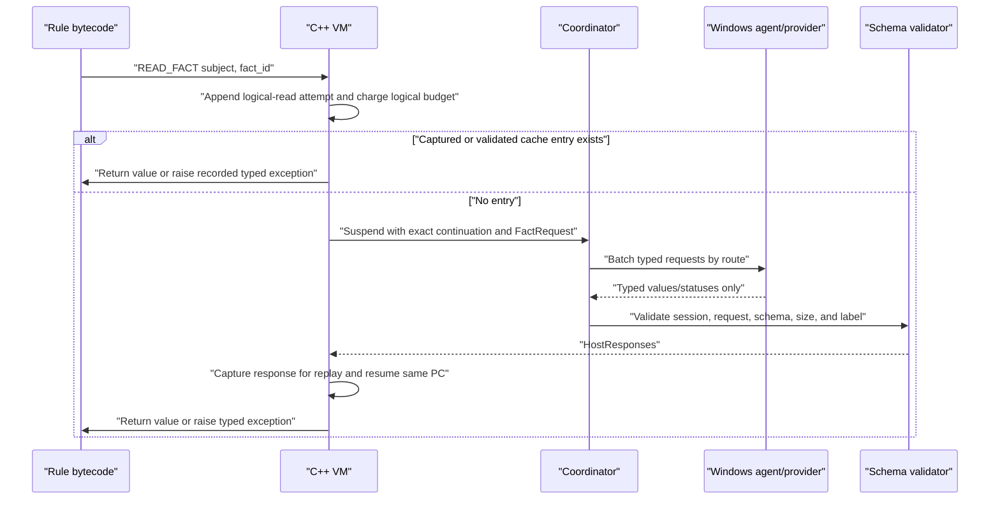

# Facts, Subjects, and Scanning

## 1. Purpose and goals

This subsystem turns an author-visible object property into a typed, auditable request for data without transferring rule semantics to an agent. It also defines the identity and lifecycle of every object on which a rule can run and replaces YARA patterns with bounded typed scan plans.

The goals are:

- make ordinary Python property access the only rule-facing fact-read syntax;
- preserve exact Python evaluation order, short-circuiting, exceptions, tracing, retention, and budgets across asynchronous fact resolution;
- give every process and nested object a stable, typed identity that is not confused by array reorder or PID reuse;
- make complete provider inventories atomic and explicitly reconcile additions, changes, and removals;
- support pull scheduling and sequenced push observations without treating either as authority to evaluate a rule;
- compile static literal, masked-byte, and RE2 patterns into bounded file or memory scan plans;
- validate all provider data before it enters the VM; and
- keep C++ solely responsible for MATCH, NO_MATCH, and FAULTED decisions.

Related decisions are [ADR-006](../decisions/ADR-006-typed-lazy-facts.md), [ADR-007](../decisions/ADR-007-hierarchical-subject-identities.md), and [ADR-016](../decisions/ADR-016-re2-scanning.md). Shared interfaces are frozen in [CONTRACTS.md](../CONTRACTS.md). Primary implementation tasks are C2, C3, V2, P1, P3, O1, and O2.

## 2. Non-goals

- Agents do not receive predicates, Python bytecode, rule entrypoints, effect policies, or permission to determine a verdict.
- A subject-key digest is not semantic identity and may not replace the canonical key on a public or persistence boundary.
- A pushed observation does not imply that unmentioned siblings were removed.
- A partial enumeration is never exposed as a complete inventory.
- Patterns cannot be constructed from runtime facts, service results, history, or state.
- The initial release does not provide a Linux provider agent, arbitrary address-space search, disassembly-aware patterns, YARA compatibility, Python `re` compatibility, or native code callbacks.
- Provider prefetch is not allowed to change observable rule behavior, even when it would reduce latency.

## 3. Trust boundaries and actors

| Actor | Owns | Must not own |
|---|---|---|
| Pack compiler | Model/scope/fact descriptors, pattern constants, purity and use certificates, source spans | Live provider values |
| Coordinator | Scheduling, request coalescing, provider rounds, deadlines, schema negotiation, snapshot transactions | Python language semantics |
| C++ VM | Logical access order, typed exceptions, verdicts, logical-read ledger, budgets, effects | Provider collection mechanism |
| Windows agent | Subject enumeration, fact collection, file/memory reads, bounded scan execution | Predicates, rule results, effects |
| Provider implementation | One declared route and its typed response/status | Arbitrary schema fields or other providers' authority |
| Runtime store | Durable inventories, observations/removals, event order, last-good snapshots | Fabricating provider facts |

All inbound values are untrusted protocol data even when the peer certificate is trusted. The server validates peer/session/fence, request, subject, route, schema hash, value type, classification ceiling, size, and response cardinality before constructing `FactValue` or `MatchSet`.

## 4. Public authoring and shared interfaces

### 4.1 Model descriptors

```python
class Process(Model):
    pid: Identity[int]
    creation_time: Identity[int]
    image_path: Sensitive[str]
    signer: Signer = provider_fact(
        route="process.signer",
        cache="subject_generation",
        cost="medium",
    )
```

The compiler emits a canonical `ScopeDescriptor` containing:

- stable `scope_schema_id`, descriptor version, and canonical descriptor hash;
- permitted parent scope, if any;
- ordered identity fields with numeric field IDs, exact value types, and schema-owned normalization;
- eager enumeration fields and their labels;
- lazy `FactDescriptor` values with stable fact ID, field path, type, provider route, cache lifetime, cost class, terminal-status allowlist, and data-label ceiling; and
- supported enumeration and scan-space capabilities.

Every `Identity[T]` field is mandatory, immutable, non-null, eager, and available before a `SubjectKey` can be created. An identity field cannot be a provider fact. Custom nested models use all of their `Identity[T]` fields, ordered by numeric field ID, as their canonical identity tuple.

### 4.2 SubjectKey

Conceptually, the public type is:

```text
SubjectKey = {
  peer_id: PeerId,
  scope_schema_id: SchemaId,
  identity: CanonicalIdentityTuple,
  parent: SubjectKey?,
}
```

Canonical identity elements are schema-typed bool, arbitrary integer, Unicode string, bytes, enum, or nested tuple values. Null, float, mutable containers, maps, records without an identity schema, and implementation pointer values are forbidden. Strings are NFC normalized; any further transformation, such as DLL case folding, belongs to the field descriptor and is applied before key construction. Integers use the canonical arbitrary-integer encoding and bytes compare byte-for-byte.

The built-in identities are exact:

| Scope | Canonical identity tuple |
|---|---|
| Process | `(peer_id, pid, creation_time)`; `peer_id` is carried by the root key and shown here to make reuse protection explicit |
| Memory region | `(allocation_base, base)` under its process |
| PE section | `(virtual_address, raw_data_offset)` under its image |
| PE import | `(normalized_dll, iat_rva)` under its image |
| PE export | `(ordinal,)` under its image |
| PE debug entry | `(type, address_of_raw_data, pointer_to_raw_data)` under its image |
| PE resource | `(tagged_type, tagged_name, language, rva)` under its image; numeric and textual tags remain distinct |
| PE certificate | `(file_offset,)` under its image |
| TLS callback | `(rva,)` under its image |
| Custom nested model | all declared `Identity[T]` values in numeric field-ID order |

Canonical serialization is versioned and length-delimited. A SHA-256 digest may be stored as an index accelerator, but equality, uniqueness, wire validation, audit output, and collision handling always use the complete canonical key.

### 4.3 Fact request and response

`IProviderDispatcher` accepts only:

```text
FactRequest {
  request_id, execution_id, peer_id, session_id, fence,
  subject_key, fact_id, route, expected_schema_hash,
  deadline, cancellation_token
}
```

Requests may be batched only when peer, session, route, deadline class, and negotiated schema permit it. Each result addresses one exact request and is either a validated value or one of these terminal statuses:

| Wire status | VM exception | Meaning |
|---|---|---|
| `not_found` | `FactNotFound` | The subject exists but the requested value does not. |
| `unsupported` | `FactUnsupported` | This peer/provider cannot resolve the declared fact. Required cluster-wide capabilities fail pack activation instead. |
| `access_denied` | `FactAccessDenied` | OS or policy refused access. |
| `timed_out` | `FactTimedOut` | The fact-specific deadline expired. |
| `unavailable` | `FactUnavailable` | A transient provider or subject-liveness failure occurred. |
| `canceled` | `FactCanceled` | The containing evaluation or provider request was canceled. |
| `malformed` | `FactMalformed` | The provider obtained data but could not form a descriptor-valid value. |

Unknown statuses, wrong types, mismatched subjects/requests/routes, over-limit payloads, duplicate results, invalid encodings, or non-negotiated descriptors are provider protocol faults. They do not enter the VM as author-catchable fabricated values. The affected request receives `FactProtocolViolation`, the peer/provider health signal is updated, and breaker accounting distinguishes this from an ordinary terminal fact status.

### 4.4 Scan authoring API

Patterns are immutable compiler constants or typed template/binding parameters:

```python
MZ = pattern.bytes(b"MZ")
POWERSHELL = pattern.text("powershell", encoding="utf-16-le", case="ascii_insensitive")
PROLOGUE = pattern.masked("48 8B ?? ?5 A? ??")
URL = pattern.regex(r"https?://[^\\s]+", dialect="re2", encoding="utf-8")

if process.image.file.scan(MZ):
    ...

for match in region.memory.scan(PROLOGUE):
    trace(match.offset, match.length, match.permissions)
```

Masked-byte tokens are exactly `HH`, `?H`, `H?`, or `??`, separated by ASCII whitespace, where `H` is a hexadecimal nibble. Regex flags are the explicit engine allowlist; unsupported RE2 syntax or flags fail compilation. The compiler validates encodings and materializes the encoded bytes in the pack artifact, so agents do not perform locale-dependent conversion.

`MatchSet` is immutable, complete, and deterministically ordered by `(offset, pattern_id, length)`. Each `Match` contains pattern ID, scan-space `SubjectKey`, zero-based space-relative offset, absolute address when meaningful, length, the permission snapshot, and optional bounded before/matched/after context. Context and match bytes inherit the scan-space data label.

If a complete `MatchSet` would exceed its count or byte budget, the read raises `ScanResultLimitExceeded`; no truncated set is presented as exact. The optimizer may issue an existential scan only when the compiled use certificate proves the program observes only truth/existence. That optimized result must be observationally identical to evaluating `bool(complete_match_set)` and cannot later be exposed as a `MatchSet`.

Built-in scan spaces are `process.image.file`, mapped image/section memory, and a readable memory-region subject's `memory` space. A scan plan fixes subject, space descriptor, bounds, pattern IDs, use mode, match/context bounds, deadline, and source span. The agent returns typed scan observations, never a rule verdict.

## 5. Control and data flow

### 5.1 Transparent fact suspension



`READ_FACT` is reached in Python's left-to-right evaluation order. It first appends a logical-read attempt, charges the logical fact budget, and consults the evaluation's captured input table and validated cache. A cache miss produces `waiting_for_facts`; the complete frame/register/exception/journal state remains in `VmSession`. A response resumes the same instruction, which commits one success or typed exception to the logical-read ledger exactly once.

Requests for the same `(execution, subject, fact_id, schema_hash)` may be physically coalesced. Every logical consumer retains its own source span, budget charge, and ledger entry. Cancellation is best effort at the provider but definitive in the VM: a late response cannot revive a canceled session.

### 5.2 Logical reads versus prefetch

The optimizer may prefetch only facts listed by a compiler certificate. Prefetch uses a separate operational quota and telemetry stream; it does not append to the logical-read ledger or charge logical fact/round/data budgets. A prefetched value/status remains quarantined in the coordinator until execution reaches the corresponding `READ_FACT`. At that point it is validated/adopted, charged, traced, retained, and—if a status—raised exactly as a demand response would be.

If control flow never reaches the read, the response is discarded or retained only in a schema-authorized provider cache. It cannot:

- raise a rule-visible exception;
- appear in traces, retention, replay inputs, or explanation of logical reads;
- affect effects, state, verdict, or fault/breaker accounting; or
- consume an evaluation's logical provider-round or data budget.

Operational metrics still count provider work and bytes, and a separate prefetch quota prevents speculative load from bypassing deployment controls. `rule_engine_check --explain-facts` reports logical routes and costs separately from proposed physical prefetch.

### 5.3 Subject discovery and nested scheduling

Every object collection is its own scope with an independently scheduled authoritative enumeration. A child can be scheduled only while its exact parent key is live. Removing a parent atomically closes all descendants; removal events are emitted in deterministic deepest-child/key order before the parent event so correlations never observe a live orphan.

For a rule targeting a nested model, the compiler identifies pure predicates whose inputs are exclusively the parent and hoists them ahead of child enumeration. Hoisting is legal only under an optimizer certificate proving identical facts, faults, traces, labels, budgets, and effects. Authors may make scheduling intent explicit with `discover_if=<pure helper>` on the rule/template declaration. The helper receives the immediate parent, may read eager or lazy parent facts, and may call deterministic pure helpers, but may not access children, state, history, services, effects, or async task groups. `False` suppresses enumeration for that binding; a typed failure produces a fault attributed to the binding and parent rather than silently skipping work.

### 5.4 Pull and push ingestion

- **Pull:** the coordinator schedules jittered inventories/facts from capability, cost, liveness, rule demand, and backpressure. Pull is the reconciliation authority.
- **Push observation/removal:** an agent may send a typed delta for one exact key to reduce latency. It never implies sibling completeness and is deduplicated by agent epoch and monotonically increasing message sequence.
- **Ordering:** an agent serializes deltas and snapshot frames per `(parent, scope descriptor)`. A snapshot commit states the source sequence through which it is authoritative; later sequenced deltas apply afterward.
- **Backpressure:** the server advertises bounded queue credit. The agent durably spools accepted outbound records and retransmits until cumulative acknowledgement.

## 6. Authoritative snapshot state machine

```mermaid
stateDiagram-v2
    [*] --> Idle
    Idle --> Staging: "Begin(snapshot_id, parent, scope, generation)"
    Staging --> Staging: "Ordered chunk + canonical items"
    Staging --> Rejected: "Gap, duplicate key, bad field/schema/limit"
    Staging --> Validating: "Commit(count, digest, through_sequence)"
    Validating --> Rejected: "Count/digest/generation mismatch"
    Validating --> Published: "One store transaction"
    Published --> Idle: "Emit additions, changes, removals"
    Rejected --> Idle: "Keep visible last-good inventory unchanged"
    Staging --> Idle: "Cancel/session loss; expose nothing"
```



`Begin` fixes peer/session/fence, exact parent, scope descriptor/hash, snapshot ID, strictly increasing generation, and limits. Chunks have contiguous indexes and carry descriptor-valid eager records. The server stages records outside the visible inventory, constructs every full `SubjectKey`, and rejects the entire snapshot for a missing identity, duplicate canonical key, invalid normalization, wrong parent/scope, chunk gap, count overflow, schema mismatch, or payload-limit violation.

`Commit` provides total count, digest of records sorted by canonical key, and source sequence watermark. Only a successful one-transaction commit:

1. compares the complete stage with the visible last-good inventory;
2. publishes additions and eager-field changes;
3. publishes explicit removals for keys absent from the complete new set;
4. stores the new last-good generation/digest; and
5. emits provider observation/removal events and audits.

On rejection, timeout, cancellation, or disconnect, staged data is discarded, visible state and the last-good comparison base stay unchanged, and no additions, updates, or removals are emitted. Root process inventory follows the same rules. An exact pushed removal can accelerate disappearance, but periodic authoritative reconciliation remains required and can restore an incorrectly removed live subject.

## 7. State, consistency, and invariants

1. A subject is equal only when its complete canonical key is equal; digest equality is insufficient.
2. PID reuse cannot alias a process because `creation_time` is mandatory.
3. Child identity is meaningful only beneath its exact live parent.
4. Identity fields never change. An identity change is removal plus addition.
5. Eager-field changes within a valid snapshot appear atomically with additions/removals.
6. At most one provider response is committed for one request ID.
7. One reached property access creates one logical result, even when physical requests are coalesced.
8. An unreached prefetched fact is unobservable to rule code and logical accounting.
9. A `MatchSet` is exact and complete or no value is returned.
10. Agents return typed facts/matches only; C++ computes every decision.
11. Required schema hashes and capabilities are negotiated before activation; runtime mismatches fail closed.

## 8. Failure modes and recovery

| Failure | Required behavior |
|---|---|
| Agent disconnect/session expiry | Cancel or re-lease pending work; ignore late results with stale session/fence; retain durable last-good inventory. |
| Provider terminal status | Resume at `READ_FACT` and raise its typed exception; normal Python/fault handling applies. |
| Protocol/schema violation | Reject response, audit provider fault, update health/quarantine signals, and return `FactProtocolViolation`; never deserialize into an unchecked VM value. |
| Snapshot interruption or invalid item | Reject whole snapshot and expose no partial change or inferred removal. |
| Parent disappears mid-child enumeration | Fence/cancel child stage; atomically close already visible descendants with parent removal. |
| Subject changes during memory/file scan | Return `ScanSubjectChanged` or `ScanUnavailable`; never combine fragments from different subject generations. |
| Scan access failure | Return typed access/timing/unavailable status and allow ordinary rule exception handling. |
| Match/result limit exceeded | Raise `ScanResultLimitExceeded`; do not expose a truncated exact-looking result. |
| Invalid scan offset/context/permissions | Treat as provider protocol violation and reject the entire scan result. |
| Prefetch arrives after branch bypass/cancel | Do not adopt it into the evaluation; cancel/discard or store only under provider-cache policy. |

## 9. Security and resource guarantees

- Schema negotiation prevents an agent from substituting a differently typed field or scope.
- Request and scan-plan IDs are unguessable within the session and bound to peer, fence, subject, route, and executable generation.
- The server checks all lengths and integer conversions before allocation or address arithmetic.
- Scan bounds must lie within the descriptor-authorized file extent or captured readable memory region. Offset-plus-length uses checked arithmetic.
- The agent reads no context outside the requested bounded window and returns no more context than the plan allows.
- Provider data retains the descriptor's classification ceiling; bytes and context can increase labels but never lower them.
- Fact, provider-round, response-byte, scan-byte, match-count, context-byte, snapshot-item, snapshot-byte, time, and cancellation limits are enforced on both sides where applicable.
- RE2 and literal/masked scanners are selected because matching work can be bounded without backtracking constructs.

## 10. Alternatives considered and reasoning

### Explicit `await fact(...)`

Rejected. It leaks transport mechanics into rules, makes ordinary models unnatural, and makes provider batching an author concern. A typed `READ_FACT` suspension preserves ordinary Python syntax while keeping C++ in control.

### Eagerly collect every fact

Rejected. It increases privileged reads, latency, bandwidth, data exposure, and failure surface even on short-circuited branches. Demand reads with certified prefetch preserve least-data behavior.

### Address subjects by path, array index, PID, or opaque string

Rejected. Paths and positions change, PID is reused, and opaque strings cannot be schema-validated. Hierarchical typed identity makes reconciliation and correlation deterministic.

### Apply enumeration chunks incrementally

Rejected. A disconnect or malformed final chunk would cause false removals and mixed generations. Stage-and-commit makes completeness an explicit precondition.

### Treat pushes as complete inventory

Rejected. Missing, reordered, or backpressured messages would imply false absence. Push deltas reduce latency; authoritative pulls reconcile completeness.

### Scan on the server

Rejected for remote process memory because it would require transferring large sensitive byte ranges and cannot reliably observe local address-space state. The agent executes a bounded typed plan, while server-side C++ retains rule semantics.

### Continue YARA, use Python `re`, `std::regex`, or PCRE-style backtracking

Rejected. YARA support is being removed, Python `re` is not executed by the VM, `std::regex` has unsuitable portability/complexity guarantees, and backtracking/backreference engines undermine bounded execution. RE2 provides a deliberately smaller, predictable dialect.

## 11. Consequences and tradeoffs

- Authors get natural typed access and precise fact exceptions, while VM/coordinator implementation becomes more sophisticated.
- Hierarchical keys cost more bytes than opaque identifiers but eliminate ambiguous reconciliation and collision dependence.
- Atomic snapshots require staging memory/storage and delay visibility until commit, but prevent false removal and partial generations.
- Demand reads minimize access, while strict logical-versus-physical accounting constrains aggressive prefetch.
- Agent-side scans avoid bulk data transfer but require strong plan/result validation and cannot eliminate live-memory races.
- Exact complete `MatchSet` semantics are easy to reason about, but very high match counts fault rather than return partial results.
- RE2 rejects familiar advanced regex features in exchange for bounded behavior.

## 12. Known limitations

- [L-006](../LIMITATIONS.md#l-006--platform-scope): no Linux provider agent initially; protected processes, privileges, and live-memory races limit Windows collection.
- [L-010](../LIMITATIONS.md#l-010--conservative-optimization): uncertain fact/fault/trace behavior can prevent prefetch or other optimizations.
- [L-011](../LIMITATIONS.md#l-011--re2-rather-than-python-regex): backreferences, lookbehind, and other Python-regex constructs are unavailable.
- A complete scan that exceeds the configured match/result budget faults rather than yielding a partial iterable.
- Authoritative inventory is current only as of its source-sequence watermark; later OS changes arrive as deltas or the next inventory.
- Stable identities depend on provider access to every required identity field. If an identity cannot be obtained, the whole containing snapshot is rejected.
- File and memory observations are not transactional with the operating system; subject-generation checks detect many races but cannot create an instantaneous global snapshot.

## 13. Observability and diagnostics

- Compiler diagnostics name unsupported patterns/encodings, illegal lazy identity fields, invalid scope ancestry, noncanonical identities, and unsafe `discover_if` functions.
- `rule_engine_check --explain-facts` shows source span, logical route, label, cache scope, cost, suspension point, hoisted discovery, and planned prefetch separately.
- Structured runtime logs and metrics include request latency/status/bytes by route, logical versus prefetched/adopted/discarded counts, batching/coalescing, validation failures, snapshot staging/commit/rejection reasons, inventory churn, push lag/spool depth, scan bytes/matches/duration, and typed exceptions.
- Audits record peer/session/fence, schema hash, parent/scope/generation, snapshot digest/count, additions/changes/removals, scan-plan identity, and protocol violations without logging Sensitive/Secret payloads.
- Flight recording includes only reached logical fact/scan reads. It records source, subject, fact/pattern, source type (captured/cache/demand/adopted prefetch), status, label, and bounded metadata, subject to recorder/data-label policy.

## 14. Required tests and acceptance criteria

### Schema and identity

- Round-trip every canonical identity type and built-in key on Windows/Linux; prove equality never relies on digest alone.
- Reject null/float/mutable/lazy/missing identity fields, wrong parent descriptors, normalization collisions, and duplicate keys.
- Prove process PID reuse creates a distinct key and parent removal closes all descendants deterministically.
- Verify descriptor and schema hashes match across operating systems.

### Facts and suspension

- Differentially test left-to-right and short-circuit access, cache hit/miss, physical coalescing, typed status catching, cancellation, late responses, replay capture, and exact-PC resume.
- Prove unreached prefetch never appears in logical budgets, traces, retention, faults, effects, state, or verdicts; prove adoption at a reached read behaves exactly like demand.
- Fuzz request/result codecs and reject every request/subject/route/schema/type/size mismatch before `FactValue` creation.

### Enumeration and ingestion

- Test valid empty/single/multi-chunk inventories and atomic additions/changes/removals.
- Interrupt or corrupt every stage; verify visible and last-good state is unchanged and no removal is inferred.
- Test duplicate identities, missing chunks, wrong count/digest/generation, reordered push messages, retransmission, source watermark, backpressure, and subsequent successful reconciliation.
- Exercise every built-in nested scope and custom `Identity[T]` model.

### Discovery

- Prove auto-hoisted predicates and explicit `discover_if` preserve facts, faults, traces, labels, budgets, and nested invocation sets.
- Reject child/state/history/service/effect/async access in `discover_if`.

### Scanning

- Golden-test every text encoding, case mode, masked nibble token, RE2 flag, invalid regex, and source diagnostic.
- Compare literal/masked/RE2 results across file, mapped image/section, and memory-region spaces.
- Validate deterministic ordering, permission/address metadata, bounded context, labels, zero-length/overlap policy, offsets, overflow, subject-generation races, access errors, cancellation, and limits.
- Prove existential specialization is used only when certified and is observationally equal to `bool(MatchSet)`.
- Fuzz scan plans/results and demonstrate that agents never receive a predicate or return a verdict.

Acceptance requires all tests above, protocol-provider integration against Windows agents and Windows/Linux servers, exact-versus-optimized parity, and zero live YARA pattern paths.

## 15. Traceability summary

| Requirement | Decision | Contract | Tasks | Gate |
|---|---|---|---|---|
| Transparent typed facts | ADR-006 | `FactDescriptor`, `IProviderDispatcher`, `VmSession::step` | C2, C3, V2, P1, P3 | Suspension/replay/parity suite |
| Stable nested identity | ADR-007 | `SubjectKey`, `ScopeDescriptor` | C2, P1, P3, S1 | Identity/snapshot/provider suite |
| Atomic inventories | ADR-007 | begin/chunk/commit provider contract | P1, P2, P3, S1 | Snapshot failure matrix |
| Least-data prefetch | ADR-006, ADR-014 | `OptimizationCertificate`, logical-read ledger | C3, V2, O1 | Exact/optimized observability parity |
| Bounded typed scanning | ADR-016 | scan request/result and `MatchSet` descriptors | C2, P3, O2 | Scanner golden/fuzz/integration suite |

