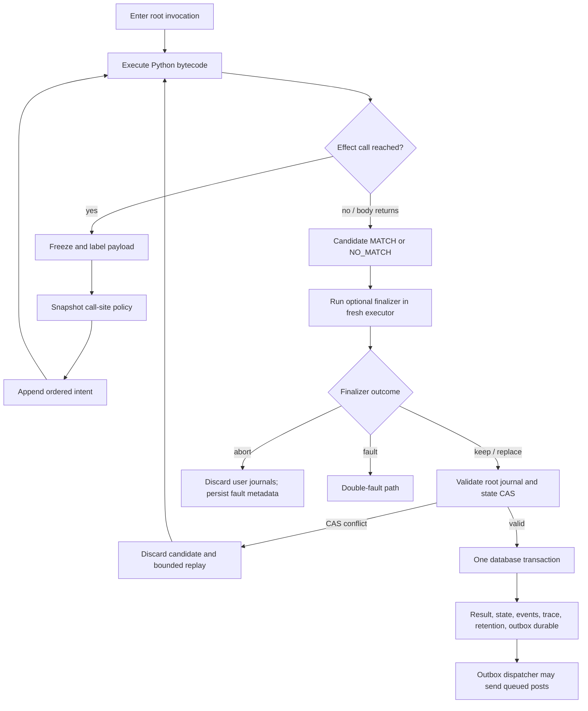
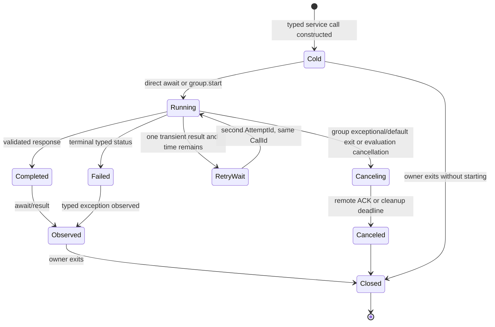
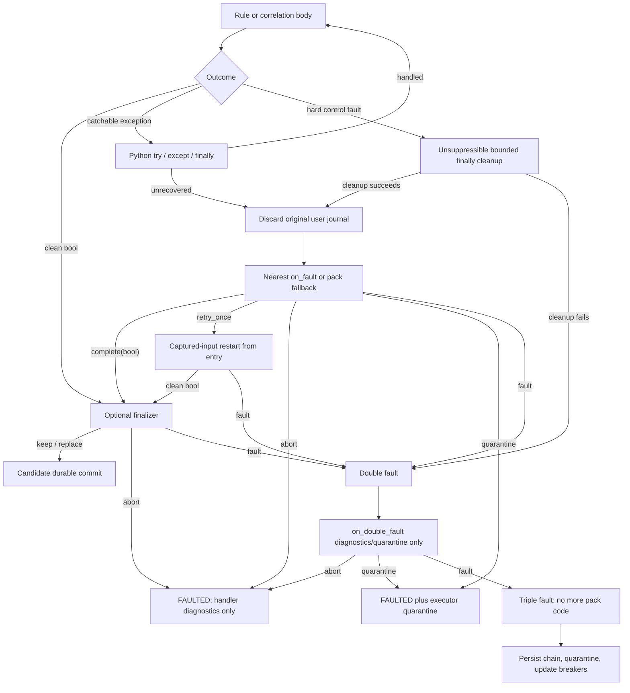

# Effects, Services, Faults, and Replay

Plan version: `design-v1`  
Status: normative architecture  
Primary task IDs: `V4`, `E1`, `E2`, `E3`, `R2`, `S2`, `O1`, `I1`, `Q1`  
Decisions: [ADR-008](../decisions/ADR-008-transactional-reach-effects.md), [ADR-009](../decisions/ADR-009-structured-async-capabilities.md), [ADR-015](../decisions/ADR-015-runtime-data-labels.md)

## 1. Purpose

This document defines the observable execution contract around a rule body: how reached operations become transactional intents, how read-only external services participate in structured async execution, how sensitive data is prevented from crossing unauthorized boundaries, how faults are recovered or quarantined, and how an evaluation can be replayed without repeating external side effects.

The design must preserve one central property: executing, optimizing, suspending, retrying, recovering, or replaying a rule cannot silently change the externally observable order or disposition of its effects.

### Goals

- Give Python authors imperative, left-to-right effect semantics without allowing partial external side effects.
- Commit state, rule results, emitted events, retention, traces, and action outbox rows atomically.
- Permit useful concurrent read-only service work without an ambient event loop or detached tasks.
- Preserve data classification through explicit and implicit flows and enforce it at every durable or external boundary.
- Separate ordinary Python exceptions, recoverable rule faults, hard VM control faults, handler failures, and engine integrity failures.
- Make state-conflict retry and diagnostic replay deterministic enough to audit and compare.
- Bound CPU, elapsed time, memory, external requests, history, state, effects, cleanup, and diagnostic recording.
- Provide enough structured telemetry to diagnose behavior without exposing protected payloads.

### Non-goals

- Exactly-once delivery to arbitrary external systems.
- Undoing an external side effect that was already acknowledged by its destination.
- Supporting `asyncio`, user-created event loops, threads, subprocesses, detached tasks, or arbitrary network clients.
- Treating data labels as encryption, identity authentication, or a replacement for operator access control.
- Resuming at an arbitrary fault site after `@on_fault`; ordinary local `try`/`except` is the only continuation mechanism.
- Replaying an evaluation against live external systems.
- Proving that an external service is semantically idempotent; it is an operator binding obligation.

## 2. Terms, ownership, and public contracts

### Terms

- **Logical evaluation:** one processing attempt for an input event and executable, including transparent MVCC retries and at most one rule-requested recovery retry.
- **Invocation:** one rule, child rule, correlation, finalizer, or fault-handler call within a logical evaluation.
- **Journal scope:** a node in the in-memory tree that owns state writes and ordered effect intents until it is merged or rolled back.
- **Intent:** an immutable proposal for an engine-managed effect. Creating an intent is observable to the VM and recorder but does not perform physical external I/O.
- **Dispatch:** physical delivery of a committed action outbox row.
- **Service query:** a typed read-only/idempotent request whose response is an input to the current evaluation.
- **Action/post:** a write-like external effect that can occur only after durable commit.
- **Primary fault:** an uncaught Python exception, typed engine exception, or unsuppressible VM control fault from the evaluated body.
- **Double fault:** failure of the finalizer, primary fault handler, or mandatory cleanup while handling a primary result/fault.
- **Triple fault:** failure of `@on_double_fault`; no more pack code runs.
- **Replay transcript:** the versioned set of executable identity, policy, deterministic seeds, requests, and captured responses needed to reproduce an evaluation without live side effects.

### Ownership

- `VmSession` owns frames, `PyValue` objects, the current program-counter label, task groups, logical-read ledger, recorder, capture broker, and journal tree.
- The root journal owns the candidate verdict, state overlay, ordered effect intents, child results, and finalizer/handler contributions until storage commit.
- `IRuntimeStore` atomically persists the evaluation result, state CAS, events, retention, trace material, audits, and outbox rows.
- The outbox dispatcher alone owns physical post delivery.
- `IExternalTransport` transports typed service requests and committed actions. It does not decide retry, policy, verdict, state, or effect disposition.
- Operator configuration owns capability bindings, sink policies, classification ceilings, budget profiles, recorder policy, emergency diagnostics, and breaker policy.

The cross-lane structural contracts are defined in `../CONTRACTS.md`. The behavior below is normative for implementations of `EffectIntent`, `EffectJournal`, `VmSession`, `IExternalTransport`, and `IRuntimeStore`.

## 3. System invariants

1. **Reach, do not match-gate.** An effect statement creates its intent exactly when Python execution reaches the call. Returning `False` does not remove an otherwise eligible intent.
2. **No physical action before database commit.** Evaluation can only create outbox rows. A transport send is never performed by the VM.
3. **Append order is semantic.** Each logical evaluation assigns monotonically increasing intent sequence numbers in VM execution order. Suspension and resumption do not renumber or duplicate them.
4. **Rollback is structural.** Discarding a journal scope discards all state writes and unmerged descendant intents from that scope. No compensating external action is needed because nothing was dispatched.
5. **Boundary freeze is eager.** An intent or service request deep-validates and freezes its argument at the call site. Subsequent mutation of the original `PyValue` cannot change it.
6. **Child ownership survives merge.** Merging a child journal changes eligibility, not the recorded `InvocationId`, `BindingId`, source span, or causation path.
7. **Policy can downgrade, never upgrade retroactively.** A call-site snapshot fixes the maximum eligibility of an intent. Later policy may suppress an eligible action for safety, but cannot turn a dry-run or suppressed intent into a dispatch.
8. **Service work is lexically owned.** Every hot service task belongs to exactly one live task group or the implicit direct-await scope. It cannot escape the evaluation.
9. **Labels only rise without authorized declassification.** Value and control labels are joined monotonically. Lowering a label requires a named, operator-bound transform that emits an audit record.
10. **Hard limits are not Python exceptions.** Pack code cannot catch, suppress, or return success after a hard control fault.
11. **Replay never dispatches or commits state.** Replay may reconstruct and compare a candidate journal; it cannot write an outbox row, mutate live state, retain new data, or contact a provider/service.
12. **Fault telemetry cannot expose payloads above its retention ceiling.** Engine-owned metadata survives; protected values are omitted or structurally redacted with their labels and provenance retained.

## 4. Journal and transaction architecture

### 4.1 Journal tree

The root invocation starts one root journal. Child-rule invocations and explicit `transaction()` contexts create child journal scopes. A scope contains:

- `ExecutionId`, `InvocationId`, owning `BindingId`, and optional parent invocation;
- its opening source span and monotonically allocated scope ID;
- a state-overlay checkpoint;
- an ordered list of `EffectIntent` references;
- child invocation results and ownership links;
- disposition `OPEN`, `ELIGIBLE_TO_MERGE`, `MERGED`, or `ROLLED_BACK`;
- the reason and source span for the final disposition.

Intent sequence numbers come from one evaluation-wide counter, not a per-scope counter. Merging therefore never changes global order.

### 4.2 Intent creation

When an effect API is reached, the VM performs these steps synchronously:

1. Verify that the effect kind is available to the active invocation and current recovery tier.
2. Deep-validate and freeze arguments as a labeled `FrozenValue`; a cycle or schema mismatch raises a typed, catchable boundary exception before an intent exists.
3. Join the payload label with the current program-counter label.
4. Snapshot call-site policy: sink/capability name, maximum classification/categories, dispatch ceiling, dry-run state, per-kind size/count limit, retention profile, and policy version.
5. Enforce the call-site ceiling. A normal author effect that exceeds it raises `DataPolicyViolation`; automatic recorder fields above their ceiling are structurally redacted instead of faulting the rule.
6. Allocate deterministic `IntentId` and evaluation-wide sequence number.
7. Append the immutable intent to the current scope and record `intent_created` in the flight recorder.
8. Return the typed receipt or handle required by the API.

An `IntentId` is derived from the logical `ExecutionId`, invocation/call-site identity, and dynamic ordinal. Transparent retries preserve it for the same logical call; discarded attempts never reach storage. If a refreshed state snapshot takes a different branch, newly reached call sites receive their own deterministic ordinals.

### 4.3 Explicit transactions

`with transaction() as tx:` checkpoints both the state overlay and effect journal. It defaults to rollback. `tx.commit()` marks the scope `ELIGIBLE_TO_MERGE`; it does not persist anything. A normal context exit merges it into its parent only if `commit()` was called. An exceptional exit always rolls it back, even if `commit()` was called earlier. `tx.rollback()` explicitly and irrevocably rolls it back.

A parent may discard any still-owned child scope before root finalization. A merged scope cannot be selectively removed except by rolling back an enclosing scope or the root.

### 4.4 Child rules

Calling a concrete child `@rule` creates a distinct bounded invocation and child journal:

- a clean `True` or `False` produces an owned child result and `MatchEvent` candidate, merges its journal into the enclosing scope, and returns the boolean;
- a recovered child resolved by `complete(bool)` is also a clean child result; only its handler/retry journal is eligible because its original faulting journal was discarded;
- an unrecovered child discards its user journal, records an engine-owned `FaultEvent` candidate, and raises `FaultedRule` in the parent;
- if the parent catches `FaultedRule`, it may continue, but the attempted child and its fault remain in the recorder and engine audit; user effects from the failed child never merge;
- if the parent does not catch it, normal parent fault processing begins.

Engine-owned fault/audit records are not user effects. They are included in the final input-event transaction even when the user journal is discarded, subject to metadata redaction policy.

### 4.5 Root finalization and durable commit

The body result is a candidate, not a commit. The optional finalizer receives a read-only view of the candidate verdict, journal summaries, state-write summaries, receipts, and recorder state. It runs in a fresh bounded executor and can enqueue permitted intents, await handler-safe read-only services, and return:

- `keep()` — retain the candidate verdict and journals;
- `replace(True | False)` — replace only the candidate verdict;
- `abort(reason)` — produce `FAULTED(FinalizerAborted)`, discard all user journals, and persist only engine fault/audit metadata.

If the finalizer raises or exhausts its dedicated limit, that is a double fault. A successful finalizer journal merges after the body journal, preserving sequence order.

After finalization, the coordinator calls the store once. One transaction validates state versions and commits the input cursor, result, eligible state overlay, emitted events, retention, trace publication, audit, and action outbox rows. Only a successful store commit changes intent dispositions from candidate to durable. An MVCC conflict discards the in-memory candidate and invokes the retry model in section 11.

## 5. Effect kinds and policy

### 5.1 Effect kinds

The first release supports these journaled effect classes:

| Effect | Durable representation | Physical behavior |
|---|---|---|
| User trace annotation | labeled trace record | none |
| Flight-record publication | bounded trace segments and metadata | none |
| `post` action | outbox row plus receipt | dispatcher sends after commit |
| `telemetry.emit(record)` | typed custom event | correlations consume after commit |
| `retention.retain(...)` | selected labeled retention records | store persists under profile |
| `retention.retain_reads(...)` | lexical logical-read selection | only logically reached reads retained |
| `PeerCapture` | deferred capture request | provider work creates future observations |
| Child `MatchEvent` | typed event with child ownership | correlations consume after commit |

Action-delivery outcomes are later stored as typed `ActionDeliveryEvent` records and never change the originating verdict.

### 5.2 Policy precedence

Effective policy is the monotone intersection of:

1. operator hard ceiling;
2. pack default;
3. rule or concrete-binding override;
4. dynamic enable/disable and lexical scopes;
5. journal/transaction disposition.

Lower levels may only reduce privileges, limits, publication, or dispatch eligibility. They cannot increase a higher-level ceiling.

Each intent stores the resolved call-site policy version. A later operator kill switch, revoked sink, certificate incident, or classification reduction may suppress physical delivery. No later change may upgrade `dry_run` or `suppressed` to `queued`.

### 5.3 Post receipts and outbox

`post.<sink>(record)` freezes its typed request and immediately returns an immutable receipt:

- `intent_id`;
- call-site disposition `queued`, `dry_run`, or `suppressed`;
- sink/schema IDs and policy version;
- no promise of successful delivery.

`queued` means eligible for durable outbox insertion if the enclosing journal commits. `dry_run` persists the intended action and audit without an outbox delivery row. `suppressed` records only policy-safe metadata. The receipt does not mutate after delivery; delivery state is observed through `ActionDeliveryEvent` or admin APIs.

The outbox provides durable at-least-once delivery with deterministic idempotency keys. Retry transport failures and HTTP-equivalent 408, 425, 429, and 5xx responses using `Retry-After` when valid and full jitter otherwise. Stop after 10 attempts or 24 hours from commit. Other 4xx outcomes and exhausted retries enter a dead-letter state. An operator redrive is a separately authorized action that preserves the original idempotency/causation identity and writes an audit event.

## 6. Flight recorder

### 6.1 Arming and publication

The recorder has two independent concepts: capture availability and publication.

- Operator, pack, and binding policy decide at evaluation start whether the recorder is **armed**.
- An armed recorder captures from the first instruction into a bounded in-memory buffer, even if publication is initially disabled.
- Dynamic `trace.enable()` or a lexical trace scope can request publication of already buffered history and subsequent selected ranges.
- `trace.disable()` stops automatic publication selection but cannot retract a range already selected. Capture continues while armed so a later enable can publish earlier buffered history if it remains within the bounded buffer.
- If the recorder was not armed at evaluation start, pack code cannot arm it retroactively. Trace annotations may still become ordinary journaled effects if policy permits, but missing automatic history cannot be reconstructed.

Full recording captures calls, arguments according to label policy, branches, returns, fact requests/status/source, service/history/state operations, tasks, effect creation/disposition, exceptions, handler transitions, optimizer choices, and budget counters.

### 6.2 Bounds and redaction

`balanced.v1` permits 25,000 events and 4 MiB. The recorder retains a deterministic head and tail plus a marker containing dropped event/byte counts and the dropped sequence interval. It never silently truncates.

Automatic events always retain non-sensitive structure: sequence, event kind, instruction/source span, type/schema, label, status, and causation. Values above the configured retention ceiling are replaced by typed redaction records containing label/category and a keyed digest when policy permits correlation. Secret material is never written to normal logs.

Because branch and effect events are observable when full recording is armed, optimizer shortcuts are disabled unless the compiler and optimizer prove recorder-equivalent output, including event order and budget counters.

## 7. Structured asynchronous service capabilities

### 7.1 Capability binding

Services are versioned read-only/idempotent operator capabilities. Pack activation fails atomically if a required capability is missing or its method/schema hash is incompatible. An optional annotated parameter `Service | None` receives `None` consistently on every active node when unbound.

Rule modules cannot open sockets or access an event loop. The operator binding maps a static service and method ID to an `IExternalTransport` endpoint, request/response schemas, classification ceilings, deadline/retry/cache policy, and handler-tier availability.

### 7.2 Cold call semantics

Calling a service method constructs a cold typed awaitable. At construction the VM validates and freezes arguments, checks the capability and data policy, and records no network activity. The request consumes scheduling/concurrency budget and receives a call ID only when:

- it is directly awaited; or
- its owning `TaskGroup.start(awaitable)` is reached.

Awaiting a cold call starts it and waits. Awaiting an already-started call joins the same result; it never sends a duplicate request. A completed call may be awaited again inside its owner scope and returns the same captured value or raises the same captured typed error.

### 7.3 Task-group ownership

Every hot task has exactly one lexical owner:

- direct `await call` uses an implicit one-call owner;
- `async with TaskGroup(on_exit=CANCEL_PENDING) as group:` creates an explicit owner;
- helper functions may create/return cold awaitables, store task handles in bounded VM containers, or start them only when the owning group is passed explicitly;
- a task handle, hot awaitable, or group cannot be stored in state, yielded across the group boundary, returned from the owning entrypoint, captured by a longer-lived generator, or passed into another group.

Normal group exit defaults to `CANCEL_PENDING`: completed results remain readable until exit; unfinished calls are canceled and bounded cleanup waits for transport acknowledgement or detachment. `WAIT_PENDING` explicitly waits for all started tasks, bounded by the original evaluation/call deadlines. Exceptional exit always cancels pending work regardless of `on_exit`.

Cancellation is best effort at the remote service but absolute locally: a late response cannot resume a closed group or alter its evaluation. Transport completion is keyed by `(ExecutionId, CallId, AttemptId)` and stale responses are discarded after audit-safe metadata recording.

### 7.4 Deadline, retry, cache, and completion order

- The evaluation elapsed deadline includes queueing, transport, retry delay, and cleanup; it never resets.
- A call deadline is the minimum of its declared timeout, `balanced.v1` 5-second maximum, and remaining evaluation time.
- Permit at most one retry for a transport failure or typed equivalent of 408, 425, 429, or 5xx, inside the original call deadline. Honor bounded `Retry-After`; otherwise use deterministic full jitter derived from the recorded evaluation seed.
- A retry uses a new `AttemptId` under the same `CallId` and idempotency key.
- There is no implicit cross-evaluation cache. An operator may bind an explicit bounded-TTL cache whose key includes method/schema, endpoint generation, normalized request, tenant, peer scope, and labels. Cache hits are captured and labeled exactly like service responses.
- APIs that preserve input order, such as gather, return in input order. APIs that observe completion order must record that order in the replay transcript.

Service statuses map to typed exceptions. A pack may catch them normally. A malformed schema, wrong call identity, oversized response, or non-idempotent binding claim is a provider/transport protocol fault and is also reported operationally.

## 8. Runtime data labels

### 8.1 Label model

Every boundary-capable value carries:

- confidentiality level `Public < Internal < Sensitive < Secret`;
- zero or more operator-defined category tags;
- bounded provenance sufficient to identify source fields/transforms without storing the protected value.

Model aliases such as `Sensitive[T]` are transparent to ordinary Python typing but produce schema and compiler label metadata. Provider/service/history/state values combine their schema label with the runtime envelope label.

### 8.2 Explicit and implicit propagation

The VM joins labels for arithmetic, comparison, formatting, slicing, hashing, container construction, attribute access, calls, returns, exceptions, yields, and awaits. Containers retain element/value labels and a structural label for length, key set, ordering, and shape.

The VM also maintains a program-counter (`pc`) label:

- a branch, match guard, loop condition, short-circuit decision, exception selector, iterator exhaustion result, or context-manager suppression result joins its label into the controlled region;
- CFG post-dominator metadata restores the prior `pc` label after the region;
- writes, returns, yielded values, raised exceptions, state keys/values, intent payloads, service requests, and event/history selection performed under the region join the current `pc` label;
- a `finally` block joins the labels of all incoming normal and exceptional paths.

This conservatively prevents a Secret predicate from leaking through a Public constant action. It can overclassify values; this is intentional and recorded as limitation L-014.

### 8.3 Boundary enforcement and declassification

At every service, state, event, retention, trace, post, capture, audit-payload, and persistence boundary:

1. deep-freeze and validate the value;
2. join the current `pc` label;
3. compare level/categories with the call-site and current operator ceilings;
4. reject, suppress, or redact according to the boundary contract;
5. persist the resulting label and policy version alongside accepted data.

Ordinary author calls that violate a declared boundary raise catchable `DataPolicyViolation` before an intent/request exists. Engine-owned diagnostics redact payloads rather than losing mandatory fault metadata. Physical outbox delivery rechecks current operator revocation and classification policy and may downgrade to suppression, never upgrade eligibility.

Only a statically named, operator-bound declassifier may lower a label. Its contract fixes accepted input schema/labels, output schema/labels, transformation version, and allowed caller bindings. Every invocation writes an audit event with input/output labels, transform ID, call site, and a protected digest; raw values appear only where the audit profile explicitly permits them.

Labels are information-flow metadata, not encryption. Transport encryption, database access control, tenant isolation, and operator authorization remain separate mandatory controls.

## 9. Exceptions, faults, and recovery

### 9.1 Exception classes

The runtime distinguishes:

- ordinary Python exceptions and typed catchable engine exceptions, including fact/service/history errors, soft-budget errors, `DataPolicyViolation`, and boundary validation errors;
- `FaultedRule`, raised to a parent when a concrete child ends unrecovered;
- hard VM control faults for deployment cancellation, elapsed/CPU/instruction/heap/frame/effect limits, verifier/integrity failure, and forced termination. These bypass Python `except` matching and cannot be converted into success;
- engine integrity faults, which quarantine the exact executor even before threshold-based breaker policy.

On a hard control fault, pending Python `finally` blocks receive the dedicated forced-cleanup budget. The control-fault token remains active before and after each block, so a `return`, caught exception, or nested control construct cannot suppress it. Cleanup effects remain in the original journal and are discarded. Cleanup failure or cleanup-budget exhaustion advances directly to double-fault handling.

### 9.2 Primary handler

After ordinary unwinding, an unrecovered primary fault discards the original user state/effect journal and resolves exactly one handler: the entrypoint's nearest `@on_fault`, otherwise the required pack fallback. Handlers never chain.

The handler runs asynchronously in a fresh executor with its own caps. It receives a frozen fault chain, safe recorder view, source/invocation context, and only operator-approved handler capabilities: read-only facts/history/services and selected diagnostic/event/post intents. It cannot mutate normal rule state, resume the failed frame, access arbitrary providers, or reuse hot tasks.

It returns one of:

- `retry_once()` — discard the failed execution state, preserve the normally returned handler journal as a candidate, and rerun the entrypoint from its first instruction through the captured-input broker;
- `complete(True | False)` — make that value the candidate result, preserve only the normally returned handler journal, then run the optional finalizer;
- `abort(reason)` — produce `FAULTED`, preserve the normally returned handler journal only if its intents are allowed for fault outcomes, and do not run the normal finalizer;
- `quarantine(reason)` — same as abort plus immediate exact-executor quarantine.

Only one `retry_once` is available per logical evaluation, including MVCC replays. A fault during the recovery retry does not invoke `@on_fault` again; it is a double fault.

### 9.3 Double and triple fault

Failure of the primary handler, normal finalizer, recovery retry, or mandatory cleanup forms a double-fault chain and discards every uncommitted user/handler/finalizer journal. `@on_double_fault` runs once in a fresh, smaller executor. It receives metadata and a redacted chain plus only bounded engine diagnostic and quarantine APIs; it cannot read general provider facts/history, call normal services, write state, retry, resume, or produce a match.

It may return `abort(reason)` or `quarantine(reason)`. Normally returned operator-authorized emergency diagnostic intents may be persisted in the engine fault transaction. If it fails or exceeds its limit, the result is a triple fault. No more pack code runs.

On triple fault, the server:

1. persists the redacted complete fault chain, budget snapshots, executable/peer IDs, recorder head/tail, and engine-integrity metadata;
2. suppresses all uncommitted pack actions; only engine-owned operator-authorized emergency diagnostics may be emitted;
3. quarantines the exact executable instance immediately;
4. updates the distributed breaker counters transactionally.

### 9.4 Distributed breakers

Breaker keys include the signed-source-derived `ExecutableId`, binding, peer, and fault class. Sliding-window updates use database ingest time and execute in the same durable fault transaction.

- Three triple faults for the same binding and peer within 10 minutes open a peer breaker for 30 minutes.
- At expiry, one fenced half-open probe may run. A clean completion closes the peer breaker; a triple fault reopens it for 30 minutes. Other nodes cannot concurrently probe.
- Five triple faults for the same binding across at least three distinct peers within 15 minutes open the global binding breaker.
- A global breaker remains open until an operator clears it or a different signed-source-derived `ExecutableId` activates. Policy-only changes do not reset it.
- Unrelated bindings and peers continue. Provider protocol faults maintain separate provider-health/quarantine counters and do not falsely count ordinary terminal fact statuses as code faults.

## 10. Resource budgets

Hard budget counters are checked at deterministic VM safepoints and before allocating/scheduling/appending. Charges occur before the operation so an exhausted operation does not partially mutate VM or journal state. The logical evaluation elapsed deadline and aggregate resource counters do not reset for state-conflict or rule-requested retries; handler/cleanup tiers receive only their explicitly separate caps.

### `balanced.v1`

| Resource | Normal evaluation limit |
|---|---:|
| elapsed time including waits and cleanup | 10 s |
| active VM CPU | 100 ms |
| bytecode instructions | 1,000,000 |
| frames | 128 |
| VM heap | 16 MiB |
| loop iterations plus yields | 250,000 |
| logical facts | 512 |
| provider rounds | 16 |
| fact response bytes | 16 MiB |
| service calls scheduled | 128 |
| service calls concurrently active | 16 |
| service response bytes | 16 MiB |
| maximum single service deadline | 5 s |
| history queries | 16 |
| history rows | 10,000 |
| history bytes | 16 MiB |
| state keys | 256 |
| combined state read/write bytes | 1 MiB |
| effect intents | 256 |
| frozen effect bytes | 2 MiB |
| recorder | 25,000 events / 4 MiB |

Recovery tiers:

| Tier | Instructions | Active/elapsed | Heap | Capabilities |
|---|---:|---:|---:|---|
| finalizer or `@on_fault` | 100,000 | 50 ms / 2 s | 2 MiB | up to 8 handler-safe services and 64 intents |
| `@on_double_fault` | 25,000 | bounded within 1 s | 512 KiB | diagnostics/quarantine only |
| forced `finally` cleanup | 25,000 | 500 ms elapsed | existing objects plus bounded emergency reserve | no new general capabilities |

Explicit author-created sub-budgets may raise catchable soft-budget exceptions. A profile change creates a new version; mutating `balanced.v1` in place is forbidden.

## 11. Replay and transparent retry

### 11.1 Capture broker

The capture broker assigns a canonical request key to every logical fact, service, history, deterministic-time, cache, and other external read. It records:

- executable, compiler, VM bytecode, schema, pack-generation, policy, operator-binding, and budget-profile identities;
- input event, tenant, peer/subject, occurrence/ingest timestamps, activation cursor, and causation;
- VM hash seed and deterministic jitter decisions;
- fact request/status/value/source and logical-read order;
- service request, attempts, cache decision, response/status, and observed completion order;
- history query plan and bounded ordered results;
- state key values and versions for each attempt;
- recorder policy and optimization certificate/plan;
- final candidate verdict, state diff, ordered journal, labels, and budget totals.

Captured payloads remain subject to retention and classification policy. Missing or purged protected values can make later diagnostic replay partial; metadata must say exactly which input is unavailable.

### 11.2 MVCC conflict retry

The first state CAS conflict discards the entire candidate journal and state overlay. The coordinator loads a fresh state snapshot and restarts the entrypoint. A second conflict permits one final restart; a third conflict produces `FAULTED(StateConflict)` and normal fault policy, for three attempts total.

Repeated canonical external requests use their first captured response. The external-input transcript is sealed after the original attempt. If refreshed state takes a new branch and requests an input not present in that transcript, the retry ends as `FAULTED(StateConflictReplayDiverged)` without contacting a provider, service, history store, cache, or clock. This prevents one logical evaluation from mixing observation epochs; a later ordinary event may evaluate again with fresh inputs.

The original elapsed deadline and aggregate normal-evaluation budgets continue across attempts. No discarded outbox row, event, retention selection, trace publication, or state write reaches storage.

### 11.3 Diagnostic and parity replay

Diagnostic replay requires the exact `ExecutableId`, bytecode/runtime ABI, schema hashes, policy snapshot, and retained input transcript. It performs no live provider, service, cache, history, time, or state access. Missing input produces `ReplayInputMissing` and an explicitly partial result; it never silently falls back to live data.

Replay runs with dispatch and durable mutation disabled. It may construct a candidate journal and trace for comparison. Exact-versus-optimized parity compares:

- result and fault chain;
- logical facts and statuses;
- service/history/state observations;
- ordered intent IDs, payload digests/labels, owners, policies, and dispositions;
- state diff and events;
- recorder events and truncation;
- budget counters and suspension points required by the observability contract.

A mismatch is an engine integrity fault, quarantines the optimized executable path, preserves the exact result when available, and emits an engine-owned audit. Replay never redrives an action. Operator redrive is a separate audited outbox operation.

## 12. Failure modes and recovery

| Failure | Required behavior | Durable evidence |
|---|---|---|
| Effect payload schema/cycle failure | Raise catchable boundary error before intent allocation | recorder diagnostic if armed |
| Effect classification violation | Raise `DataPolicyViolation`; no intent | policy ID, labels, call site without protected value |
| Store commit failure before commit | No visible state/effect; retry event under fenced lease | store/lease audit |
| Crash after commit before acknowledgement | Recover cursor/result/outbox idempotently; do not re-evaluate visibly | transaction ID and idempotency keys |
| Outbox transient failure | bounded retry | attempts and next deadline |
| Outbox terminal/exhausted failure | dead letter and emit delivery event | typed status and redacted ack |
| Service timeout/status | typed catchable exception; captured for replay | call/attempt/deadline/status |
| Service malformed response | reject before VM value; protocol-health fault | schema/call identity and endpoint generation |
| Task group exits with hot calls | cancel or bounded wait according to policy | call final states |
| Late task response | discard; never resume closed group | stale-response audit metadata |
| Hard evaluation limit | unsuppressible unwind, discard user journal, fault ladder | counter snapshot and source instruction |
| Handler/finalizer failure | double-fault path | complete redacted chain |
| Double-handler failure | triple fault, quarantine and breaker update | breaker event and recorder head/tail |
| MVCC conflict | discard candidate and bounded captured-input restart | state versions and attempt count |
| Replay input missing | explicitly partial/non-replayable; no live fallback | missing request key and retention reason |
| Exact/optimized mismatch | use exact result if available, quarantine optimized path | structured parity diff |

## 13. Security, consistency, and observability guarantees

### Security guarantees

- Pack code cannot directly dispatch an action or open a service transport.
- No action is eligible before atomic durable commit.
- Service and effect boundaries validate schemas, sizes, labels, capabilities, tenant/peer scope, and policy version.
- Handler tiers cannot regain capabilities denied to the body or escape their smaller limits.
- Recorder/log/audit output applies label-aware redaction before serialization.
- Task handles and mutable/cyclic values cannot cross persistence or invocation-lifetime boundaries.

### Consistency and ordering guarantees

- VM execution and intent creation are left-to-right according to supported Python semantics.
- Intents are totally ordered within one logical evaluation and retain child ownership.
- State and effects commit atomically with the event cursor/result.
- Actions are at-least-once after commit; service queries are captured inputs, not effects.
- Correlation and peer ordering are defined in `07-events-history-state-and-correlation.md` and `08-protocol-storage-and-cluster.md`; this design adds no global order.

### Required metrics, logs, and audits

- evaluation/fault/finalizer/double/triple counts and latency by executable/binding/peer with cardinality controls;
- journal intent counts/bytes by kind and final disposition;
- classification violations and redactions by policy/label/category without payload values;
- service scheduled/active/retry/cache/status/deadline/cancel/late-response metrics;
- outbox queued/retry/delivered/dead-letter age and attempts;
- recorder armed/published/truncated/redacted counts;
- state-conflict attempt counts and replay-input misses;
- breaker transitions, half-open probes, clear reasons, and executable hash changes;
- exact/optimized parity mismatches and quarantines;
- structured source span, execution/invocation/intent/call IDs, policy/profile versions, and causation in logs.

## 14. Reasoning and rejected alternatives

### Why reach-based intents plus atomic commit

Authors expect an imperative call in a reached branch to matter even when the rule eventually returns `False`. Match-gating would make refactoring a predicate change unrelated effects. Immediate dispatch, however, would expose partial execution and make exceptions, state conflicts, cancellation, and parent rollback unsafe. An in-memory ordered journal followed by one durable transaction preserves author-visible order and gives the system a single commit boundary.

Rejected alternatives:

- **Match-gated effects:** surprising, unable to express useful negative-result telemetry, and sensitive to predicate refactoring.
- **Immediate post/service side effects:** cannot roll back and duplicates under retry/replay.
- **Compensating actions:** destination-specific and cannot guarantee reversal.
- **Commit each effect independently:** breaks state/result/effect atomicity and creates partial evaluations.

### Why structured service concurrency

Serial service waits waste elapsed time, but general `asyncio` permits detached tasks, ambient I/O, scheduler-dependent lifetime, and resource escape. Cold typed calls and lexical groups expose bounded concurrency while keeping ownership, cancellation, capture, and replay explicit.

Rejected alternatives:

- **All calls blocking:** simple but unnecessarily consumes deadlines and provider capacity serially.
- **Hot-by-default futures:** call construction becomes a hidden effect and evaluation order becomes fragile.
- **Full Python event loop:** conflicts with the C++ scheduler and deterministic capability model.
- **Detached background tasks:** can outlive verdict and transaction ownership.

### Why runtime labels include control dependencies

Static annotations alone cannot describe provider labels or values assembled dynamically. Value-only taint misses implicit flows such as posting a Public constant only when a Secret predicate is true. Runtime value labels plus a CFG-scoped `pc` label provide conservative enforcement at the actual boundary.

Rejected alternatives:

- **Documentation-only labels:** no enforceable guarantee.
- **Static-only labels:** insufficient for dynamic provider/service/history data.
- **Value-only propagation:** leaks through branches, loops, exceptions, and container shape.
- **Automatic lowering after hashing/redaction-looking calls:** unsafe without operator-reviewed semantics.

### Why bounded recovery rather than fault-site resume

Resuming arbitrary frames after an uncaught fault would need to reconstruct partially mutated state, scopes, tasks, and effects and would be very difficult to reason about. Local Python exception handling already supports intentional continuation. Fresh bounded handlers make recovery explicit and auditable; one retry prevents loops.

### Why captured replay is side-effect-free

Live inputs can change and external actions cannot be undone. Reusing captured facts/services/history/time/seeds allows deterministic diagnosis and MVCC re-execution. Preventing dispatch and state mutation makes replay safe to run repeatedly.

## 15. Known limitations

- [L-008](../LIMITATIONS.md#l-008--at-least-once-actions): external endpoints must honor idempotency; arbitrary systems cannot participate in the database transaction.
- [L-009](../LIMITATIONS.md#l-009--replay-boundary): replay cannot undo or re-perform external effects, and retention may make old replay partial.
- [L-010](../LIMITATIONS.md#l-010--conservative-optimization): effects, full recording, services, state, or uncertain fault behavior can force exact VM execution.
- [L-014](../LIMITATIONS.md#l-014--conservative-data-labels): `pc`-label joins intentionally overclassify some outputs.
- [L-017](../LIMITATIONS.md#l-017--boundary-values): cyclic VM objects cannot be frozen across a service/effect/state/event boundary.
- [L-018](../LIMITATIONS.md#l-018--performance-gate): first-release acceptance is semantic, budget, and stability based rather than a fixed throughput target.
- Handler diagnostics are constrained by operator-defined safe capabilities; a fault may therefore be diagnosable only from captured metadata.
- An operator revocation after call-site receipt creation may suppress queued physical delivery; the immutable receipt expresses initial eligibility, not a delivery promise.
- Cancellation cannot force a remote service to stop work; it only guarantees that a late result cannot re-enter the evaluation.
- Labels reduce accidental/expression-level data leakage but do not replace encryption, tenant authorization, or trusted operator administration.

Revisit any limitation only through an ADR amendment with new contracts, failure behavior, resource accounting, and tests.

## 16. Verification and acceptance

### Journal and child-rule tests (`E1`)

- Prove reached effects survive MATCH and NO_MATCH and unvisited effects do not exist.
- Prove suspension/resumption, loops, recursion, and child calls never duplicate or reorder intent IDs.
- Cover explicit commit, default rollback, explicit rollback, exceptional exit after `commit()`, parent rollback, and state-overlay rollback.
- Cover clean/recovered/faulted child rules, caught `FaultedRule`, child ownership, child MatchEvent/FaultEvent behavior, and parent failure.
- Crash before store commit, after commit before ACK, and during outbox dispatch; verify one visible result and idempotent outbox behavior.

### Recorder, labels, and replay tests (`E2`, `O1`)

- Cover unarmed, armed-buffering, default-published, dynamic enable/disable, nested scopes, and non-retroactive arming.
- Verify deterministic head/tail truncation and label-aware redaction.
- Exercise explicit and implicit flows through branches, loops, short-circuiting, exceptions, `finally`, container shape, returns, state, services, traces, and posts.
- Prove only named bound declassifiers lower labels and every use is audited.
- Replay exact bytecode with no live calls, no state/outbox commit, and identical result/journal/trace/budget output.
- Exercise partial replay after retention purge and exact/optimized mismatch quarantine.

### Service and action tests (`E3`)

- Cover cold construction, direct await, group start, repeated await, helper-returned awaitables, task collections, handle escape rejection, group nesting, default cancellation, explicit waiting, and exceptional cancellation.
- Cover late/stale results, malformed identity/schema, classification rejection, concurrency/response-byte limits, original deadlines, one retry, `Retry-After`, deterministic jitter, cache scoping, and captured completion order.
- Cover post receipts, call-site dry-run/suppression, later safety downgrade, non-upgrade, delivery retry, typed acknowledgement, dead letter, redrive audit, and ActionDeliveryEvent.
- Verify replay never invokes either action dispatch or a live service.

### Fault, budget, and breaker tests (`V4`, `S2`)

- Cover normal Python catch/finally, `FaultedRule`, catchable soft budgets, every hard limit, unsuppressible cleanup, and cleanup exhaustion.
- Cover finalizer keep/replace/abort/fault; handler complete/retry/abort/quarantine/fault; recovery-retry fault; double-handler abort/quarantine/fault; and triple-fault no-user-code behavior.
- Verify original, handler, finalizer, and emergency journals receive the exact specified commit/rollback disposition.
- Prove one recovery retry per logical evaluation and three total MVCC attempts under aggregate deadline/resources.
- Test that repeated external reads use the sealed capture and that a newly reached state-dependent external read produces `StateConflictReplayDiverged` without live I/O.
- Test distributed threshold windows, peer isolation, fenced half-open probes, global breaker persistence, operator clear, and reset only on a new signed-source-derived executable.

### Acceptance criteria

This architecture is implemented only when:

- every effect and service operation has one deterministic owner, sequence, budget charge, policy snapshot, label decision, and final disposition;
- no failure, retry, optimization, or replay can dispatch an uncommitted or duplicate action outside the at-least-once/idempotency contract;
- every hot task is closed before evaluation teardown;
- every hard resource limit is unsuppressible by pack code;
- fault transitions and breaker decisions are durable and reproduce under multi-node failover;
- trace/log/audit tests demonstrate that payloads above configured ceilings are never serialized;
- exact and optimized runs have identical defined observability;
- all linked task tests pass on the Windows and Linux server build matrix.
