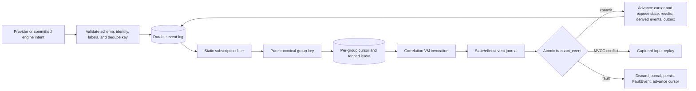
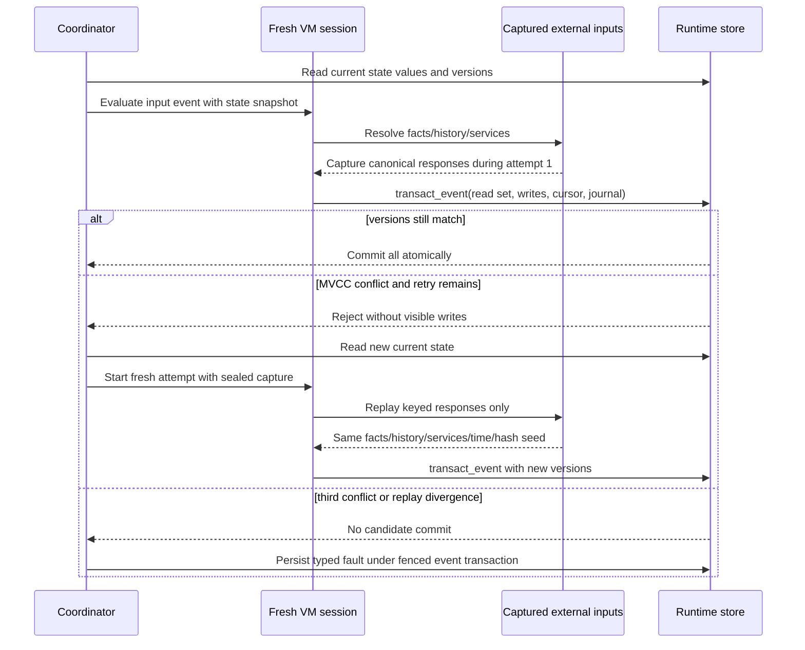
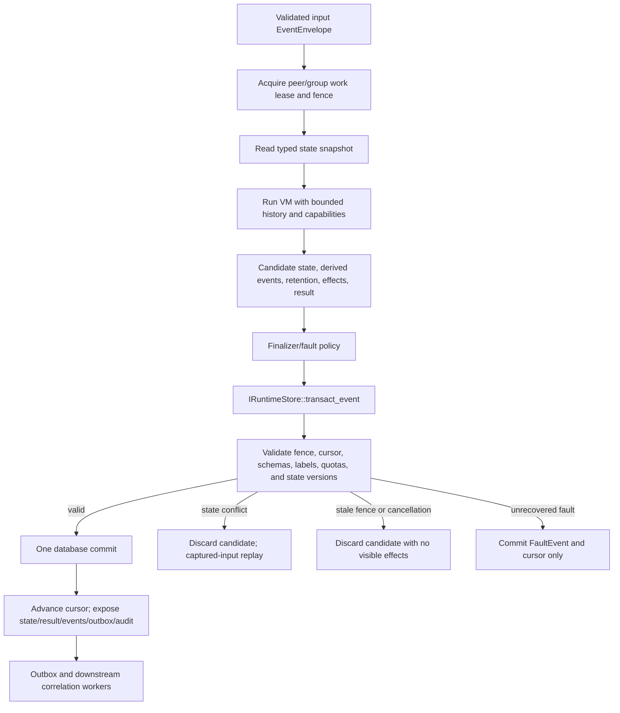

# Events, History, State, and Correlation

Status: frozen for the `design-v1` foundation\
Primary tasks: `R1`, `R2`, `R3`\
Related contracts: event envelopes, `FrozenValue`, `IRuntimeStore::transact_event`, effect journals, fence tokens\
Related decisions: `ADR-008`, `ADR-009`, `ADR-010`, `ADR-012`, `ADR-013`, `ADR-015`

## 1. Purpose

This subsystem turns validated observations and evaluation outcomes into a durable, typed event stream; provides deterministic, bounded history to rules; gives rules and correlations transactional state; and schedules correlation entrypoints without weakening the engine's effect, replay, or tenant-isolation guarantees.

The design has six goals:

1. An input event, its cursor movement, state changes, verdict, derived events, retention selections, effects, outbox rows, and audit records become visible atomically.
2. Reprocessing after a node failure is safe and observably once per event despite at-least-once work delivery.
3. A correlation group observes events serially and deterministically without requiring a global event order.
4. History is typed, bounded, label-aware, and inspectable; rule code never executes SQL.
5. State conflicts do not repeat fact reads or external service calls with different answers.
6. Retention, peer capture, and purge are explicit operator-governed capabilities rather than accidental consequences of evaluation.

## 2. Non-goals

- A globally total order across tenants, peers, or independent correlation groups.
- Arbitrary SQL, user-defined storage indexes, joins, or unbounded stream processing from rule code.
- Exactly-once delivery to external action endpoints. The durable outbox is at-least-once.
- Rewinding external side effects during replay or backfill.
- Mutable Python module globals, client-owned rule state, or a distributed shared-memory abstraction.
- Unbounded event-time correction or automatic reopening of finalized windows.
- Cross-generation execution against one mutable state namespace.
- Retaining every fetched fact by default.

## 3. Actors and trust boundaries

| Actor | Responsibility | Trust treatment |
|---|---|---|
| Agent/provider | Sends observations, removals, capture results, and typed facts | Authenticated peer, but every schema, identity, sequence, size, and label claim is validated server-side |
| Ingestion coordinator | Assigns durable ingest position, deduplicates, normalizes labels, and creates work | Trusted C++ control plane |
| C++ VM | Evaluates rules/correlations and stages state, events, retention, and effects | Sole owner of language semantics |
| Runtime store | Owns events, cursors, MVCC state, retention materialization, outbox, and audits | Trusted persistence boundary; production is PostgreSQL |
| Operator | Defines retention/capture profiles, capabilities, backfills, purges, and quarantine policy | Privileged and fully audited |
| Rule pack | Selects from declared capabilities and emits typed intents | Signed operational input, constrained by compiler and operator policy |
| External action/service | Receives posts or answers read-only service requests | Separate trust domain; all wire values are schema-validated and labeled |

Tenant, peer, subject, executable generation, and schema identity are derived from authenticated/session/compiler context. Rule code cannot forge them by constructing an event envelope directly.

## 4. Event model

### 4.1 Envelope

Every durable event is a typed `EventEnvelope<Payload>` with these logical fields:

| Field | Meaning |
|---|---|
| `event_id` | Server-assigned stable identifier; duplicate source records resolve to the same durable event |
| `event_schema_id` / `schema_hash` | Stable event type and exact payload descriptor |
| `tenant_id` | Authenticated tenancy boundary |
| `peer_id` / `subject_key` | Optional typed origin or affected subject |
| `producer_timestamp` | Occurrence time claimed by the producer, preserved after validation |
| `ingest_timestamp` / `ingest_cursor` | Server time and durable database position assigned once |
| `source_sequence` | Optional peer epoch and monotonically increasing agent sequence used for deduplication |
| `source_generation` | Provider snapshot or capture generation where applicable |
| `pack_generation` / `executable_id` | Producer executable identity for engine-emitted events |
| `classification` | Envelope ceiling plus field-level `FrozenValue` labels/categories |
| `causation` | Root event, immediate parent event, producing execution/invocation, and depth |
| `payload` | Canonical, immutable, acyclic, schema-validated `FrozenValue` record |

`producer_timestamp` is data, not authority. The server validates its range and precision, but an authenticated peer can still have clock skew. `ingest_cursor` is the default scheduling order. It is stable after commit and paired with `event_id` for deterministic tie-breaking.

Provider source identities such as `(peer_id, agent_epoch, sequence, record_index)` and engine intent identities such as `(execution_id, intent_sequence)` have unique constraints. Re-delivery therefore returns the existing event instead of creating a duplicate.

### 4.2 Built-in event families

- `ObservationEvent<T>` carries a validated provider snapshot item, service/custom observation, or capture result.
- `RemovalEvent<TSubject>` states that a previously authoritative subject no longer exists. It is emitted only after a valid complete enumeration commit.
- `MatchEvent` records rule/binding ownership, subject, MATCH/NO_MATCH where policy retains both, selected evidence, generation, and execution identity.
- `FaultEvent` records the typed fault chain, source spans, attempt count, handler outcome, truncation state, and quarantine decision without exposing payloads above the retention ceiling.
- `ActionDeliveryEvent<Ack>` records queued/delivered/retried/dead-lettered action state and an optional validated typed acknowledgement.
- `CaptureResultEvent<T>` records the result of a previously committed named `PeerCapture` request.
- User-defined `ObservationEvent<T>` is emitted through `telemetry.emit(record)` after `T` has passed its stable event-schema boundary.

No rule can publish a raw provider fact as an untyped blob. Event payloads are deep-frozen and classification-checked when their intent is created, then revalidated before store commit.

### 4.3 Causation and derived-event chains

An emitted event inherits the root event and records its immediate parent, producing execution, and monotonically increasing causation depth. A direct ingestion event is its own root at depth zero. These fields support audit, deduplication, loop diagnosis, and dry-run backfill.

Correlation subscriptions and correlation-to-correlation emissions form a statically compiled directed graph. Activation rejects a graph cycle, including cycles introduced through embedded source dependencies. Runtime also enforces the operator profile's maximum derived-event depth as defense in depth. Reaching the depth cap faults the emitting invocation and rolls back its journal; it never publishes a partial chain.

## 5. Correlation declarations and scheduling

### 5.1 Static subscription

Each `@correlation("stable.id")` declares a finite union of input event schemas. The compiler lowers broad type tests and immutable metadata filters into a coarse subscription plan. Dynamic subscriptions, topic strings, reflection, and database-defined callbacks are rejected.

Newly activated correlations begin at the pack activation cursor. They do not implicitly consume older data. An operator can request a bounded backfill with an explicit tenant/time/event-type range and row ceiling; posts and peer captures remain dry-run unless separately authorized for that backfill.

### 5.2 Group keys

A correlation must define either an inline typed pure lambda or a named pure helper for `group_by`. The key function runs before the correlation body and may use only the immutable incoming envelope plus deterministic pure modeled operations. It cannot access facts, state, history, services, effects, mutable globals, or `await`.

The result must be a canonical bounded value composed from `None`, `bool`, `int`, `str`, `bytes`, enum members, and tuples of those types. Floats, mutable containers, records with non-identity fields, and cyclic values are rejected. Key encoding includes type tags, so `1`, `True`, and `"1"` are distinct.

The canonical scheduling identity is:

```text
(tenant_id, executable_id, correlation_binding_id, canonical_group_key)
```

Including `executable_id` prevents two executable generations from sharing a work queue. State continuity is handled separately through an activation-selected state namespace: an exact schema match aliases the prior namespace, while an incompatible schema selects a new namespace and migration path.

### 5.3 Serialized group execution

The runtime store maintains a durable subscription-intake cursor and work queue per scheduling identity. Intake scans events in `(ingest_cursor, event_id)` order and idempotently materializes matching group work. A worker obtains a fenced group lease and runs exactly one eligible item for that group. In ingest-time mode, eligibility and execution follow queue ingest order. Event-time mode uses the buffered ordering described below. The database transaction predicates every cursor, queue-item, and result write on the current fence token.

Successful MATCH and NO_MATCH executions atomically advance the group cursor and commit state/results/events/effects. After local Python handling and the fault ladder are exhausted, the engine atomically records `FaultEvent`, discards state/effects, and advances the cursor so a poison event cannot block later events. If the outcome quarantines the group or binding, that same transaction records quarantine and advances the failed event; the gate prevents claiming the next event until clearance or replacement activation.

Node death before commit leaves the cursor unchanged and another fenced owner re-evaluates the event. Node death after commit but before acknowledgement observes the committed cursor/idempotency records and does not duplicate visible results.



## 6. Timestamp and window semantics

Every event preserves producer-occurrence and server-ingest time. A correlation explicitly selects one of two modes:

- **Ingest-time mode (default):** scheduling and windows use `(ingest_timestamp, event_id)` in durable ingest order. No producer clock assumption is required.
- **Event-time mode:** scheduling within each correlation group buffers events and orders them by `(producer_timestamp, event_id)`. The declaration includes `allowed_lateness`, capped by its named operator profile.

For event-time mode, intake first places events in a durable per-group pending queue. Each group tracks `max_valid_producer_timestamp_seen` and a monotonic watermark. The data-driven watermark is the maximum valid producer timestamp minus `allowed_lateness`; an operator-profiled idle-watermark rule may also advance it from authenticated server time after accounting for the accepted producer-clock skew. Queue items at or before the watermark become eligible in `(producer_timestamp, event_id)` order. Windows ending at or before the watermark are final.

An event arriving behind the watermark is durably retained and marked `late_beyond_watermark`, but does not reopen finalized state or emit replacement actions. It can be reconsidered only through an explicit bounded backfill/new generation. This favors deterministic forward progress over silent retroactive side effects. Watermark values and the rule that advanced them are durable so failover cannot reorder or reopen a window.

Occurrence timestamps outside the operator's accepted skew range remain visible as typed timestamp-validation faults and are not admitted to event-time ordering. Ingest-time correlations may still consume a policy-approved normalized observation if the provider protocol defines one.

## 7. Typed bounded history

History is an injected read-only capability, never ambient storage access. A query must statically establish:

1. one event payload type or finite typed union;
2. tenant selection (the current tenant by default; another tenant requires a separately bound capability);
3. a bounded time range;
4. a finite result limit;
5. the selected ordering timestamp: ingest or producer.

Illustrative authoring shape:

```python
recent = (
    history.events(ProcessStart)
    .tenant(context.tenant)
    .between(context.ingest_time - minutes(10), context.ingest_time)
    .where(lambda event: event.process.image_path == process.image_path)
    .limit(200)
)

if await recent.exists():
    ...
```

The compiler converts the pure predicate into a typed query plan. Supported comparisons over indexed envelope fields and schema-declared scalar payload fields are pushed into the store. The store must return no more than the declared limit and profile row/byte caps. The exact VM applies any certified-pure residual predicate after retrieval. Query APIs provide `collect`, `count`, `exists`, and bounded async iteration; `count` means count within the declared store bound, never an implicit unbounded aggregate.

Results are sorted by `(selected_timestamp, event_id)` and deep-validated before entering the VM. Their labels join into every derived value and control-dependent effect. The query plan, returned event IDs/versions, canonical values, and statuses are captured for state-conflict replay and diagnostic replay. Rule code never receives SQL, storage table names, physical indexes, or an untyped row.

Peer-local history is the default. A query is automatically constrained to the current authenticated peer unless the entrypoint has an explicit operator-bound `FleetHistory` capability. Tenant isolation is never relaxable by pack configuration.

## 8. Typed state

### 8.1 Capability and namespace

State is available only through an annotated entrypoint parameter. Helpers receive the capability explicitly. Python module/class globals cannot hold mutable runtime state.

`StateKey[T]` has a stable schema ID, value type, declared scope, default/absence behavior, and classification ceiling. Supported scopes are session, peer, typed subject, correlation group, and explicitly operator-bound shared scopes. The compiler rejects a key whose identity components are not canonical or whose value cannot become a `FrozenValue`.

The physical namespace includes:

```text
(tenant_id, state_owner, state_namespace_id, state_schema_id, scope_identity, key_identity)
```

`state_owner` is the consuming pack/binding by default, including for embedded library source. `state_namespace_id` is selected at activation: an exact stable schema ID/hash continues using the prior namespace, while an incompatible schema allocates a new namespace linked to its predecessor. Cross-pack sharing requires `SharedState`; cross-peer access additionally requires the appropriate operator capability. These capabilities constrain schema, tenant, key prefix, labels, and read/write mode.

### 8.2 MVCC and evaluation journal

Each read returns a canonical value plus an opaque version. The session records the version in its read set. Writes and deletes update only the VM's state journal and are visible to subsequent reads in that invocation. No database lock is held while the VM waits for facts, history, or services.

On clean MATCH or NO_MATCH completion, finalization produces a candidate journal. `IRuntimeStore::transact_event` checks every state version and the current work fence, then atomically commits the event cursor, state writes, result, derived events, retention, effect journal, outbox, and audit. A Python exception, hard budget fault, abort, cancellation, or failed finalizer discards all candidate state.

### 8.3 Conflict replay

An MVCC mismatch never merges or overwrites another execution. The coordinator discards the entire candidate transaction and starts a fresh VM session with:

- the same input event, executable, subject, source timestamps, deadline basis, and execution identity;
- a sealed replay bundle containing the original logical fact answers/statuses, history query results, read-only service responses, deterministic time values, and hash seed;
- newly read current state versions and values;
- action dispatch disabled until a later attempt commits, as it is for every uncommitted journal.

Logical external requests have canonical replay keys containing their call site, occurrence index, typed arguments, subject, route/schema, and policy version. A retry may consume only responses in the sealed bundle. If changed state makes it reach a new fact, service, or history request that did not occur originally, evaluation ends as `FAULTED(StateConflictReplayDiverged)` rather than observing a different external world.

The limit is three executions total: the original plus two transparent retries. Another MVCC conflict yields `FAULTED(StateConflict)`. A retry is a fresh VM session but inherits the evaluation-owned remaining elapsed, active-CPU, instruction, heap-allocation, provider, service, history, state, and effect budgets; it does not multiply `balanced.v1`. Only the separately specified finalizer/fault/cleanup executors receive fresh dedicated caps. Each attempt is recorded; only the committed attempt's state and ordinary effects survive.



Correlation group serialization makes normal correlation conflicts rare. General rules or explicit shared-state users can still conflict and must be written so a retry is semantically acceptable.

### 8.4 State schema evolution

An exact stable state schema ID and canonical descriptor hash reuses its namespace across activation. Any field removal, type change, identity change, label-ceiling change, or incompatible default requires a new schema ID and one of:

- an explicit pure migration from every supported predecessor;
- an explicit operator-approved reset.

A migration is compiler-checked, deterministic VM bytecode. It cannot read facts/history/services, emit effects/events, or access another state key. The new generation reads an old value and migrates it inside the same state transaction that first uses the key. A background warmer may invoke the identical transaction path. The migrated value is validated against the new schema before commit.

Migration failure writes nothing to the new namespace, records a typed migration fault, and quarantines the affected binding/group or key work until operator action. Activation tests verify migration graphs and fixtures but cannot prove success for every production value.

The prior incompatible namespace remains immutable for a bounded rollback window. Rolling back selects it again; writes made only in the new incompatible namespace are not reverse-migrated. Operators must see this data-loss boundary in rollback preview/audit. Compatible unchanged state uses the same namespace and does not have this limitation.

## 9. Retention, capture, and purge

### 9.1 Retention

The compiler infers a static minimum retention set from correlation subscriptions, group keys, history predicates/projections, state migrations, report schemas, and operator-required audit fields. Dynamic `retention.retain(value_or_fields, ttl=...)` appends an ordered intent when reached. `with retention.retain_reads(...):` records only logical VM reads reached inside the lexical scope; optimizer prefetch and canceled speculative work never count.

The operator profile is authoritative over TTL, byte/item quotas, allowed event/fact categories, and maximum classification. Packs may request less, never more. Production refuses startup unless versioned profiles cover event envelopes, facts, matches, faults, traces, service captures, state, outbox/dead letters, and classifications. A rejected retention request faults or suppresses according to the call-site's declared policy; it never silently lowers a classification.

### 9.2 Peer capture

`PeerCapture` addresses a static named operator profile and supplies only its typed parameters, anchor event/subject, reason, and dedupe key. The profile owns subject selectors, fact/scan fields, TTL, classification, concurrency, and quotas. A capture request is an effect intent: it becomes schedulable only after final commit, cannot be awaited by the current invocation, and produces future typed `CaptureResultEvent` observations.

Backfill leaves capture in dry-run unless an operator separately authorizes physical capture for that run.

### 9.3 Purge

Administrative purge is scoped by tenant plus peer and/or bounded time interval. It has a mandatory preview reporting affected events, retained payloads, traces, state, pending outbox, dead letters, indexes, and classification totals. Execution is audited and increments a purge epoch/tombstone fence so late retries cannot resurrect deleted material.

Purge cascades through history payloads, traces, state namespaces, pending outbox, dead letters, capture artifacts, and secondary indexes. Minimal non-payload tombstones, event/idempotency hashes, audit identity, and purge evidence remain to prevent duplicate dispatch or re-ingestion. If policy requires destroying even those identifiers, it must also define the loss of deduplication guarantees as a separately approved operation.

## 10. Complete transaction and data flow



## 11. Failure modes and recovery

| Failure | Required behavior |
|---|---|
| Duplicate provider/event submission | Unique source key resolves to existing event; no duplicate downstream work |
| Process/node dies before transaction commit | Lease expires; next fenced worker reevaluates unchanged cursor |
| Process/node dies after commit before acknowledgement | Existing cursor/idempotency records suppress duplicate visible work |
| Stale work owner submits | Fence predicate rejects the complete candidate transaction |
| History result violates schema/limit/tenant | Boundary fault; candidate journal rolls back; provider/store protocol health is degraded |
| State version conflict | Captured-input replay, at most two retries after original |
| Replay reaches uncaptured external read | `StateConflictReplayDiverged`; do not fetch live data |
| Correlation user fault | Roll back journal, persist typed fault, advance failed event cursor |
| Correlation quarantine | Persist fault/quarantine and advance failed event; block claiming the next event |
| Derived-event graph depth exceeded | Fault emitter and roll back the entire journal |
| Event arrives beyond watermark | Retain/mark late; do not reopen finalized event-time windows |
| State migration fails | No partial new value; durable fault and affected work quarantine |
| Purge races an old worker | Purge/fence epoch rejects resurrection on commit |

## 12. Reasoning and alternatives

- **Typed append-only events instead of callbacks or mutable tables:** events preserve provenance, make correlations replayable, and allow one transactional visibility boundary. Direct callbacks would lose durable causation and complicate recovery.
- **Per-group serial order instead of global order:** most detections require entity/group consistency, while a global order would serialize unrelated peers and make multi-node operation fragile.
- **Ingest time by default:** it is authoritative and monotonic at the service boundary. Producer time remains available where domain semantics justify bounded reordering.
- **Static, bounded history instead of SQL:** the compiler can enforce tenant scope, resource limits, labels, replay capture, and stable semantics.
- **MVCC instead of holding locks across evaluation:** rules may suspend on remote facts/services. Long database locks would cause head-of-line blocking and failure amplification.
- **Captured replay instead of live re-execution:** a state retry should resolve only a state race, not change the observed machine/service/history world or duplicate external work.
- **Explicit migrations and separate namespaces instead of implicit coercion:** schema changes become auditable and rollback has a clear boundary.
- **Operator-owned retention/capture profiles:** a signed pack can request evidence, but storage cost, privacy, and remote collection authority remain operational policy.

## 13. Known limitations

- There is no global total event order; independent groups can be observed in different interleavings (`L-007`).
- Event-time windows do not reopen for events beyond the configured watermark (`L-013`).
- A state retry can fault if new state changes control flow so that it needs an external input absent from the original sealed capture. This is deliberately safer than mixing observation epochs and should be added to the central limitations registry.
- The original plus two retries can still fail under heavy shared-state contention. Correlation serialization reduces but does not eliminate conflicts.
- Replay cannot undo or reissue physical external side effects (`L-009`).
- Incompatible-state rollback returns to the retained old namespace; it does not reverse-migrate writes made by the new generation (`L-012`).
- Static history plans expose only modeled predicates/indexes. Some otherwise natural queries require bounded collection and residual VM filtering.
- Count and iteration results are bounded by declared query/profile limits, not implicit whole-dataset aggregates.
- Conservative labels can overclassify stored history and block retention/sinks (`L-014`).
- Cyclic VM values cannot be stored or emitted (`L-017`).
- Purge retains minimal tombstone/idempotency/audit material unless an exceptional policy explicitly trades away deduplication.

## 14. Observability and diagnostics

Metrics and structured logs include event ingestion/deduplication, queue depth/age by tenant and event type, group lease/fence rejection, correlation lag, watermark/late-event counts, history pushdown/residual rows and bytes, state conflicts/retry/divergence, migration progress/faults, retained bytes by label/category, capture queue/quota, purge counts, and derived-event depth.

Every evaluation audit links `event_id`, root/parent causation, `execution_id`, executable generation, group-key digest, attempt number, state read/write versions, history query-plan hashes, replay-capture hash, journal disposition, cursor, and fence token. Sensitive values are represented by approved redaction or keyed digest according to the retention profile.

`rule_engine_check` explains static subscriptions, group-key purity, history pushdown, inferred retention, state schema/migration paths, causation graph, event-time lateness, and required capabilities before activation.

## 15. Required tests and acceptance criteria

### Event and correlation tests

- Schema evolution, canonical encoding, label validation, source deduplication, and causation-chain/depth tests.
- Static subscription and cycle rejection across local modules and embedded dependencies.
- Group-key purity/type/size tests, including type-tag distinction and deterministic cross-platform encoding.
- Multi-node fenced serialization, node death before/after commit, poison event cursor advancement, quarantine gating, and once-visible derived events.
- Ingest-time and event-time ordering, watermark advancement, clock-skew rejection, and late-beyond-watermark behavior.
- Activation starts at its cursor; bounded backfill defaults posts/captures to dry-run.

### History tests

- Compile-time rejection for missing type, tenant, time bound, limit, or unauthorized fleet access.
- Store pushdown and residual parity, deterministic ordering, count/exists/collect/async iteration, row/byte budgets, and schema corruption.
- Tenant/peer isolation and label/control-taint propagation.
- Captured result identity/value parity across state retry and diagnostic replay.

### State and migration tests

- Read-your-writes, deletes, absent/default values, scope isolation, shared-capability denial, and boundary-cycle rejection.
- Atomic commit/rollback with results, events, retention, effects, outbox, and cursor.
- Original plus two conflict retries, refreshed state with identical captured inputs, replay divergence, deadline/aggregate-budget behavior, and third-conflict fault.
- Unchanged-schema carry-forward, complete migration graph validation, lazy/background migration races, migration failure quarantine, reset authorization, and rollback namespace behavior.

### Retention, capture, and purge tests

- Static retention inference and logical `retain_reads` excluding optimizer prefetch.
- Classification/TTL/quota ceilings and production startup refusal for incomplete profiles.
- Capture dedupe, deferred execution, future result events, and dry-run backfill.
- Purge preview/audit/cascade, late-worker resurrection fencing, and preserved tombstone/idempotency behavior.

This architecture is accepted when PostgreSQL two-node integration tests prove the transaction and fencing invariants, SQLite passes the same single-node store contract, exact and optimized VMs produce identical event/state/effect observations, and all requirements map through `TRACEABILITY.md` to `R1`, `R2`, and `R3` evidence.
