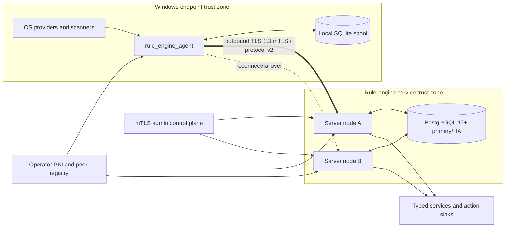
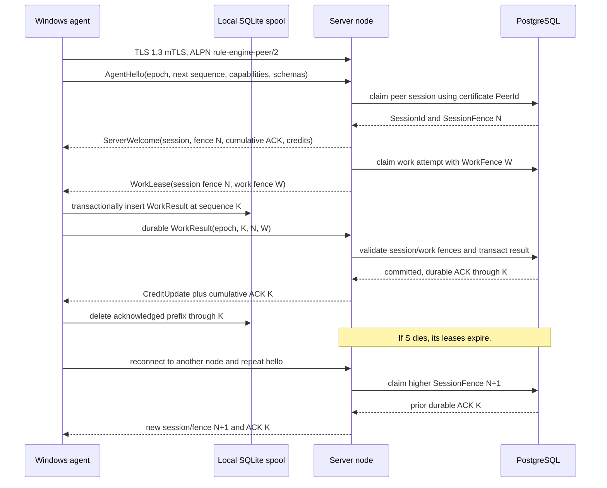
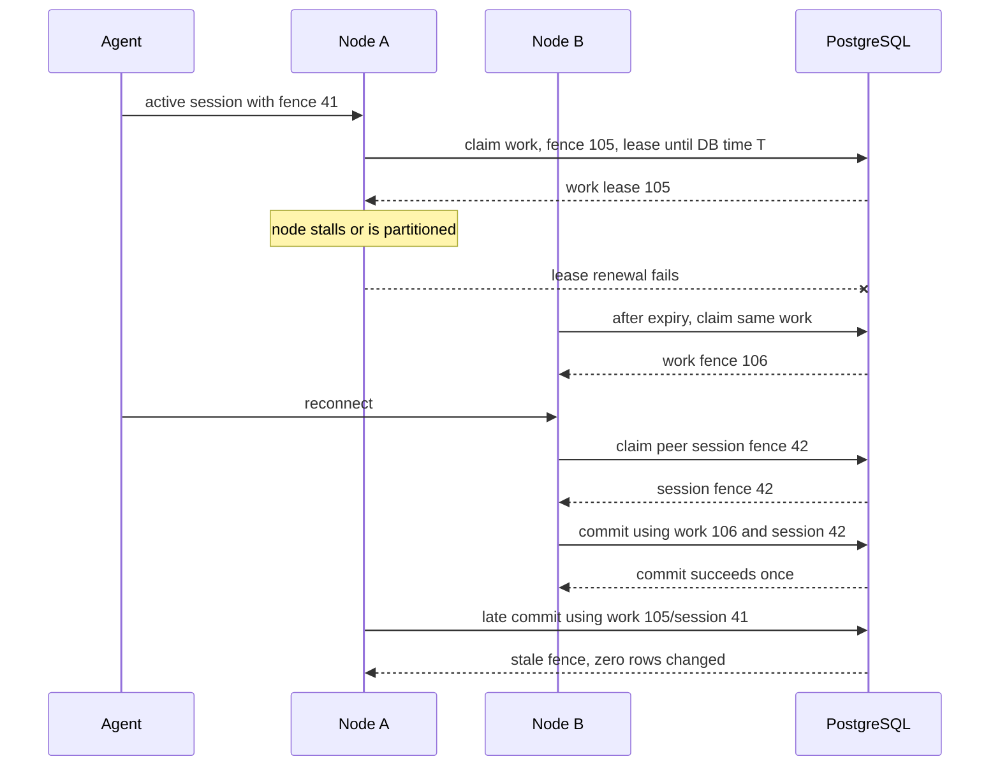
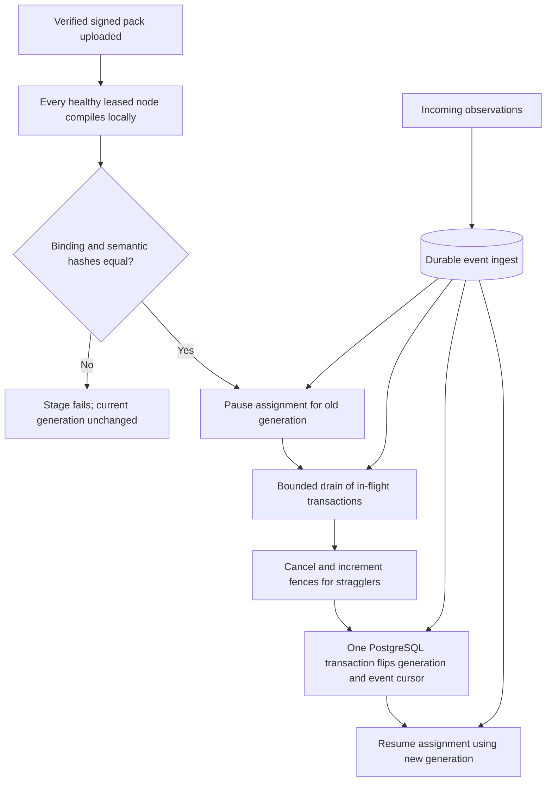
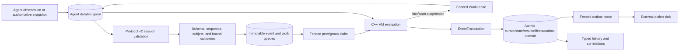

# Protocol, Storage, and Cluster Architecture

Status: normative pre-implementation design\
Owners: protocol-v2 and python-cluster lanes\
Tasks: P1, P2, P3, S1, S2, S3, I1, Q1\
Decisions: [ADR-011](../decisions/ADR-011-protocol-v2-clean-break.md), [ADR-012](../decisions/ADR-012-postgresql-active-active.md), ADR-013\
Foundation contracts: [CONTRACTS.md](../CONTRACTS.md)

## 1. Purpose and goals

This subsystem connects centrally evaluated rules to remote Windows fact providers and gives active-active server nodes one durable source of truth. Its goals are:

- preserve the central trust boundary: the server owns semantics and the agent returns only typed subjects, facts, scan matches, observations, and provider diagnostics;
- authenticate every production peer with TLS 1.3 mutual authentication and bind all accepted messages to a database-fenced server session;
- tolerate connection loss, process crashes, duplicate delivery, server failover, and unknown database commit outcomes without producing duplicate visible events or effects;
- provide explicit backpressure from the database through the server to a bounded durable agent spool;
- apply subject inventories atomically, including nested scopes, so malformed or partial snapshots cannot create false removals;
- negotiate capabilities and compatible schema projections before work is assigned;
- expose one transactional storage contract for PostgreSQL production and SQLite single-node development;
- guarantee serial processing where semantics require it—per peer and per correlation group—without claiming a global total order;
- fence stale sessions and workers so a paused or partitioned node cannot commit after ownership changes;
- support cluster-atomic pack activation and generation cutover without overlapping executable generations.

The design favors explicit identities, durable idempotency, and database-enforced fences over assumptions about reliable networks or graceful shutdown.

## 2. Non-goals

- Agents do not receive rules, predicates, bytecode, optimizer conditions, match criteria, state, correlation logic, or authority to decide a verdict.
- Protocol v1 is not negotiated, translated, proxied, or retained after cutover.
- This is not a general RPC framework. Only versioned rule-engine messages and modeled service/action envelopes are supported.
- TLS does not make an enrolled but compromised agent truthful. Schema validation, bounds, audit, and provider-fault handling constrain its impact; endpoint integrity remains an operational responsibility.
- Active-active refers to multiple stateless/coordinating rule-engine servers sharing PostgreSQL. It does not mean PostgreSQL multi-primary operation.
- Exactly-once execution and exactly-once external delivery are not promised. Durable effects are once-per-event inside the database and at-least-once at an external sink.
- A global event order across tenants, peers, and correlation groups is not exposed.
- SQLite is not a production clustering, high-availability, or multi-process backend.
- Linux fact-provider agents are outside the initial release.

## 3. Actors, trust boundaries, and ownership

### 3.1 Actors

| Actor | Owns | May submit | Must not decide |
|---|---|---|---|
| Windows agent | provider execution, local subject observation, bounded durable spool, client certificate | typed observations/removals, authoritative snapshots, fact/scan results, terminal provider statuses | matches, effects, state transitions, retention, correlation outcomes |
| Server node | TLS listener, session/work leases, compilation, VM execution, orchestration, protocol validation | work requests, cancellation, credits, schema requirements, durable transaction proposals | certificate issuance or database failover policy |
| PostgreSQL | durable events, cursors, leases/fences, state, results, effects, outbox, audits, activation state | transactional ordering and ownership decisions | rule semantics |
| SQLite development store | the same logical rows in a single process | local deterministic test/development transactions | cluster behavior or production HA |
| Operator PKI/control plane | peer enrollment, certificate trust, capability binding, pack activation policy | trusted mappings and administrative commands | individual rule verdicts |
| External service/action sink | modeled replies and idempotent action acknowledgements | typed response/ack envelopes | engine state or verdicts |

### 3.2 Trust boundaries

- The TLS endpoint authenticates a certificate; production configuration maps its canonical URI SAN to exactly one `(TenantId, PeerId)`. A payload field can never override this mapping.
- The server treats every decoded agent field as untrusted until message limits, session, sequence, schema, subject, route, capability, and value validation succeed.
- A successfully negotiated capability permits a request shape; it does not make a returned value semantically trusted. Provider protocol violations are durable faults and may trip provider health policy.
- The database is the authoritative owner of session fences, work fences, event deduplication, cursors, state versions, pack generation, journals, and outbox disposition.
- In-memory ownership, socket liveness, server wall clocks, and agent acknowledgements are hints only. None can authorize a commit without the current database fence.



## 4. Protocol v2 wire contract

### 4.1 Transport and framing

- Production uses a long-lived outbound TCP connection from each Windows agent to a configured server endpoint set.
- OpenSSL 3 and standalone Asio implement TLS and asynchronous I/O without C++ exceptions or RTTI.
- TLS requirements:
  - minimum and maximum version are TLS 1.3;
  - client certificates are mandatory;
  - server hostname verification is mandatory;
  - certificate chains, validity, critical extensions, configured trust anchors, EKU, and the canonical peer URI SAN are validated;
  - ALPN is exactly `rule-engine-peer/2`;
  - TLS early data, compression, renegotiation, session tickets, and PSK resumption are disabled in the first release;
  - the server certificate requires `serverAuth`; the agent certificate requires `clientAuth`;
  - production revocation uses the operator-supplied CRL snapshot and fails closed when the configured CRL is expired or cannot be loaded.
- Plaintext is available only when both endpoints explicitly enable development plaintext and both resolved socket addresses are loopback. Binding or connecting a plaintext peer to a non-loopback address is a startup error.
- After TLS, frames are `uint32_be payload_length` followed by one Protocyte-encoded `PeerEnvelopeV2`.
- Empty frames and payloads above the negotiated frame limit are protocol violations. The hard pre-negotiation limit is 16 MiB. Larger logical payloads use bounded chunks; no decoder allocates from an unvalidated length.
- Unknown optional fields are skipped according to Protocyte rules. Unknown message kinds, duplicate scalar fields, malformed required fields, invalid UTF-8, non-canonical identities, and incompatible required fields cause a bounded `ProtocolError` followed by connection close.

The 16 MiB hard limit matches the existing defensive bound while the new chunk protocol prevents one large subject inventory from monopolizing memory.

### 4.2 Common envelope

`PeerEnvelopeV2` has stable numeric wire field IDs and contains:

| Field | Meaning |
|---|---|
| `protocol_major` | Must be `2`; any other value closes the connection. |
| `protocol_minor` | Selected minor version after welcome; `0` during hello. |
| `message_id` | Sender-generated 128-bit ID for diagnostics and request correlation. |
| `session_id` | Server-issued 128-bit ID; absent only on `AgentHello`. |
| `agent_epoch` | Agent-spool epoch for durable agent-to-server messages. |
| `agent_sequence` | Strictly increasing sequence within an epoch for durable messages; zero/absent for ephemeral control. |
| `ack_agent_sequence` | Server cumulative acknowledgement piggybacked on server frames. |
| `body` | Exactly one typed protocol-v2 message. |

The envelope deliberately omits an authoritative `PeerId`: the accepted TLS identity supplies it. If a body includes a peer for a subject or audit record, it must equal the authenticated peer or the message is rejected.

`message_id` correlates logs but is not an idempotency boundary. Durable agent idempotency is `(TenantId, PeerId, AgentEpoch, AgentSequence, item_index)`. Server work idempotency is `(WorkId, AttemptId, WorkFence)`. A durable spool row stores canonical body bytes, not the session-specific envelope; retransmission wraps the unchanged body in a new envelope carrying the current `SessionId`.

### 4.3 Message catalog

#### Handshake and session control

- `AgentHello`
  - supported major and inclusive minor range;
  - agent build/executable identity, platform/architecture, configured provider routes;
  - random persistent `AgentEpoch` and next locally durable sequence;
  - capability descriptors and their stable IDs/versions;
  - schema catalog root hash and bounded per-schema descriptors or hashes;
  - maximum receive frame/chunk/in-flight bounds;
  - no caller-supplied authoritative peer identity.
- `ServerWelcome`
  - `SessionId`, selected minor, authenticated tenant/peer display identity, `NodeId`;
  - monotonically increasing `SessionFence` allocated by PostgreSQL;
  - acknowledged durable sequence for the presented epoch;
  - negotiated capabilities, schemas, frame/chunk limits, heartbeat/lease durations, and initial credits;
  - active pack generation/hash information relevant to provider planning.
- `HandshakeReject` contains one stable public reason code and a redacted diagnostic. Authentication failures are logged server-side without reflecting sensitive PKI details.
- `Heartbeat` carries session fence, last processed sequence/work result, local queue health, and optional credit update. It never renews ownership by itself; successful database lease renewal does.
- `GoAway` carries a reason and optional reconnect delay. It does not promise that unacknowledged data committed or that current work remains owned.
- `ProtocolError`/`Nack` identifies a message/sequence and stable error code. A permanent schema/validation NACK quarantines that spool record for operator inspection; a transient overload NACK leaves it pending.

#### Work and provider messages

- `WorkLease`
  - `WorkId`, `AttemptId`, `WorkFence`, `SessionFence`, pack generation, typed subject, work kind, provider route, bounded request batch, absolute server deadline plus relative remaining duration, and cancellation token ID;
  - each fact request carries the exact expected schema ID and canonical descriptor hash derived from the active pack catalog;
  - kinds are fact read, scan plan, root inventory, nested enumeration, and explicitly modeled capture;
  - contains no rule expression, predicate, verdict threshold, effect policy, correlation query, or bytecode.
- `WorkAccepted` or `WorkRejected` reports whether the route/capability can begin. Acceptance does not extend its deadline.
- `WorkResult` contains the originating session/work identities and fences, typed per-item values or terminal statuses, provider timing, and bounded diagnostics. A fact value carries the authoritative returned schema ID/hash from the provider route catalog and no diagnostic. A non-value terminal carries neither a value nor schema identity and may carry a diagnostic. Missing, mixed, unknown, or mismatched shapes are protocol violations. It is a durable spooled message. On replay, the server first resolves the agent epoch/sequence: an already committed result returns its recorded disposition, while an uncommitted result with a stale originating fence is durably rejected so the work can be reassigned.
- `WorkCancel` is best effort and identifies the attempt/fence. The agent stops promptly where the OS/provider permits and replies with a canceled result. A late result is harmless because the database fence rejects it.
- `QueueHint` is an ephemeral wake-up instruction requesting the agent to ask for work or refresh an inventory. Losing it is safe because server scheduling and reconciliation remain authoritative.

#### Observation and inventory messages

- `ObservationBatch` contains bounded typed observation records, occurrence timestamps, schema IDs/hashes, canonical subjects, and source-generation identifiers. Server ingest time is assigned only after acceptance.
- `RemovalHintBatch` accelerates removal visibility but never substitutes for authoritative inventory reconciliation.
- `EnumerationBegin` identifies `SnapshotId`, parent subject, scope descriptor, provider generation, expected item count, expected canonical digest, and negotiated schema projection.
- `EnumerationChunk` identifies the snapshot and zero-based chunk index and contains canonical typed subjects plus eager fields. Chunks may arrive only in order in the first release.
- `EnumerationCommit` repeats the count/digest and closes the snapshot.
- `EnumerationAbort` discards staged chunks and reports a typed cause.
- The server persists snapshot staging separately from visible inventory. It atomically compares the complete identity set with the last-good generation only after all chunks, count, digest, identities, field schemas, and bounds validate. Duplicate or missing identities reject the whole snapshot, emit a provider protocol fault, retain last-good visibility for future diff, and emit no removals. A later valid complete snapshot emits additions/changes/removals in one transaction.

#### Flow-control messages

- `CreditUpdate` gives independent byte, message, work-attempt, and snapshot-chunk credits. Credit is permission to transmit, not proof of durable acceptance.
- Durable data consumes credit when written and regains it only through cumulative ACK or explicit per-message disposition.
- The server lowers credits before database maintenance or overload and can set work credit to zero while retaining heartbeat/control capacity.
- The agent never drops an unacknowledged durable record to satisfy credit. It pauses new provider pulls and observation production at configured high-water marks, reports degraded health, and resumes below the low-water mark.
- Immediate process-removal hints may be coalesced only because authoritative inventory will reconcile them. Work results, committed observations, and begun snapshots are never silently coalesced or dropped.

### 4.4 Schema and capability negotiation

Every external record uses a stable `SchemaId`, schema major, numeric field IDs, declared type, required/optional status, maximum encoded size, and classification ceiling. Capability descriptors name a stable route/method plus request/response schemas and limits.

Negotiation rules:

1. Both sides advertise the schema catalog root and known `(SchemaId, major, SchemaHash)` tuples.
2. When hashes differ, the sender may provide a bounded canonical descriptor. A remote descriptor never installs new semantics; it is compared with the receiver's locally compiled descriptor.
3. A projection is compatible only when every receiver-required field exists with identical numeric ID, wire type, semantic type, identity marker, and classification ceiling.
4. Unknown sender fields must be optional and are ignored after size/label validation. A field added as required, a removed required field, field-ID reuse, identity change, type change, or weaker classification requires a new `SchemaId` or major and is incompatible.
5. Missing optional fields decode as absent, not as an invented value.
6. The negotiated projection and both descriptor hashes are stored on the session and attached to work. A message that changes hash mid-session is rejected; renegotiation requires reconnect.
7. A capability is usable only if route version, request/response projections, resource bounds, and operator policy all intersect. Required pack capabilities missing on any targeted peer fail activation or make that peer ineligible according to pack policy; optional capability parameters are consistently passed as `None`.

This preserves additive optional evolution while preventing a merely matching name from changing C++ semantics.

For a fact value, negotiation compatibility is necessary but not sufficient. Admission correlates the exact request and subject, compares returned schema ID and hash byte-for-byte with the requested pair, then validates the value against the server's active descriptor. These checks occur before the response enters resident capture or the VM. The provider derives its returned pair from its route catalog; simply reflecting request bytes is not an attestation.

### 4.5 Session, sequence, reconnect, and spool state machines

The agent stores durable outbound messages in a local SQLite WAL database before considering them queued. Each row contains epoch, sequence, kind, canonical payload bytes, creation time, attempt metadata, and disposition. Sequence allocation and row insertion are one local transaction.

- `AgentEpoch` is generated when a spool is initialized or deliberately reset and persists across ordinary process restarts.
- Agent sequences are gap-free for records admitted to the spool. A record is deleted only after the server cumulatively ACKs through its sequence or permanently NACKs it into a local quarantine table.
- On reconnect, `AgentHello` presents epoch and next sequence. The server returns its durable high-water ACK for that peer+epoch. The agent retransmits every later canonical body byte-for-byte inside an envelope for the new session.
- The server may accept duplicates and out-of-order transport arrival but advances the durable high-water mark only through a contiguous prefix. Duplicate rows resolve to the original durable disposition.
- A spool reset creates a new epoch; it never reuses sequence numbers. The next authoritative inventory repairs subject presence, but arbitrary unsent observations lost with a destroyed spool are not recoverable.
- Reconnect uses exponential backoff with full jitter across the configured endpoint set. DNS is resolved anew. A new `ServerWelcome` and session fence invalidates every prior connection for that peer.



### 4.6 Lease and fence invariants

- PostgreSQL allocates every peer-session and work-attempt fence monotonically from the owned row while holding its row lock. Random IDs identify instances; the numeric fence establishes recency.
- At most one current production session exists per `(TenantId, PeerId)`. Claiming a new session increments the fence and makes the old session unable to commit even if its TCP socket remains open.
- Work is owned by `(WorkId, AttemptId, WorkFence, SessionFence, NodeId, lease_until)`. Lease renewal and final commit require all current values to match.
- Database time, not a server or agent wall clock, evaluates lease expiry.
- Processing happens outside the claim transaction. Completion occurs in a new transaction with `WHERE current_fence = supplied_fence AND lease_until >= database_now() AND generation = supplied_generation` plus relevant cursor/state preconditions.
- Cancellation, disconnect, timeout, and node death may cause duplicate computation. They cannot cause duplicate visible commit because only the current fence and idempotency keys succeed.
- A stale-result rejection is normal coordination, not an internal error; it is counted, traced, and never sent to the VM as a fact.

## 5. Runtime storage contract

### 5.1 Public C++ interface

`IRuntimeStore` is a project interface, not a lowest-common-denominator SQL wrapper. Both adapters implement the same semantic operations and conformance suite:

```cpp
struct IRuntimeStore {
    virtual auto claim_peer_session(const PeerSessionClaim &) noexcept
        -> std::expected<PeerSessionLease, StoreError> = 0;
    virtual auto renew_peer_session(const PeerSessionLease &) noexcept
        -> std::expected<LeaseStatus, StoreError> = 0;
    virtual auto claim_work(const WorkClaimRequest &) noexcept
        -> std::expected<std::vector<WorkLease>, StoreError> = 0;
    virtual auto renew_work(const WorkLease &) noexcept
        -> std::expected<LeaseStatus, StoreError> = 0;
    virtual auto transact_event(const EventTransaction &) noexcept
        -> std::expected<CommitReceipt, StoreError> = 0;
    virtual auto query_history(const BoundedHistoryQuery &) noexcept
        -> std::expected<HistoryPage, StoreError> = 0;
    virtual auto claim_outbox(const OutboxClaimRequest &) noexcept
        -> std::expected<std::vector<OutboxLease>, StoreError> = 0;
    virtual auto settle_outbox(const OutboxSettlement &) noexcept
        -> std::expected<void, StoreError> = 0;
};
```

The real interface also exposes bounded activation, snapshot, purge, migration, node-lease, audit, and dead-letter operations. All fallible methods use `std::expected`; implementations do not throw.

`StoreError` separates retryable connection/serialization/busy failures, unknown commit outcome, constraint/validation failures, stale fence, state conflict, unavailable migration, and permanent configuration failure. Callers must resolve an unknown outcome by deterministic transaction ID lookup before retrying.

### 5.2 Logical data model and ownership

| Logical relation | Key/owner | Invariant |
|---|---|---|
| `schema_migrations` | store | Ordered checksummed migrations; no downgrade in place. |
| `cluster_nodes` | node ID | Lease/readiness/build/platform/compiled generations. |
| `peers` | tenant+peer | Enrollment status, expected capabilities, health, last-good inventory. |
| `peer_sessions` | tenant+peer | One current session fence and lease. |
| `agent_receipts` | tenant+peer+epoch | Contiguous durable ACK and bounded gap/disposition records. |
| `inventory_snapshots`/`snapshot_items` | peer+scope+snapshot | Staging is invisible; commit atomically replaces one scope generation. |
| `events` | event ID | Immutable typed envelope; producer key is unique for deduplication. |
| `peer_cursors` | peer+consumer generation | Monotonic serial position within that peer. |
| `event_work` | event+consumer/group | Attempt fence, lease, generation, and disposition. |
| `correlation_groups` | executable+binding+group key | One cursor/state writer at a time. |
| `execution_results` | execution ID/attempt | Immutable verdict/fault/metrics/source identity. |
| `state_cells` | state namespace+typed key | Schema hash, MVCC version, labeled frozen value. |
| `effect_intents` | intent ID | Ordered immutable journal record and final disposition. |
| `outbox` | intent/idempotency key | Durable pending action; leased delivery is at-least-once. |
| `dead_letters` | outbox ID | Terminal delivery details and redacted payload metadata. |
| `retained_values`/`traces` | policy-owned IDs | Classification/retention profile enforced on write. |
| `pack_sources`/`pack_builds`/`activations` | source/build/generation | Verified source, node compilation evidence, current cursor. |
| `audit_log` | audit ID | Append-only administrative/security/coordination facts. |

Large source archives and capture blobs may live in an operator-configured content-addressed object store, but PostgreSQL owns their verified digest, size, classification, retention, and transactional reference. A row is never considered usable before blob durability and digest verification.

### 5.3 Atomic event transaction

`transact_event` is the only operation that makes an evaluation visible. Its request includes deterministic transaction/execution IDs, the input event and claimed cursor/work fence, state read versions and staged writes, evaluation result, emitted events, retention writes, effect journal dispositions, outbox rows, trace metadata, and audit records.

In one database transaction the adapter:

1. verifies current node/work/session/generation fences and the expected peer or group cursor;
2. inserts or resolves the immutable input event through its producer idempotency key;
3. verifies every state MVCC read version and schema hash;
4. writes state, result, emitted events, retention, trace references, committed effect intents, outbox rows, and audits;
5. advances the peer/correlation cursor and marks work complete;
6. commits and returns a receipt containing the deterministic transaction ID and committed event IDs.

If any precondition fails, no item becomes visible. State conflict is reported to the evaluator for captured-input replay. Stale fence discards the attempt. A database/network failure before known commit returns retryable or unknown-outcome status; the coordinator queries by transaction ID before creating another attempt.

MATCH and NO_MATCH may both commit reached effects and state. FAULTED commits only the fault handler's permitted journal and the durable fault/result records specified by the fault architecture. CANCELED and stale attempts do not commit user state/effects.

### 5.4 Ordering and idempotency

- Provider-originated items are deduplicated by `(tenant, peer, agent_epoch, agent_sequence, item_index)`.
- Server-emitted events and effects use deterministic IDs derived from source event, executable generation, invocation path, and monotonic journal sequence. Replay reproduces those IDs.
- Each peer has a durable serial cursor. Events for one peer are selected deterministically and only one current peer worker may advance that cursor.
- Each correlation group has its own cursor and fence. Different groups and peers may progress concurrently.
- History defaults to ingest ordering within its selected peer/group domain and uses `(selected_timestamp, EventId)` as a deterministic tie-break. There is no supported comparison that establishes a global order between unrelated domains.
- External outbox delivery is at-least-once. The idempotency key is stable across worker failure and retry; sinks must honor it where duplicate physical delivery is unacceptable.

## 6. PostgreSQL production adapter

### 6.1 Transaction and queue strategy

- Support PostgreSQL 17 and later within the declared compatibility range.
- Use libpq through an exception-free RAII wrapper, parameterized binary queries, UTC timestamps, explicit statement timeouts, bounded pools, and cancellation.
- Normal queue claims and event commits use `READ COMMITTED` with explicit row locks, unique constraints, MVCC predicates, and fence predicates. This makes state conflicts visible to the engine instead of hiding them in unbounded database retries.
- Claim transactions select ready rows in deterministic priority/ingest/ID order using `FOR UPDATE SKIP LOCKED`, assign a new attempt/fence and lease, and commit quickly. Evaluation and provider waits occur outside database transactions.
- Activation/cutover and schema migration operations lock their singleton generation/migration rows and use `SERIALIZABLE` where a multi-row invariant cannot be represented by one locked row.
- PostgreSQL `NOTIFY` is only a latency hint. Polling with jitter is authoritative, so notification loss cannot strand work.
- All SQL that mutates fenced data includes the expected fence/generation in the predicate and verifies exactly one affected row.

### 6.2 Active-active node behavior

- Every ready server node may accept agents, claim event/correlation work, compile/stage packs, and lease outbox rows.
- A short database-backed node lease publishes build/platform, health, capacity, and compiled generation hashes. A node that cannot renew becomes unready, sets peer credits/work assignment to zero, cancels local work, and cannot commit after its work leases expire.
- No server is a permanent data-plane leader. Rare control-plane operations use a fenced database lease or a locked singleton row for the duration of the operation.
- Agent endpoint selection is configured as multiple endpoints or DNS records. Reconnection to another node creates a new session fence; the local spool replays from the database ACK.
- A node joining the cluster is not ready until migrations are compatible, the active pack generation is locally compiled and hash-equal, trust/config snapshots are loaded, and PostgreSQL round trips succeed.
- The PostgreSQL primary/HA system is an external operational dependency. During primary failover, nodes stop new commits and apply backpressure; they do not switch to divergent local writes.



### 6.3 Pack-generation cutover interaction

The full activation state machine is specified in architecture 09 and ADR-013. Storage supplies these invariants:

- one current activation row per deployment scope contains generation, verified source digest, semantic hash, activation cursor, and state namespace;
- every work row and event transaction carries the generation it was assigned;
- staging evidence is recorded per healthy leased node and includes compiler/runtime/platform ABI, binding hash, and platform-independent semantic hash;
- cutover first stops assignment of old-generation work, waits for bounded drain, cancels and fences stragglers, then flips the activation row and cursor in one transaction;
- no old-generation transaction can commit after the flip because its generation predicate fails;
- observations continue ingesting while evaluation assignment is paused;
- a joining node compiles the active generation before becoming ready.



## 7. SQLite development adapter

- SQLite implements the same logical store operations and conformance tests using WAL mode, foreign keys, a configured busy timeout, explicit transactions, and one application-level writer mutex.
- It is available only when `deployment_mode = "single_node_dev"`. Startup rejects SQLite when production mode, more than one server process, remote clustering, or HA is configured.
- The adapter preserves idempotency keys, fences, cursor/state preconditions, outbox semantics, and unknown-outcome lookup even though in-process contention is simpler.
- Lease expiry still uses store time. Tests may inject a deterministic clock through the store adapter; production code cannot use the test clock.
- SQLite files are never treated as a fallback replica for PostgreSQL. There is no automatic promotion, replication, or merge path.

The shared semantic interface keeps local development representative, while an explicit deployment gate prevents accidental reliance on SQLite behavior that cannot provide active-active guarantees.

## 8. End-to-end control and data flow



Important invariants across this flow:

1. No agent-supplied data reaches the VM before authentication, session, request, schema, identity, classification, and size validation.
2. No VM attempt becomes visible before the one atomic event transaction commits.
3. No network owner can commit after a higher database fence exists.
4. No ACK permits local spool deletion until the server's durable receipt transaction is known committed.
5. No external action is sent before its outbox row commits.
6. No partial authoritative snapshot changes visible subject state.

## 9. Failure modes and recovery

| Failure | Required behavior | Observable evidence |
|---|---|---|
| TLS/authentication failure | Reject before protocol processing; rate-limit by network source; do not reveal peer registry details. | Security audit and metric by public reason code. |
| Protocol corruption/oversize | Bounded decode failure, optional redacted protocol error, close session; do not ACK. | Protocol-fault audit with message ID/sequence. |
| Schema/capability mismatch | Reject handshake or individual permanent record; never coerce types. | Negotiation report and peer ineligibility reason. |
| Connection loss before ACK | Agent retains and retransmits spool rows. | Reconnect/replay counters and unchanged epoch. |
| ACK loss after commit | Retransmit resolves to existing idempotent disposition and returns the same cumulative ACK. | Duplicate-receipt counter, one durable event. |
| Agent process crash | Local SQLite WAL preserves admitted records; restart resumes epoch/sequence. | Spool recovery metric. |
| Spool full | Stop new provider work/production, keep control channel alive, report degraded; never drop durable records. | Disk/high-water health alert. |
| Spool destroyed/reset | Generate new epoch; force complete inventory reconciliation; report a durable data-loss audit. | Epoch-reset audit and reconciliation request. |
| Invalid/partial inventory | Abort staging; retain last-good visible generation; emit no removals. | Provider protocol fault with snapshot ID. |
| Server process crash | Work/session leases expire; another node claims higher fences; duplicates remain invisible. | Lease-takeover metric. |
| Paused/partitioned old server resumes | Every stale commit changes zero rows and is discarded. | Stale-fence metric and trace. |
| PostgreSQL unavailable | Nodes become unready, stop claiming/committing, reduce credits, agents spool; never write a divergent local fallback. | Readiness failure and DB outage alert. |
| Database response lost after commit | Query deterministic transaction ID; return stored receipt or retry only if absent. | Unknown-outcome resolution metric. |
| State MVCC conflict | Roll back attempt and invoke captured-input replay policy; after three total attempts produce typed fault. | Conflict/replay/fault metrics. |
| Outbox worker crash after physical send | Lease expires and delivery retries with same idempotency key. | Retry count; sink may observe duplicate physical request. |
| Node hash differs during staging | Fail activation atomically; retain current generation. | Node compilation evidence and activation audit. |
| Certificate revoked/expired | New/reconnected sessions fail; active session is terminated when trust snapshot refresh detects it. | Revocation audit and disconnected peer health. |
| Clock skew | Leases use database time; occurrence time remains labeled producer metadata and event-time policy bounds it. | Skew metric derived from ingest/occurrence difference. |

## 10. Security, consistency, and resource guarantees

### Security guarantees

- Production transport confidentiality/integrity and mutual authentication are provided by TLS 1.3 and the operator PKI.
- Tenant and peer authorization derive from the validated certificate registry entry, never from message content.
- Schema projections, route capability, classifications, and hard size/count limits are checked before allocation or dispatch.
- Sensitive payloads are absent from routine logs; diagnostics use stable codes, IDs, sizes, schema/route names, and redacted summaries.
- SQL is parameterized; identifiers come from compiled allowlists, not wire content.

### Consistency guarantees

- Durable provider delivery is at-least-once with idempotent database admission.
- Visible engine result/state/effects for one event attempt are atomic.
- Peer and correlation-group processing is serial and fenced.
- There is no global total order and no exactly-once physical external action guarantee.
- Last-good inventory remains visible until a valid authoritative replacement commits.

### Resource guarantees

- Frame, chunk, message, item, value, string, bytes, nesting, schema, in-flight, snapshot, spool, pool, query, and transaction limits are configured by versioned profiles and capped by operator ceilings.
- The pre-negotiation frame ceiling is 16 MiB; the authoritative snapshot ceiling is 100,000 items/16 MiB unless an operator profile lowers it.
- Decode validates lengths and nesting before allocation. Chunks are staged incrementally rather than concatenated in memory.
- Database transactions do not remain open during VM execution, provider waits, external service waits, or outbox delivery.
- Credits reserve a control-channel floor so overload cannot prevent heartbeat, cancellation, or shutdown.

## 11. Observability and diagnostics

Metrics include, by tenant/peer/route/schema where cardinality policy permits:

- authenticated sessions, handshake rejects, certificate expiry/revocation, reconnects, session-fence changes;
- frames/bytes, decode failures, permanent/transient NACKs, sequence duplicates/gaps, ACK lag;
- spool rows/bytes/oldest age, high-water duration, epoch resets, coalesced removal hints;
- credits, in-flight work, queue time, provider latency/status, cancellation and late/stale results;
- snapshot staging bytes/items/duration, commits/aborts, duplicate/missing identity faults, additions/removals;
- node/database lease age, claim latency, stale-fence rejects, DB pool saturation, unknown-outcome resolutions;
- peer/group cursor lag, transaction latency/retries, state conflicts, work takeovers;
- outbox pending age/attempts/dead letters and idempotent duplicate settlements;
- active/staged pack generation and per-node semantic hash/readiness.

Structured logs carry tenant/peer only according to classification policy and use IDs (`SessionId`, `WorkId`, `AttemptId`, `EventId`, transaction ID, snapshot ID) for correlation. Durable audits record enrollment/trust changes, epoch resets, data-loss declarations, activation, quarantine, purge, dead-letter changes, and operator overrides.

Readiness fails when the node cannot authenticate peers, load current trust/config, reach the database, verify schema migrations, or compile the active generation. Liveness reports process health only and must not cause a database-partitioned node to receive traffic.

## 12. Alternatives considered and reasoning

### Keep or extend protocol v1

Rejected. V1's localhost listener/client handshake and opaque subject strings cannot safely express authenticated sessions, hierarchical identities, durable replay, schema negotiation, authoritative snapshot commit, or database fences. Preserving it would force two semantic boundaries and weaken the big-bang removal guarantee. See ADR-011.

### gRPC or generic JSON RPC

Rejected. gRPC adds an unwanted runtime and code-generation surface, while JSON loses exact canonical typed values and makes bounds/unknown-field behavior harder to enforce. Framed Protocyte matches the repository's generated typed protocol approach and permits the required versioned envelopes without adopting gRPC semantics.

### Inbound server connections to agents

Rejected. Outbound persistent agent connections work through ordinary enterprise egress/firewall policy and let the authenticated session carry both work and observations. The tradeoff is that disconnected endpoints cannot receive immediate work; they spool observations and reconcile after reconnect.

### Trust a peer ID in the handshake

Rejected. It permits identity substitution unless every later operation separately cross-checks it. Binding identity once from the validated certificate and database registry is simpler and auditable.

### Unbounded send with TCP backpressure only

Rejected. Socket buffers do not represent database capacity and cannot protect the durable agent spool or distinguish control from bulk data. Application credits make accepted pressure explicit and preserve a control floor.

### Exact schema-hash equality only

Rejected because harmless additive optional fields would require lockstep deployment. Arbitrary coercion is also rejected. Structural projection compatibility permits additive optional evolution while preserving locally compiled types and semantics.

### Execute work in the claim transaction

Rejected. Fact, VM, history, and service waits would hold database locks and exhaust connections. Short claim transactions plus fencing permit long-running work without sacrificing exclusive commit authority.

### One permanent server leader

Rejected. It creates a data-plane bottleneck and failover pause. Database-fenced per-peer/group work allows all ready nodes to contribute while retaining required serial semantics.

### Kafka/event log as the primary coordinator

Rejected for the initial release. The engine needs atomic state CAS, cursor, result, effects, outbox, activation, and audit updates; PostgreSQL supplies these in one transaction with fewer operational systems. A future ingest broker can feed immutable events without replacing the transactional authority.

### Distributed embedded database or PostgreSQL multi-primary

Rejected. Conflict semantics and operational complexity would become part of rule correctness. One externally HA PostgreSQL write authority gives explicit transactional behavior. Active-active server compute remains horizontally scalable.

### SQLite production fallback during PostgreSQL outage

Rejected. It would create divergent histories and effects that cannot be merged safely. Production backpressures and waits for the authoritative database.

## 13. Known limitations

1. Protocol v2 is a coordinated clean break; v1 agents and servers cannot interoperate or perform an in-place negotiated upgrade.
2. Production availability depends on correct PKI enrollment, trust distribution, CRL freshness, and certificate rotation. Revocation visibility is bounded by trust-snapshot refresh.
3. TLS resumption is initially disabled, increasing reconnect CPU/latency; persistent sessions make this acceptable.
4. One peer has one active server session. The same agent cannot actively load-balance work across nodes.
5. Agent outbound connectivity is required for immediate fact work. Offline agents do not evaluate rules locally.
6. The local spool is finite. Sustained server/database outage eventually pauses provider work and observation production.
7. Physical destruction/corruption of an unreplicated agent spool can lose unsent non-inventory observations. Authoritative inventories recover current subject state, not historical events.
8. Protocol payloads are capped and large values must be chunked; individual fact values above profile limits are rejected.
9. Schema evolution under one ID is limited to compatible optional additions. Identity, requiredness, type, or classification changes require a new schema ID/major and coordinated activation.
10. Active-active server operation still has one PostgreSQL write authority/HA system as a dependency; it is not database multi-primary.
11. PostgreSQL outage stops durable evaluation progress. Servers deliberately do not accept divergent local commits.
12. Ordering is guaranteed only per peer and correlation group, not across unrelated peers/groups/tenants.
13. Duplicate computation can occur after timeouts and failover, although stale/idempotent database rules prevent duplicate visible engine commits.
14. External action transport is at-least-once; a crash after send but before acknowledgement can cause duplicate physical delivery unless the sink honors the idempotency key.
15. SQLite models semantics for development but does not reproduce PostgreSQL planner, failover, pool, or concurrency behavior.
16. `SKIP LOCKED` provides scalable queue claiming but not fairness under continuous higher-priority work; aging/priority policy and lag metrics mitigate starvation.
17. Database-time leases avoid node-clock correctness issues, but badly skewed producer occurrence timestamps remain data-quality concerns handled by correlation lateness policy.
18. A compromised enrolled agent can submit false but schema-valid facts. The central engine prevents it from deciding matches but cannot independently prove all OS observations.
19. CRL-based revocation is not instantaneous and the first release does not require online OCSP.
20. Linux fact-provider agents are not supported initially.

These limitations must also appear in the dossier-wide `LIMITATIONS.md`; implementation-discovered limits must be registered before their task is marked done.

## 14. Required tests and acceptance criteria

### Protocol and security

- Golden encode/decode tests for every message and stable numeric field ID on Windows and Linux.
- Property/fuzz tests for truncated frames, oversized lengths, invalid varints, duplicate/unknown fields, nesting bombs, malformed UTF-8, invalid identities, and random bodies with bounded memory/time.
- TLS tests for valid enrollment; untrusted/expired/not-yet-valid/revoked/wrong-EKU/wrong-SAN certificates; hostname mismatch; TLS 1.2; missing ALPN; attempted early data; and non-loopback plaintext refusal.
- Verify payload peer spoofing cannot override certificate identity and sensitive PKI errors are not reflected.
- Schema tests for equal descriptors, compatible optional additions, missing optional fields, and rejection of required additions/removals, field-ID reuse, type/identity/classification changes, mid-session descriptor change, and missing capabilities.

### Sessions, spool, and snapshots

- Crash/restart tests at every local spool transaction boundary and every server commit/ACK boundary.
- Reconnect tests with duplicate retransmission, ACK loss, sequence gaps, permanent/transient NACK, epoch reset, endpoint failover, and simultaneous stale sockets.
- Credit tests proving bulk traffic cannot starve control, durable rows are not dropped, provider production pauses at high-water, and resumes at low-water.
- Work tests for accept/reject/cancel/deadline, late response, wrong session/work fence, wrong generation, wrong subject/route/schema, and provider terminal statuses.
- Authoritative snapshot tests for valid empty/full/chunked commits, duplicate/missing identities, wrong order/count/digest/schema, crash during staging/commit, abort, last-good retention, and later valid additions/removals.

### Store conformance and active-active behavior

- Run one parameterized `IRuntimeStore` conformance suite against PostgreSQL and SQLite for idempotency, cursor ordering, MVCC state, effects/outbox, audits, snapshots, history bounds, purge, and unknown-outcome lookup.
- PostgreSQL two-node tests must pause/kill/partition a node after claim, during evaluation, before commit, after commit before ACK, and after external send. A higher fence takes over and exactly one visible event transaction exists.
- Prove peer and correlation-group serial order under concurrency while unrelated peers/groups progress in parallel.
- Prove stale session/work/node/generation fences change zero rows.
- Exercise pool exhaustion, statement timeout, deadlock/serialization response, primary restart/failover, notification loss, and database outage/backpressure/recovery.
- Verify outbox lease takeover, deterministic idempotency, retry/dead-letter policy, and duplicate physical-delivery documentation.
- Verify joining nodes remain unready until active generation hashes match.

### Activation and cross-platform acceptance

- Stage the same signed pack on Windows and Linux nodes and compare platform-independent semantic/binding hashes.
- Fail staging on one node and prove the active generation/cursor does not change.
- Drain, cancel/fence a straggler, flip generation once, and prove no old-generation result commits after cutover while observations continue ingesting.
- Run Windows agents against both Windows and Linux servers, including reconnect between OSes with the same epoch/spool.
- Run a 10,000-peer simulation under `balanced.v1`, exercising reconnect jitter, backpressure, queue lag, per-peer order, lease takeover, and bounded database connections.

P1 is done when the wire/schema/identity/snapshot tests pass. P2 is done when TLS/session/spool/fence/backpressure tests pass. S1 is done when both store adapters pass conformance and SQLite refuses production mode. S2 is done when the two-node fault-injection suite demonstrates serial domains and once-per-event visible commits. S3 is done when node readiness, activation evidence, breaker/admin/audit integration, and database-failover behavior pass. I1/Q1 require the cross-platform and scale suites above.

## 15. Traceability

| Requirement | Decision/contract | Tasks | Acceptance evidence |
|---|---|---|---|
| Server owns semantics; agents return facts only | ADR-011; `IProviderDispatcher` | P1, P3, I1 | Work-message inspection and end-to-end provider tests |
| TLS identity binds peer/session | ADR-011; protocol/session contracts | P2 | PKI negative matrix and spoof tests |
| Durable reconnect without duplicate visibility | ADR-011/012; receipt/idempotency contracts | P2, S1, S2 | Crash at every spool/commit/ACK boundary |
| Atomic authoritative inventory | facts/provider contract | P1, P3, S1 | Snapshot invalidity and last-good/removal tests |
| Stale nodes cannot commit | ADR-012; fence contracts | P2, S2 | Paused-node higher-fence fault injection |
| Atomic event/state/effects/outbox | ADR-012; `transact_event` | S1, S2 | Store conformance and unknown-outcome tests |
| Per-peer/group order without global order | ADR-012 | S2, R3 | Concurrent serial-domain tests |
| Atomic non-overlapping pack generation | ADR-012/013; activation contract | S3, I1 | Multi-node drain/fence/cutover suite |
| SQLite development parity with explicit limits | ADR-012 | S1 | Shared conformance and production refusal test |
