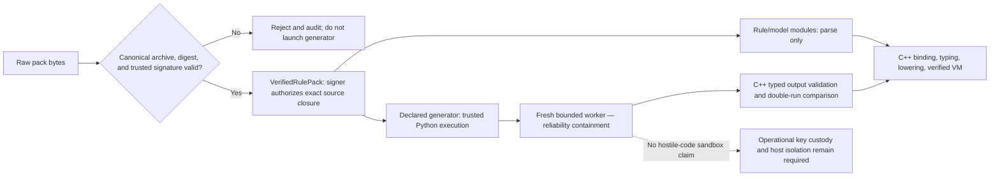

# ADR-002: Treat Production-Signed Pack Source as Trusted Operational Code

- **Status:** Accepted for design-v1
- **Date:** 2026-07-20
- **Owners:** Security architecture, pack lifecycle, integration
- **Related:** ADR-003, ADR-005, ADR-017, `architecture/01-trust-and-threat-model.md`, limitations L-001/L-005

## Context

Python rule/model source is statically parsed and then executed only by the C++ VM, but an optional pack generator is real Python executed by CPython. The project must decide whether pack authors are mutually untrusted tenants requiring a hardened hostile-code sandbox, or authorized operational developers whose signatures confer code-execution trust for generation.

The deployment already requires centrally managed pack activation, operator capabilities, peer certificates, retention, and action sinks. Source trust is explicitly placed in the operational signing pipeline. Building a credible cross-platform sandbox for arbitrary hostile Python would be a separate major security product: Windows AppContainer/LPAC or virtualization, Linux namespaces/seccomp/LSM/container policy, filesystem images, brokered I/O, kernel/runtime hardening, and continuous escape analysis. Import restrictions and resource limits alone would not justify that claim.

At the same time, trusted code can be buggy or unexpectedly expensive, CPython parsing can fail catastrophically on extreme input, and generator state/environment can cause nondeterminism. The design therefore needs reliability isolation even though it does not claim adversarial isolation.

## Decision

In production, a pack's canonical source payload must be verified under an operator-managed Ed25519 trust policy before any generator execution. A valid trusted signature means the operator authorizes that exact source digest and its embedded dependency/input closure as trusted operational code.

The consequences of that authorization are deliberately different for the two source classes:

- **Rule and model modules:** CPython parses but never imports or executes them. C++ owns binding, types, semantics, lowering, capability checks, and VM execution.
- **Declared generator module:** CPython may execute it after verification, using the private pinned runtime, declared immutable inputs, embedded digest-pinned source dependencies, bundled standard library, and locked pure-Python wheels.

Worker environment reduction, import/input restrictions, double-run validation, resource caps, process-tree termination, and short lifetime are mandatory defense in depth. They are availability, reproducibility, and accident-containment controls. They are not represented as AppContainer, LPAC, hostile-code sandboxing, or protection from a malicious trusted signer.

Unsigned packs are allowed only in an explicit development profile. Development artifacts and audits remain visibly marked unsigned/non-production and cannot be activated by a production configuration.

## Primary reasons

1. **Honest security claim:** The system does not label an import allowlist and process limits a sandbox.
2. **Operational fit:** Pack publishing is already a privileged, reviewed, centrally activated operation.
3. **Semantic isolation where it matters:** Static rules never run in Python; C++ remains the only rule-semantic authority.
4. **Practical generator ecosystem:** Trusted generators can use normal deterministic Python tooling and pure-Python dependencies without inventing a second generator language immediately.
5. **Cross-platform consistency:** Windows and Linux share the same trust contract without pretending their process-containment primitives provide equal adversarial isolation.
6. **Clear escalation path:** If untrusted publisher support becomes a requirement, it triggers an explicit sandbox architecture rather than silently stretching the current promise.

## Required controls

### Provenance and authorization

- Canonicalize `.rpack` entries and sign a domain-separated SHA-256 source index.
- Verify every payload/dependency/input digest and the signer trust decision before generator invocation.
- Bind trust roots and activation permissions to operator policy and tenant where applicable.
- Support key rotation and revocation; record key ID, signer, digest, trust result, and policy version in durable audit.
- Never fetch live dependencies during compile/activation; use only embedded exact-digest source closure.

### Generator defense in depth

- Launch a fresh private CPython 3.14 worker for one generator request.
- Clear Python/environment discovery paths and reject native wheels, bytecode, `.pth`, scripts, and ambient site packages.
- Expose only declared immutable inputs and generated typed binding objects.
- Run twice in fresh workers with different hash seeds; canonicalize and compare all emitted bindings in C++.
- Enforce wall, CPU, memory, output, child-process/tree, input, and binding-count limits.
- Deep-validate output against compiled template identities, schemas, types, stable binding IDs, and capability rules.

### Static rule confinement

- Parse rule/model source without importing or executing it.
- Reject dynamic imports, reflection, native access, runtime code generation, ambient OS/process/network/filesystem/time/random APIs, and mutable globals.
- Execute only verified C++ bytecode with explicit capabilities and versioned budgets.

## Rejected alternatives

### Claim the generator worker is a hostile-code sandbox

Rejected. Neither Job Objects/`rlimit` nor a private runtime prevents arbitrary filesystem/network/process access or runtime exploits by itself. AppContainer/LPAC was not selected, and claiming security parity on Linux would require an independently designed isolation platform. A misleading sandbox promise is worse than an explicit trust boundary.

### Use Windows AppContainer/LPAC only

Rejected for this architecture. It would create asymmetric platform guarantees, packaging/broker complexity, and a new security boundary that was not required for trusted pack source. It may be revisited as part of a cross-platform untrusted-publisher design, not added piecemeal here.

### Execute no Python at all; use a declarative generator format

Rejected initially because the user accepted Python runtime use, existing generation needs benefit from real typed Python, and canonical double-run validation provides useful operational assurance. This remains the preferred future alternative if strong generator determinism or untrusted publishing becomes mandatory.

### Execute every rule directly in CPython after signature verification

Rejected because signer trust does not change semantic ownership. Direct execution would weaken fact suspension, budgets, replay, capability control, effect transactions, portability, and optimizer equivalence.

### Allow unsigned production packs after static validation

Rejected because static validation does not establish publisher authorization and does not protect generator execution provenance.

### Keep a permissive generator but rely only on human review

Rejected because accidental hangs, environmental drift, state leakage, crashes, and nondeterminism are realistic even for trusted code. Defense-in-depth controls remain mandatory.

## Consequences

### Positive

- Security guarantees are precise and testable rather than aspirational.
- Static evaluation stays safe-by-construction inside the C++ VM.
- Trusted generators retain a productive Python environment while outputs remain typed and deterministic enough for cluster comparison.
- Server availability is protected from ordinary parser/generator failure by short-lived bounded processes.
- Signing, audit, activation, and incident-response ownership is explicit.

### Negative

- A compromised or malicious trusted signing key can authorize arbitrary generator Python under the worker account.
- Operational controls for keys, host accounts, filesystem/network policy, and deployment isolation are essential.
- Generator restrictions and double-run add build latency and packaging complexity.
- Unsigned development behavior must be visibly and technically separated from production to prevent accidental promotion.
- The engine cannot accept arbitrary third-party packs under this threat model.

## Failure modes and response

| Failure | Response |
|---|---|
| Signature missing/untrusted/revoked or digest mismatch | Reject before parse/generate; audit; keep active generation unchanged. |
| Archive/dependency/input mismatch | Reject whole pack; never substitute or fetch ambient content. |
| Worker limit/crash/malformed output | Kill process tree, discard all output, produce bounded diagnostic, reject staging. |
| Double-run output differs | Diagnose nondeterministic generator and reject all generated bindings. |
| Output names unknown template/forges SDK object/type | Reject during C++ canonical validation. |
| Trusted signing key suspected compromised | Revoke key, prevent new activations, identify active source digests by audit, quarantine/rollback affected packs under operator procedure. |
| Unsigned development pack reaches production endpoint | Fail closed; configuration/profile mismatch is an auditable startup or request error. |

## Operational and security implications

- Signing keys should be hardware-backed or equivalently protected where possible, with code review and separation of publishing/activation duties.
- Worker accounts and hosts should still be least-privileged and network/filesystem-restricted by deployment policy; that reduces impact but does not alter the documented trust decision.
- Trust-policy and revocation changes require durable audit and deterministic effect on staging/activation.
- Active pack inventory must be searchable by signer, key, source digest, dependency digest, and executable hash for incident response.
- Production documentation must use the terms **trusted generator** and **reliability containment** and explicitly avoid **sandboxed Python** unless a future ADR supplies a real sandbox contract.

## Known limitations

- Deliberately malicious signed generator behavior is outside the product security guarantee (`L-001`).
- Two equal fresh runs do not prove determinism (`L-005`).
- CPython/runtime/native dependency vulnerabilities remain relevant even in a reduced environment.
- Operator misconfiguration or key compromise can authorize dangerous generator behavior.
- This decision does not protect secrets from a fully compromised server or worker host.

## Validation evidence required

- Pack lifecycle test proving verifier/trust success occurs before the generator process is created.
- Signature, tamper, wrong-key, revoked-key, wrong-tenant, archive-collision, path-traversal, and digest-substitution tests.
- Environment-poisoning tests proving system Python, `PYTHONPATH`, user site, registry installs, and ambient packages do not affect execution.
- Tests rejecting native wheels, `.pth`, bytecode, scripts, undeclared inputs, and forged binding output.
- Forced generator crash, timeout, memory/output overflow, child process, malformed frame, and mismatched double-run tests with server-survival/process-tree-cleanup evidence.
- Production configuration test proving unsigned packs cannot stage or activate.
- Audit test proving signer/digest/trust/runtime/input/binding hashes and outcomes are durable and queryable.

## Traceability

- Architecture: `architecture/01-trust-and-threat-model.md` and `architecture/03-rulepacks-and-python-worker.md`.
- Contracts: `VerifiedRulePack`, trust result, `PackCompiler`, canonical pack/runtime identities.
- Tasks: PK1, PK2, PK3, S3, I1, Q1.
- Limitations: L-001, L-004, L-005.
- Acceptance: signature/tamper/hostile-archive qualification, environment isolation, worker failure containment, production unsigned rejection, and audit evidence.

## Revisit conditions

Replace or amend this decision if any of the following becomes a product requirement:

- Unreviewed or mutually untrusted third parties can submit generators.
- The worker must safely process malicious Python independent of signer trust.
- Regulation requires a formally described code-isolation boundary.
- Determinism must be proven rather than operationally checked.

Revisit requires a cross-platform sandbox or declarative-generator proposal, adversarial threat analysis, escape/patch ownership, brokered input/output design, performance analysis, and updated limitations. It cannot be satisfied by merely adding more import filters or resource limits.

## References

- [Python 3.14 AST documentation and parser resource warning](https://docs.python.org/3.14/library/ast.html#ast.parse)
- [Microsoft Job Objects](https://learn.microsoft.com/en-us/windows/win32/procthread/job-objects)
