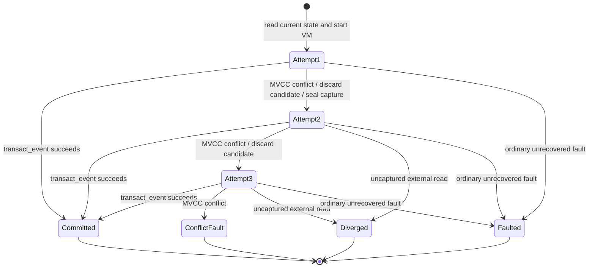

# ADR-010: MVCC State with Captured-Input Replay

Status: accepted for `design-v1`\
Date: 2026-07-20\
Owners: integration and events/state lanes\
Tasks: `R2`, with coordinator support from `S1` and `S2`\
Architecture: `architecture/07-events-history-state-and-correlation.md`

## Context

Rule and correlation executions may suspend while waiting for remote facts, typed history, or read-only services. An invocation can therefore live much longer than a normal database transaction. During that time another invocation can update a state key that the suspended invocation read.

The engine must decide how to handle that race while preserving all of these guarantees:

- C++ owns state and effect semantics; Python has no mutable ambient globals.
- A verdict, cursor, state changes, derived events, retention, effect journal, and outbox become visible atomically.
- A retry must not repeat a post/capture or silently observe different fact, history, service, time, or hash-seed inputs.
- Active-active nodes and shared-state users cannot overwrite each other through stale work.
- A failed invocation leaves no partial state or effects.
- Correlation groups progress deterministically and do not remain blocked forever by one poison event.
- Resource use and retry count remain bounded.

Holding a database transaction or row lock across remote suspension would make these requirements operationally unsafe. Blind last-write-wins would make the result depend on commit timing. Re-running against live external dependencies could turn a state conflict into a different detection and could duplicate externally visible activity.

## Decision

### 1. State is typed, scoped, and capability-owned

Runtime state is exposed only through injected typed state capabilities. Each `StateKey[T]` declares a stable schema ID, canonical key/value types, classification ceiling, scope, and absence/default behavior. Helpers receive state explicitly; mutable module/class globals are rejected.

The default physical identity is:

```text
(tenant_id, consuming_owner, state_namespace_id, state_schema_id, scope_identity, key_identity)
```

The consuming pack/binding owns embedded-library state by default. Activation reuses `state_namespace_id` only when the stable schema ID and canonical descriptor hash are exact matches; incompatible state receives a new linked namespace. Cross-pack sharing requires an operator-bound `SharedState` capability, and cross-peer access requires an additional explicit scope capability. Capabilities constrain tenant, schema, key prefix, label, and read/write mode.

### 2. Evaluation uses optimistic MVCC

The runtime store returns each state value with an opaque version. `VmSession` records the version in its read set and stages writes/deletes in the same candidate journal as effects and derived events. Reads observe prior writes from the current invocation.

No database lock is held during VM evaluation or suspension. At clean completion and finalization, `IRuntimeStore::transact_event` verifies:

- the current work/session fence;
- the expected input/group cursor;
- every state read/write version;
- schema, label, quota, idempotency, and policy constraints.

If all predicates hold, one database transaction commits state, cursor, result, emitted events, retention, effect journal, outbox, and audit. If any MVCC predicate fails, none of the candidate transaction is visible.

### 3. Conflicts use fresh VM sessions and a sealed replay bundle

The original attempt captures every non-state input that can influence language-visible behavior:

- input event and validated subject;
- logical fact values or typed terminal statuses;
- history query plans, returned event identities/versions, values, and statuses;
- read-only service responses/statuses;
- deterministic time/call-context values;
- per-evaluation hash seed;
- executable/schema/policy versions and source timestamps.

At the end of the original attempt, this bundle is sealed. A state-conflict retry creates a fresh `VmSession`, reads current state and versions, and reuses the same input event, execution identity, deadline basis, and sealed non-state inputs. The prior attempt's heap, frames, state journal, effects, emitted events, and retention intents are discarded.

Logical external reads use canonical replay keys derived from operation kind, source call site, dynamic occurrence index, typed arguments, subject/route/schema, and policy version. A retry cannot contact a provider, history store, or external service for a replayable read. If changed state takes a branch that reaches an external read absent from the sealed bundle, the invocation ends as `FAULTED(StateConflictReplayDiverged)`.

This conservative rule ensures that a state retry changes only the state snapshot. It does not combine a newer state value with a newer machine/service/history observation and call that the same evaluation.

### 4. Retry bounds and budgets

An evaluation has at most three executions: the original plus two transparent retries. A third MVCC rejection produces `FAULTED(StateConflict)`. A retry creates fresh VM frames/heap/journals but consumes the evaluation-owned remaining budget; retries do not multiply `balanced.v1`. All attempts share:

- the original elapsed deadline basis;
- active-CPU, bytecode-instruction, allocation, provider, service, history, state, and effect ceilings;
- the same external-input capture;
- the same hard deployment policy version.

Only separately specified finalizer/fault/cleanup executors receive fresh dedicated caps. Attempts are individually visible in the flight recorder and audit. Only a committed attempt's ordinary state/effects/events survive. Fault policy can diagnose the exhausted conflict but cannot turn an uncommitted stale journal into committed state.

### 5. Correlation faults advance deterministically

Correlation group leases serialize normal work by canonical group identity, so MVCC conflicts should chiefly arise from explicitly shared state, lease turnover races, or administrative work.

After Python handling and the bounded fault ladder are exhausted, the coordinator atomically persists a `FaultEvent`, discards the candidate state/effect journal, and advances the failed input cursor. A quarantine outcome records the quarantine and also advances that failed event; the quarantine gate prevents the next claim. This prevents automatic infinite retries of a poison event while retaining a complete durable failure record.

### 6. Schema evolution uses explicit migration namespaces

An exact state schema ID and canonical descriptor hash reuses its namespace. An incompatible descriptor requires a new schema ID and either a compiler-checked pure migration or an operator-approved reset.

Migration is lazy per key and transactional: read the retained predecessor, run deterministic migration bytecode without facts/history/services/effects/events, validate the new value, and write it to the new activation-selected state namespace. A background warmer uses the same path. Failure writes no partial value and quarantines affected work with a typed migration fault.

The old incompatible namespace remains immutable for a bounded rollback interval. Rollback selects it again; writes performed only under the new schema are not reverse-migrated.

## State-conflict state machine



## Primary reasons

1. **Atomic correctness:** optimistic versions and one storage transaction prevent partial or lost updates without holding locks across asynchronous work.
2. **Deterministic replay:** sealing non-state inputs makes the state snapshot the only intended difference between attempts.
3. **Effect safety:** abandoned attempts never expose outbox rows, emitted events, capture requests, or state.
4. **Active-active compatibility:** version predicates and fence tokens reject stale workers regardless of process ownership.
5. **Bounded recovery:** two retries handle ordinary races while preventing unlimited CPU or queue starvation.
6. **Auditability:** attempt, input-capture, state-version, and journal hashes explain why a retry changed its verdict or failed.

## Alternatives considered

### Hold pessimistic row locks across the entire evaluation

Rejected because fact/service/history waits can take seconds. Long locks would block unrelated workers, increase deadlocks, retain failed sessions, and make agent/network latency part of database availability. Lock loss on node failure would still require fenced recovery.

### Last-write-wins or merge state automatically

Rejected because arbitrary Python state records do not have a universal associative/commutative merge. A lost counter, suppression marker, or correlation phase can change detections and external effects without a visible fault.

### Fail immediately on the first conflict

Rejected as the default because a short ordinary race is recoverable and correlation/shared-state workloads would see avoidable faults. The hard three-attempt bound still makes persistent contention explicit.

### Re-run against current live facts, history, and services

Rejected because the second attempt could observe a different machine or service and produce a different journal for reasons unrelated to state conflict. It can also repeat expensive provider reads and weaken privacy/accounting guarantees.

### Permit new external reads during retry while replaying old ones

Rejected because it creates a mixed observation epoch that cannot be described as either the original evaluation or a clean new evaluation. The chosen design faults with `StateConflictReplayDiverged` and asks authors to isolate state-dependent external access.

### Capture a complete world snapshot before evaluation

Rejected because facts are lazy, subject graphs are large, services are external, and history is query-shaped. Eager capture would violate logical-read privacy, increase cost, and undermine optimizer semantics.

### Event sourcing or CRDTs as the only state model

Rejected as a universal author API. They are useful for selected modeled state types but cannot express all bounded typed correlation state with simple deterministic semantics. They may be added later as explicit state capabilities, not implicit merging.

### Client-owned state

Rejected because clients are fact providers only and must never own rule semantics, correlation progress, or match decisions.

## Positive consequences

- Remote suspension does not hold database locks.
- State, effects, events, cursor, and audit have one visible commit point.
- Provider/service reads are neither duplicated nor changed by a state retry.
- A crashed or stale node cannot commit after lease turnover.
- State conflict outcomes are explicit, typed, bounded, and reproducible.
- Schema migrations and rollback ownership are reviewable during activation.

## Negative consequences and tradeoffs

- The engine must retain a bounded canonical capture of every replayable non-state input until commit or final fault.
- Canonical replay keys and call-occurrence semantics become part of the VM/compiler contract.
- A harmless state-dependent branch can fault on retry if it reaches an external read absent from the original capture.
- Each conflict reruns pure computation and can consume substantial CPU within the overall deadline.
- Explicit migration adds author/operator work and retains duplicate state during the rollback window.
- Rollback of an incompatible schema does not preserve writes made only in the new namespace.

## Operational implications

- Production dashboards report state-conflict rate, attempts-to-commit, replay-capture bytes, replay divergence, top contended keys/scopes, migration backlog/faults, and elapsed-deadline exhaustion.
- Repeated conflicts should trigger author guidance to narrow state ownership or correlation grouping before operators raise limits.
- Replay bundles are encrypted/retained under the same or stricter classification as their highest-labeled member and are deleted according to the governing profile.
- Background migration warming uses ordinary fenced transactions and rate limits; it never bypasses activation or state quotas.
- Rollback preview must state whether the schema is compatible or will restore the retained pre-activation namespace and omit new-generation-only changes.

## Security and privacy implications

- Tenant, peer, owner, schema, and scope are included in every physical key; rule-provided bytes cannot escape the bound namespace.
- Stored values are deep-validated `FrozenValue` objects. Cycles and values above the capability's classification ceiling fail before commit.
- Captured facts/history/service responses can contain sensitive data. They inherit labels, retention ceilings, encryption, redaction, and purge behavior; audit logs store only approved digests/metadata.
- Replaying does not call services, providers, posts, or peer capture. It therefore cannot bypass call quotas or create duplicate physical side effects.
- Fence tokens and MVCC predicates are checked inside the same database transaction as all effects, preventing a stale node from committing a valid-looking journal.

## Known limitations

1. Three total attempts may be insufficient under high shared-state contention; the result is a typed fault rather than unbounded retry.
2. A retry that needs an external read not present in the original sealed capture faults even if that read would be safe. This conservative false negative is an accepted consistency tradeoff and must be reflected in the central limitations registry.
3. Captured-input replay reproduces engine-visible inputs, not the state of arbitrary external systems and not physical side effects already committed by an earlier, separate event.
4. Captures increase transient memory/storage proportional to bounded fact, history, and service results.
5. Migration fixtures cannot prove that every historic production value will migrate successfully; bad keys can quarantine affected work after activation.
6. Rolling back an incompatible state schema does not reverse-migrate new-generation writes.
7. Shared mutable state can reduce active-active parallelism and should remain an explicit capability rather than the default.

## Evidence and validation

The decision is validated by:

- store-contract tests against PostgreSQL and SQLite for CAS read sets, atomic candidate rejection, read-your-writes, deletes, and fence predicates;
- two-node PostgreSQL tests that kill an owner before commit and after commit-before-ack, then prove once-visible results/effects;
- deterministic VM tests that compare attempt-one and replay fact/history/service/time/hash inputs byte-for-byte;
- tests where refreshed state follows the same path, a different pure path, and a path requiring an uncaptured external read;
- original-plus-two conflict tests proving the third rejection becomes `StateConflict` and never commits an abandoned journal;
- label, tenant/scope, quota, cyclic-value, and captured-input purge tests;
- migration tests for unchanged schemas, complete/incomplete migration graphs, lazy/background races, invalid historic values, reset authorization, and rollback namespace selection;
- exact-versus-optimized parity tests over state read/write sets, replay keys, journals, verdicts, faults, and recorder events.

Acceptance requires all of the above plus audit evidence linking one `execution_id` to every attempt, state-version set, capture hash, transaction result, and final cursor.

## Revisit conditions

Revisit this ADR only if one of these becomes true:

- production measurements show bounded retries faulting at an unacceptable rate after state ownership/grouping fixes;
- a concrete use case needs a modeled CRDT/commutative state type and can specify deterministic merge, labels, replay, and effect semantics;
- storage can provide a bounded transactional snapshot spanning all relevant facts/history/services without eager overcollection;
- incompatible-schema rollback must preserve new-generation changes and a reviewed bidirectional migration model is available;
- trusted workload evidence justifies a different retry count in a new named budget profile.

Any revision must update the state/VM/store contracts, architecture chapter, central limitations registry, traceability, replay tests, and activation/rollback documentation before implementation changes land.
